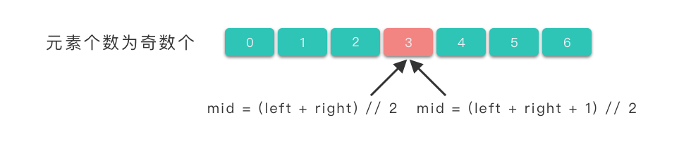
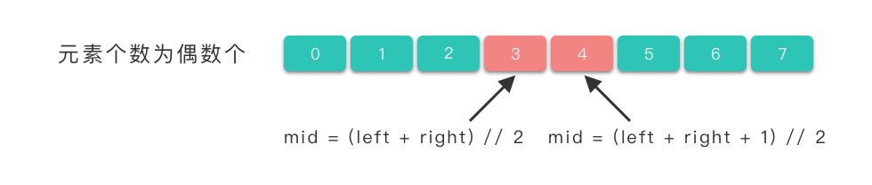

import Tabs from '@theme/Tabs';
import TabItem from '@theme/TabItem';

# 数组二分查找

## 二分查找基本思路

1. 首先确定要查找的数组，以及要查找的值
2. 然后确定数组的中间位置，并判断中间位置的值是否是要查找的值
3. 如果中间位置的值等于要查找的值，则返回中间位置的索引
4. 如果中间位置的值大于要查找的值，则继续在左半部分查找
5. 如果中间位置的值小于要查找的值，则继续在右半部分查找

## 二分查找算法步骤

## 例题

[704 二分查找](https://leetcode.cn/problems/binary-search/description/)

```text
给定一个 n 个元素有序的（升序）整型数组 nums 和一个目标值 target  ，写一个函数搜索 nums 中的 target，如果目标值存在返回下标，否则返回 -1。


示例 1:

输入: nums = [-1,0,3,5,9,12], target = 9
输出: 4
解释: 9 出现在 nums 中并且下标为 4
示例 2:

输入: nums = [-1,0,3,5,9,12], target = 2
输出: -1
解释: 2 不存在 nums 中因此返回 -1


提示：

你可以假设 nums 中的所有元素是不重复的。
n 将在 [1, 10000]之间。
nums 的每个元素都将在 [-9999, 9999]之间。
```

题解：

```python {4,9} showLineNumbers
class Solution:
    def search(self, nums: List[int], target: int) -> int:
        # 快速的初始化方法
        left, right = 0, len(nums) - 1

        # 在区间 [left, right] 内查找 target
        while left <= right:
            # 取区间中间节点，使用//可以得到整数，而不是小数
            mid = (left + right) // 2
            # 如果找到目标值，则直接返回中心位置
            if nums[mid] == target:
                return mid
            # 如果 nums[mid] 小于目标值，则在 [mid + 1, right] 中继续搜索
            elif nums[mid] < target:
                left = mid + 1
            # 如果 nums[mid] 大于目标值，则在 [left, mid - 1] 中继续搜索
            else:
                right = mid - 1
        # 未搜索到元素，返回 -1
        return -1
```

:::tip

1. 使用`left, right = 0, len(nums) - 1`可以快速初始化左右边界
2. 使用`mid = (left + right) // 2`可以快速得到中间位置，因为`//`返回的是整数，而`/`返回到是浮点数。
3. 使用`left <= right`来代替`left < right`，可以防止死循环
   :::

## 二分查找细节

从上篇文章的例子中我们了解了二分查找的思路和具体代码。但是真正在解决二分查找题目的时候还需要考虑更多细节。比如说以下几个问题：

1. 区间的开闭问题
2. mid 的取值问题
3. 出界条件的判断
4. 搜索区间的范围选择

### 区间的开闭问题

在二分查找中，我们使用`left, right = 0, len(nums) - 1`来初始化左右边界。
关于二分查找算法的左闭右闭区间、左闭右开区间，其实在网上都有对应的代码。但是相对来说，左闭右开区间这种写法在解决问题的过程中，会使得问题变得复杂，需要考虑的情况更多，所以不建议使用左闭右开区间这种写法，而是**建议：全部使用「左闭右闭区间」这种写法**。

### mid 的取值问题

常见的 mid 取值有两个

1. `mid = (left + right) // 2`
2. `mid = (left + right + 1) // 2`

第一种写法，在 Python 中，`//`是向下取整，所以`mid = (left + right) // 2`等价于
<br/>`mid = left + (right - left) // 2`。

第二种写法，在 Python 中，`//`是向下取整，所以`mid = (left + right + 1) // 2`等价于
<br/>`mid = left + (right - left + 1) // 2`。

而当待查找区间中的元素个数为偶数时，使用 mid = (left + right) // 2 式子我们能取到中间靠左边元素的下标位置，使用 mid = (left + right + 1) // 2 式子我们能取到中间靠右边元素的下标位置。

<Tabs>
<TabItem value="odd" label="数组为奇数">

</TabItem>
<TabItem value="even" label="数组为偶数">

</TabItem>
</Tabs>
### 出界条件的判断

在二分查找中，我们使用`left <= right`来代替`left < right`，可以防止死循环。

举个例子，假如我们使用`left < right`来代替`left <= right`，那么在查找过程中，如果`left`和`right`都指向同一个元素，那么就会导致死循环。

## 总结
1. 快速初始化左右边界，使用闭区间`left, right = 0, len(nums) - 1`。
2. 设置出界条件为`left <= right`。
3. mid中间值取值为`mid = left + (right - left) // 2`。

[35. 搜索插入位置](https://leetcode.cn/problems/search-insert-position/description/)：当left>right停止查找时，left就是待插入位置。
