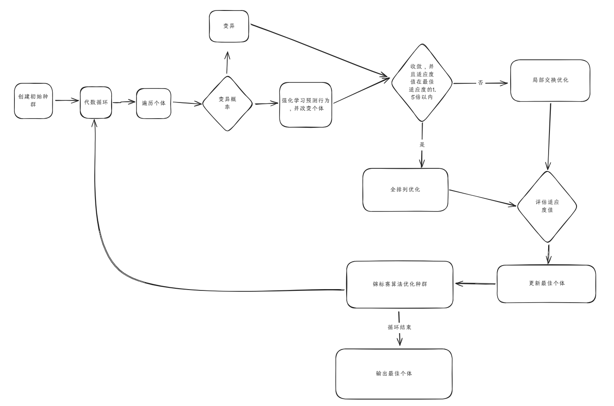
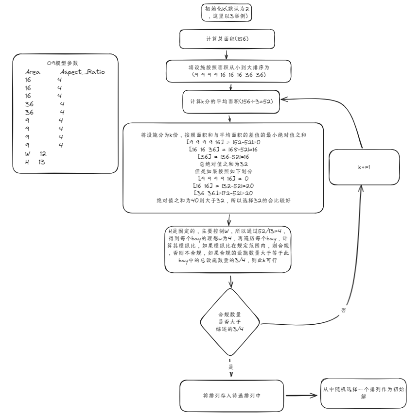

##

## Gym 核心概念

### Env

####

## 方案设计

### 方案一：k 生成->强化学习变化->全排列局部优化

架构图如下：



这里的强化学习的作用是用于将其快速收敛，所以采用收敛训练模型-->[收敛训练模型](./gym-flp/#收敛训练模型)

实验结果：

| 模型 | 种群数量 | 种群代数 | 平均迭代时间 | best   | avg    | worst  | 已知最佳值 | 实验时间 |
| ---- | -------- | -------- | ------------ | ------ | ------ | ------ | ---------- | -------- |
| O7   | 50       | 100      | 6.98s        | 134.19 | 134.19 | 134.19 | 134.19     | 08-11    |
| O9   | 50       | 100      | 12.35s       | 254.38 | 262.90 | 272.40 | 254.38     | 08-11    |

### 方案二：二阶段优化算法

### 方案三：混合优化算法

## FBS 模型的设计与实现

这里主要是在原有的 FBS 上的基础上进行改进和实现，所以针对其核心概念与实现暂时没有更改。这里我只分析核心的相关代码，对于其他的代码则简单带过。

:::danger
代码中有一些地方有点恶心，大写的例如 W，H，L 是厂房相关的数据，小写的，例如 w，l，length，width 等是设施相关的数据，但是其方向不统一！！！

- W 代表厂房宽度，为纵向的 Y 坐标，H/L 代表厂房高度，为横向的 X 坐标
- w/width/fac_b 代表设施的宽度，但是是纵向 y 坐标，l/length/fac_h 为设施长度为横向的 x 坐标

即，纵向坐标代表的是宽度，横向坐标代表的是长度。
:::

### init 初始化

主要是加载 pkl 文件中封装的数据，然后再初始化环境。对于想加载自己的模型，我已经写好了 pkl 文件生成器，代码见-->[pkl-生成器](./gym-flp/#pkl-生成器)，通过 pkl 文件，我们可以得到如下的数据：

1. self.problems, # 问题模型，就是模型的设施数量
2. self.FlowMatrices, # 流量矩阵
3. self.sizes, # 尺寸数据
4. self.LayoutWidths, # 布局宽度，X 坐标，后续 w 相关的
5. self.LayoutLengths, # 布局长度，Y 坐标，后续 h 或则 l 相关的

但是这些数据中包含的都是矩阵，即所有模型的数据，所以我们需要提取出目标模型的数据：

1. self.n = self.problems[self.instance] # 问题模型的设施数量
2. self.F = self.FlowMatrices[self.instance] # 物流强度矩阵
3. self.AreaData = self.sizes[self.instance] # 面积数据

以上数据都可以直接的提取，但是还有一些数据需要经过计算

**模型中设施的横纵比，长宽限制，面积等数据**，实现方法见-->[getAreaData 方法](./gym-flp/#获得设施的长宽以及横纵比等数据)

```python
self.beta, self.l, self.w, self.a, self.min_side_length = getAreaData(self.AreaData)
```

**设置厂房信息**：

如果有厂房的尺寸信息，则直接使用，否则则计算所有的设施面积之和，然后创建一个同等面积大小的正方形作为厂房尺寸。赋值给`self.L`以及`self.W`两个参数

```python
if (
    self.instance in self.LayoutWidths.keys()
    and self.instance in self.LayoutLengths.keys()
):
    self.L = int(
        self.LayoutLengths[self.instance]
    )
    self.W = int(self.LayoutWidths[self.instance])
else:
    self.A = np.sum(self.a)
    self.L = int(
        round(math.sqrt(self.A), 0)
    )
    self.W = self.L
```

**动作空间初始化**

动作是**离散动作**，只有五个离散动作，所以这里使用`spaces.Discrete`来存储。

```python
self.action_space = spaces.Discrete(4)
self.actions = {
    0: "Randomize",  # 随机交换两个元素
    1: "Bit Swap",  # 将bay中的随机的1转换为0，或者将0转换为1
    2: "Bay Exchange",  #
    3: "Inverse",
    4: "Repair",
 }
```

**定义一些参数信息**

```python
self.state = None
self.permutation = None  # 设施的排列顺序
self.bay = None
self.done = False
self.MHC = rewards.mhc.MHC()
```

在 gym 中，我们还有一个观察空间，这里有两种模式，对于不同的模式，实现的方式也有些差别：

```python
# 观察空间的模式
        if self.mode == "rgb_array":
            self.observation_space = spaces.Box(
                low=0, high=255, shape=(self.W, self.L, 3), dtype=np.uint8
            )  # Image representation
        elif self.mode == "human":

            observation_low = np.tile(
                np.array([0, 0, self.min_length, self.min_width], dtype=int), self.n
            )
            observation_high = np.tile(
                np.array([self.W, self.L, self.W, self.L], dtype=int), self.n
            )
            self.observation_space = spaces.Box(
                low=observation_low, high=observation_high, dtype=int
            )  # Vector representation of coordinates
        else:
            print("Nothing correct selected")
```

### reset 重置

reset 中主要是用于重置，即初始化一些参数，以及生成初始的排列和区带划分。默认的生成器是使用随机生成器，而这里我实现了一个 k 分初始解生成器，主要用于生成优质解。

#### k 分初始解生成器

核心思想，我们可以拿一个例子来分析，以 O9 的例子来分析，k 分初始解的核心思想如下：


核心的代码实现，分为两个部分

1. k 划分方法
2. k 验证方法

k 划分方法，就是将排列划分为 k 份:

```python
# k分划分法
def find_best_partition(self, arr, k):
    target_sum = np.sum(arr) // k
    n = len(arr)
    best_diff = float("inf")
    best_partition = None
    for comb in itertools.combinations(range(1, n), k - 1):
        partitions = np.split(arr, comb)
        partition_sums = [np.sum(part) for part in partitions]
        diff = sum(abs(target_sum - s) for s in partition_sums)
        if diff < best_diff:
            best_diff = diff
            best_partition = comb
    return best_partition, np.split(arr, best_partition)
```

k 验证方法，就是得到设施的横纵比，然后验证这个 k 是否可行，以及将可行的排列加入到待选择的设施排列中：

```python
# k分初始解生成器
    def binary_solution_generator(self):
        print("k分初始解生成器")
        # print(self.n)
        # print(self.L)
        # print(self.W)
        # print(self.a)
        # print(self.beta)
        # 存储可行的k分解
        bay_list = []
        # 分界参数
        k = 2
        # 计算面积之和
        total_area = np.sum(self.a)
        # 生成一个设施默认的编号序列
        permutation = np.arange(1, self.n + 1)
        # 根据a对序列进行排序
        permutation = permutation[np.argsort(self.a[permutation - 1])]
        # 对a也进行排序
        a = np.sort(self.a)
        # 对beta也按照a的顺序进行排序
        beta = np.array([self.beta[i - 1] for i in permutation])
        # print("排序后的排列: ", permutation)
        # print("排序后的a: ", a)
        # print("self.a: ", self.a)
        while k <= self.n:
            # 计算W的k分
            l = self.L / k
            # print("l: ", l)
            w = a / l  # 每个设施的宽度
            # print("w: ", w)
            # print("w/l: ", np.maximum(w, l) / np.minimum(w, l))
            aspect_ratio = np.maximum(w, l) / np.minimum(w, l)
            # 验证k分是否可行
            # print("a/l", a / l)
            # 合格个数
            qualified_number = np.sum(
                (aspect_ratio >= beta[:, 0]) & (aspect_ratio <= beta[:, 1])
            )
            # print(f"k: {k}, 合格个数: {qualified_number}")
            # 如果合格个数大于等于3/4*n，即此k值可行
            if qualified_number >= self.n * 3 / 4:
                # print("可行的k: ", k)
                # print("符合的个数: ", qualified_number)
                # 根据面积和找到k分界点
                best_partition, partitions = self._find_best_partition(a, k)
                # print("序列分界点: ", best_partition)
                # 将k分界点转换为bay
                bay = np.zeros(self.n)
                for i, p in enumerate(best_partition):
                    bay[p - 1] = 1
                # 将最后一个分界点设为1
                bay[self.n - 1] = 1
                bay_list.append(bay)
            k += 1

        # print("可行的bay: ", bay_list)
        # 从可行的bay中随机选择一个
        if len(bay_list) > 0:
            bay = random.choice(bay_list)
        return (permutation, bay)
```

#### 参数初始化

reset 就是初始化`state`参数，使用`state`来表示当前的状态，state 包含了许多的数据，主要包含以下数据：

- fac_x： 设施的 x 轴坐标 NDArray
- fac_y： 设施的 y 轴坐标 NDArray
- fac_b：设施的宽度，本质上来说是 x 坐标上的长度
- fac_h：设施的长度，本质上来说是 y 坐标上的长度
- n：设施的数量

:::warning
这里需要注意的是，这些`fac_x`，`fac_y`等参数，其顺序都与`self.permutation`顺序保持一致的
:::

所以我们需要先生成 self.fac_x, self.fac_y, self.fac_b, self.fac_h 四个参数，可以通过作者的`getCoordinates`方法直接调用，但是在有些地方也需要用到，所以我封装了一个重载通用版，代码如下：

入参为：

1. bay： 区带
2. permutation： 排列
3. a： 面积数组
4. W： 厂房 Y 坐标长度，可以由`init`方法中初始化得到，一般使用`self.W`

```python
def getCoordinates_mao(self, bay, permutation, a, W):
        facilities = np.where(bay == 1)[0]  # 查找bay为1的位置，即区带的划分点
        bays = np.split(
            permutation, facilities[:-1] + 1
        )  # 将排列按照划分点分割成多个子数组，每个子数组代表一个区段的排列

        lengths = np.zeros(
            (
                len(
                    permutation,
                )
            )
        )
        widths = np.zeros(
            (
                len(
                    permutation,
                )
            )
        )
        fac_x = np.zeros(
            (
                len(
                    permutation,
                )
            )
        )
        fac_y = np.zeros(
            (
                len(
                    permutation,
                )
            )
        )

        x = 0
        start = 0
        # print("当前Bays: ", bays)
        # print("当前Permutation: ", permutation)
        for b in bays:  # 遍历每一个区带中的设施
            # print("b: ", b)
            areas = a[b - 1]  # Get the area associated with the facilities
            # print("areas: ", areas)
            end = start + len(areas)

            # 计算每个设施的长度和宽度
            lengths[start:end] = (
                np.sum(areas) / W
            )  # Calculate all facility widhts in bay acc. to Eq. (1) in https://doi.org/10.1016/j.eswa.2011.11.046
            widths[start:end] = areas / lengths[start:end]

            fac_x[start:end] = lengths[start:end] * 0.5 + x
            x += np.sum(areas) / W

            y = np.ones(len(b))
            ll = 0
            for idx, l in enumerate(widths[start:end]):
                y[idx] = ll + 0.5 * l
                ll += l
            fac_y[start:end] = y

            start = end

        return fac_x, fac_y, lengths, widths
```

:::info
这里有很多需要注意的地方：

1. a 是在`init`环节初始化的，所以其对应的顺序是排序序列的正常升序排列
2. 而 permutation 和 bay 是已经变化过的
3. bays 得到的是区带的排列，相当于把 permutation 按照区带切开为小数组
4. 这样的话我们的 bays 中的 b 即其中的设施 id 就与 a 相对应，即 a 无需跟排列同时变化也可以正确的计算
   :::

然后就是计算设施距离矩阵了，注意，这里的入参是 x 和 y 数组，所以返回的距离矩阵也是与 x 和 y 数组的序列对应的，一般传入的是`self.fac_x`和`self.fac_y`所以，距离矩阵与当前的`self.permutation`序列对应。

```python
    def getDistances(self, x, y):
        return np.array(
            [
                [
                    abs(float(x[j]) - float(valx)) + abs(float(valy) - float(y[i]))
                    for (j, valy) in enumerate(y)
                ]
                for (i, valx) in enumerate(x)
            ],
            dtype=float,
        )
```

### step 动作算子

动作算子原先有 5 个，有一个是不变的静态算子，我将其去掉了，然后参考论文又写了一个修复算子。

首先是算子的初始化，算子的核心就是变换两个东西`permutation`和`bay`，即设施的排列顺序和区带参数，而其他的参数只是辅助使得计算更为简便。

```python
a = self.actions[action]
fromState = np.array(self.permutation)  # 原先的排列
facilities = np.where(self.bay == 1)[0]  # 查找bay为1的位置，即区带的划分点
bay_breaks = np.split(self.bay, facilities[:-1] + 1) # 将bay按照划分点分割成多个子数组，每个子数组代表一个区带的bay
bays = np.split(self.permutation, facilities[:-1] + 1) # 将排列按照划分点分割成多个子数组，每个子数组代表一个区段的排列
```

#### Randomize

随机选择排列中的两个元素，并交换它们的位置

```python
if a == "Randomize":
    # 随机选择排列中的两个元素，并交换它们的位置
    k = default_rng().choice(
        range(len(self.permutation) - 1), size=1, replace=False
    )
    l = default_rng().choice(
        range(len(self.permutation) - 1), size=1, replace=False
    )
    fromState[k], fromState[l] = fromState[l], fromState[k]
    self.permutation = np.array(fromState)
```

#### Bit Swap

将 bays 中的一个元素 1 转换为 0，或者将 0 转换为 1

```python
elif a == "Bit Swap":
    # 将bay中的随机的1转换为0，或者将0转换为1
    j = default_rng().choice(
        range(len(self.bay - 1)), size=1, replace=False
    )  # 随机选择一个区带序
    temp_bay = np.array(self.bay)  # Make a copy of bay
    temp_bay[j] = 1 if temp_bay[j] == 0 else
    self.bay = np.array(temp_bay)
```

#### Bay Exchange

随机选择两个不同的 bay，并交换它们的位置

:::warning
对于原先实现的算法，对于只有一个 bay 的情况下，会造成死循环，所以这里小优化了一下
:::

```python
elif a == "Bay Exchange":
    # 随机选择两个不同的bay，并交换它们的位置
    o = int(default_rng().choice(range(len(bays)), size=1, replace=False))
    p = int(default_rng().choice(range(len(bays)), size=1, replace=False))
    # while p == o:  # 确保不在同一个区带，但是会造成死循环，例如只有一个区带
    # p = int(default_rng().choice(range(len(bays)), size=1, replace=False))
    if p == o:  # 确保不在同一个区带，但是会造成死循环，例如只有一个区带
        p = int(default_rng().choice(range(len(bays)), size=1, replace=False))
    # Swap bays and break points accordingly:
    bays[o], bays[p] = bays[p], bays[o]
    bay_breaks[o], bay_breaks[p] = bay_breaks[p], bay_breaks[o]
    new_bay = np.concatenate(bay_breaks)
    new_state = np.concatenate(bays)
    # Make sure state is saved as copy
    self.permutation = np.array(new_state)
    self.bay = np.array(new_bay)
```

#### Inverse

设施在某个 bay 中随机选择，并翻转它们的位置

```python
elif a == "Inverse":
    # 设施在某个bay中随机选择，并翻转它们的位置
    q = default_rng().choice(range(len(bays)))  # 随机选择一个区带
    bays[q] = np.flip(bays[q])
    new_bay = np.concatenate(bay_breaks)
    new_state = np.concatenate(bays)
    # Make sure state is saved as copy
    self.permutation = np.array(new_state)
    self.bay = np.array(new_bay)
```

#### Repair

参考[Learning-based simulated annealing algorithm for unequal area facility layout problem](https://link.springer.com/article/10.1007/s00500-023-09372-6)实现的修复方法。

核心思想：随机选择一个 bay，判断其中的设施满足条件的是否超过一半，如果不超过一般，则判断是太宽了还是太窄了，然后进行相应的调整。

- 如果太宽了，说明这个 bay 中的设施过多，则将其对半分（太宽：横坐标长度/纵坐标长度 > 横纵比）。
- 如果太窄了，说明这个 bay 中的设施过少，则将当前 bay 与相邻的 bay 进行合并（太窄：纵坐标长度/横坐标长度 > 横纵比）。
- 如果满足条件，则保持不变

<span style={{background:'yellow',fontWeight:'bold'}}>// TODO </span>: 还没有完善，应该是需要修复一下的

```python
elif a == "Repair":
    # print("开始修复")
    q = default_rng().choice(range(len(bays)))  # 随机选择一个区带
    bay_length = len(bays[q])
    facilities_in_bay = bays[q]
    print("当前bay中的设施编号:", facilities_in_bay)

    # 获取当前bay中设施的规定长宽比
    current_beta = self.beta[facilities_in_bay - 1]
    # print("当前bay中的设施的规定长宽比:", current_beta)
    # 获得子排列在排列中的索引
    indices = np.where(np.isin(self.permutation, facilities_in_bay))[0]
    # 获得子排列的设施横坐标长度和纵坐标长度
    fac_b_bay = self.fac_b[indices]
    fac_h_bay = self.fac_h[indices]
    # actual_ratio = fac_b_bay / fac_h_bay
    actual_ratio = np.maximum(fac_b_bay, fac_h_bay) / np.minimum(
        fac_b_bay, fac_h_bay
    )

    print("当前bay中的设施的实际长宽比:", actual_ratio)
    # 判断满足条件的设施数量
    satisfied = np.sum(
        (actual_ratio >= current_beta[:, 0])
        & (actual_ratio <= current_beta[:, 1])
    )
    print("当前bay中满足条件的设施数量:", satisfied)
    if satisfied < bay_length / 2:
        # 如果满足条件的设施少于一半
        # 判断是否太宽
        if fac_b_bay.mean() / fac_h_bay.mean() > self.beta.mean():
            # 如果平均实际比率大于平均规定比率，说明太宽了，需要分割
            split_point = bay_length // 2
            new_bay1 = facilities_in_bay[:split_point]
            new_bay2 = facilities_in_bay[split_point:]
            # 更新bays和bay_breaks
            bays[q] = new_bay1
            bays.insert(q + 1, new_bay2)
            bay_breaks[q][-1] = 1  # 设置分割点
            bay_breaks.insert(q + 1, np.zeros(len(new_bay2)))
            bay_breaks[q + 1][-1] = 1
            print("Bay太宽，已分割")
        else:
            # 如果平均实际比率小于平均规定比率，说明太窄了，需要合并
            if q < len(bays) - 1:
                # 与下一个bay合并
                bays[q] = np.concatenate((bays[q], bays[q + 1]))
                bay_breaks[q] = np.concatenate(
                    (bay_breaks[q][:-1], bay_breaks[q + 1])
                )
                del bays[q + 1]
                del bay_breaks[q + 1]
            elif q > 0:
                # 与上一个bay合并
                bays[q - 1] = np.concatenate((bays[q - 1], bays[q]))
                bay_breaks[q - 1] = np.concatenate(
                    (bay_breaks[q - 1][:-1], bay_breaks[q])
                )
                del bays[q]
                del bay_breaks[q]
            print("Bay太窄，已合并")
    else:
        print("当前bay满足条件，无需修复")
    # 更新permutation和bay
    self.permutation = np.concatenate(bays)
    self.bay = np.concatenate(bay_breaks)
    print("修复后的排列:", self.permutation)
    print("修复后的bay:", self.bay)
```

#### 结果封装

我们知道`step`需要返回四个参数，分别是`state`,`reward`,`done`,`info`，其中`state`是环境的状态，`reward`是奖励，`done`是是否结束，`info`是其他信息。

`state`不必多说，通过`self.state = self.constructState(self.fac_x, self.fac_y, self.fac_b, self.fac_h, self.n)`即可获得环境的当前状态。

`reward`的设计对强化学习的学习效果至关重要，由于强化学习的目标是最大化`reward`，但是我们的目标是得到最小的适应度值，所以我们可以有如下的两个 reward 设计方案：

1. -fitness：可以帮助我们找到最佳的设施排列
2. mhc-fitness：可以帮助我们快速的收敛

`done`通常用于标识以下几种情况，以及我们对应的设计方案：

1. **目标已达成**：达到了目标的预定状态。
   - 收敛模型：mhc==fitness
   - 优化模型：在一定的步数内，没有找到更优解
2. **失败**：违反了某个约束条件，或者资源耗尽
   - 这里没有失败一说
3. **时间步骤限制**：一个循环中步数超过了最大限制，防止一个 episode 运行过长时间。
   - 设置最大步数，当前步数在 reset 的时候设置为 0，没执行一个 step 则加一

## 参数计算

### MHC 计算

MHC 计算公式十分的简单，就是距离成本矩阵\*设施距离矩阵\*物流强度矩阵即可，公式如下：

$$
\text{MHC} = \sum_i^n \sum_j^n c_{ij}f_{ij}d_{ij}
$$

这里不考虑距离成本矩阵，默认都是 1，那么问题就是设施距离矩阵\*物流强度矩阵，这两个求解需要注意的问题就是顺序的问题，即矩阵中所表示的数据要互相对应。

MHC 的计算代码如下:

```python
def getMHC(self, D, F, s):
    P = self.permutationMatrix(s)
    MHC = np.sum(np.tril(np.dot(P.T, np.dot(D, P))) * (F.T))
    return MHC
```

:::warning
这里的入参为：D：距离矩阵，F：物流强度矩阵，s：排列序列
但是距离矩阵我们知道是使用`self.D = self.MHC.getDistances(self.fac_x, self.fac_y)`生成的，他的入参为`fac_x`和`fac_y`，所以表明 D 是与设施的当前排列`permutation`相对应的，但是 F 物流强度矩阵是从文件中加载的，是与原始的设施序列相对应的，所以我们需要将距离矩阵转换为原始序列的矩阵。

以及 F 物流强度矩阵是上三角阵，我通过转置将其转换为下三角阵，转换后的距离矩阵为对角阵，所以使用`np.tril`转换为下三角阵即可。
:::

转换的方式是使用`permutationMatrix`方法

```python
def permutationMatrix(self, a):
    # print("a的值: ", a)
    P = np.zeros((len(a), len(a)))
    for idx, val in enumerate(a):
        P[idx][val - 1] = 1
     return P
```

### 适应度函数

适应度函数公式如下:

$$
\text{fitness} = \text{MHC} + (D_{inf})^k \text{MHC}
$$

由于需要计算违规的设施数量，所以需要入参`fac_b`，`fac_h`以及设施的最大横纵比。

```python
def getFitness(self, D, F, s, fac_b, fac_h, fac_aspect_ratio):
        aspect_ratio_list = []
        k = 3
        non_feasible_counter = 0
        # P矩阵用于将后续的距离矩阵转换为设施ID升序的距离矩阵，方便与物流矩阵相乘
        P = self.permutationMatrix(s)
        MHC = np.sum(np.tril(np.dot(P.T, np.dot(D, P))) * (F.T))
        if fac_aspect_ratio is None:
            return MHC
        for i, (b, h) in enumerate(zip(fac_b, fac_h)):
            facility_aspect_ratio = max(b, h) / min(b, h)
            aspect_ratio_list.append(facility_aspect_ratio)
            if not (
                min(fac_aspect_ratio[i])
                <= facility_aspect_ratio
                <= max(fac_aspect_ratio[i])
            ):
                non_feasible_counter += 1
        aspect_ratio = np.array(aspect_ratio_list)
        # print("aspect_ratio: ", aspect_ratio)
        fitness = MHC + MHC * (non_feasible_counter**k)
        return fitness
```

## 遗传算法

### 种群初始化

即生成新的种群，种群的大小由`population_size`定义。
:::warnging
但是这里要注意的是，每一个个体是`env`，而不是序列什么的。
:::

可以使用传统的生成方式如下:

```python
def initialize_population(self):
    population = []
    for _ in range(population_size):
        env = gym.make("fbs-v0", instance=instance, mode="human")
        env.reset()
        population.append(env)
    print("初始化种群:", population)
    return population
```

也可以使用高效的**并行方法**来生成种群，首先创建一个创建个体的方法，即环境的生成

```python
def create_individual(self, instance):
    env = gym.make("fbs-v0", instance=instance, mode="human")
    env.reset()
    return env
```

然后再使用多线程并行生成

```python
def initialize_population(self):
    with ThreadPoolExecutor() as executor:
        futures = [
            executor.submit(self.create_individual, self.instance)
            for _ in range(self.population_size)
        ]
        population = [future.result() for future in futures]
    return population
```

### 种群适应度

我们需要获得种群中每个个体的适应度值，可以使用如下的方法

:::info
这里使用`np.array`而不使用传统的数组，是因为后面的算法中需要使用到 numpy 的相关函数，所以这里直接使用 numpy 的数组。
:::

```python
fitness_scores = np.array(
    [evaluate_fitness(individual) for individual in population]
)
```

当然也可以使用多线程的并行方式来生成，但是首先需要实现一个获取个体适应度值的函数：

```python
def evaluate_individual(self, individual):
    fitness = individual.getFitness()
    return fitness
```

然后再使用多线程即可

```python
with ThreadPoolExecutor() as executor:
    futures = [
        executor.submit(evaluate_individual, ind) for ind in population
    ]
    fitness_values = [f.result() for f in as_completed(futures)]
    fitness_values = np.array(fitness_values)
```

### 选择

选择的方式有两种，分别是`轮盘赌选择`和`锦标赛算法`，这里我选择使用`锦标赛算法`来对种群中的个体进行选择。

:::warning
需要注意的是，因为我们的种群中的个体是环境，所以我们返回的也是环境，我们是通过对比 fitness 来进行选择的，所以可以借助前面已经生成的种群 fitness 来进行选择。
:::

```python
def select(population, fitness_values):  # 锦标赛选择法
        selected = []
        for _ in range(len(population)):
            # 随机选择三个个体进行锦标赛
            tournament = np.random.choice(len(population), 3, replace=False)
            # 找到锦标赛中适应度最高的个体
            winner = tournament[np.argmin(fitness_values[tournament])]
            # 将获胜者添加到选择列表中
            selected.append(population[winner])
        print("Selected individuals:", len(selected))
        return selected
```

### 交叉

交叉的操作算是很难实现的了，这里我们只实现顺序交叉。交叉算子的详细可见-->[进化计算-遗传算法之史上最直观交叉算子（动画演示）](https://blog.csdn.net/hba646333407/article/details/103349279)

### 更新种群

## 局部优化

## 强化学习训练模式

强化学习的模型主要用于解决一个问题，针对不同的问题有不同的模型，这里我将其分成了几类模型，主要控制模型作用的参数主要有以下几点：

1. 训练数据，即输入数据
2. 奖励函数
3. 轮次结束条件，即 done 的结束条件

### 收敛训练模型

目的：为了使得生成的模型快速收敛，即没有违规的设施，所以设计如下

- 训练数据：k 分法生成数据，数据质量要比随机生成的更多，而且在实际的使用中也是通过 k 分法生成的。
- 奖励函数：mhc-fitness，即差值越大，惩罚越大
- 结束条件：达到收敛即为结束，fitness == mhc

### 优化训练模型

目的：找到最优的布局，即找到最优的 fitness

- 训练数据：对于不同的用处，使用不同的输入数据
  - k 分法生成数据
  - k+遗传算法作用后的数据
- 奖励函数：-fitness，即适应度值越小，奖励越大
- 结束条件：达到最优 fitness 即为结束，即达到最大步数或者达到最大连续步数且没有改善

```python
import gym
import gym_flp
import matplotlib.pyplot as plt
import imageio
import numpy as np
from stable_baselines3 import DQN
from stable_baselines3.ddpg.ddpg import DDPG
from stable_baselines3.ppo.ppo import PPO

instance = "SC35-maoyan"

# 创建环境和模型
env = gym.make("fbs-v0", instance=instance, mode="human")
# model = DQN("MlpPolicy", env, verbose=1,tensorboard_log="logs")
model = DQN("MlpPolicy", env, verbose=1)


# 初始化模型（这会确保所有组件都被正确设置）
model.learn(total_timesteps=1, reset_num_timesteps=False)

total_episodes = 10000
max_steps_per_episode = 10000

for episode in range(total_episodes):
    obs = env.reset()
    for step in range(max_steps_per_episode):
        action, _states = model.predict(obs, deterministic=False)
        action_number = action.item()
        action = action
        new_obs, reward, done, info = env.step(action_number)
        # 存储transition
        model.replay_buffer.add(obs, new_obs, action, reward, done, [info])
        obs = new_obs
        if done:
            break

    # 每个episode结束后进行训练
    if model.replay_buffer.size() > model.batch_size:
        model.train(gradient_steps=step, batch_size=model.batch_size)

    print(f"Episode {episode+1}/{total_episodes}, Reward: {reward}, Steps: {step+1}")

    # 每100个episodes保存一次模型
    if (episode + 1) % 100 == 0:
        model.save(f"dqn-fbs-episode-{episode+1}-{instance}")

# 训练结束后保存最终模型
model.save("dqn_fbs_final")
```

## 强化学习训练相关代码

### 收敛模型测试

```python
# 测试收敛模型的效果
import gym
import gym_flp
import matplotlib.pyplot as plt
import imageio
import numpy as np
from stable_baselines3 import DQN
from datetime import datetime

instance = "O9-maoyan"
# 加载模型
model = DQN.load("./models/dqn-fbs-Convergence-500-O9-maoyan")
# 创建环境
env = gym.make("fbs-v0", instance=instance, mode="human")
obs = env.reset()

# 测试模型
max_steps = 100000
current_steps = 0
start_time = datetime.now()
end_time = datetime.now()
duration = end_time - start_time
duration_list = []
max_episodes = 30  # 最大测试次数
convergence_number = 0  # 收敛次数

for episode in range(max_episodes):
    print(f"第{episode + 1}次测试开始")
    start_time = datetime.now()
    env.reset()  # 重置环境
    while current_steps < max_steps:
        current_steps += 1
        action, _states = model.predict(obs)
        action = action.item()
        obs, rewards, dones, info = env.step(action)
        if dones:
            convergence_number += 1
            break
    end_time = datetime.now()
    duration = end_time - start_time
    duration_list.append(duration)

env.close()

print(
    f"测试结束，共测试{max_episodes}次，其中{convergence_number}次收敛，平均每次测试时间为{np.mean(duration_list)}"
)
```


## 工具类实现

### pkl 生成器

原有的 FBS 模式初始化的时候是通过加载封装好的 pkl 文件，然后初始化参数，但是如果想要添加或者修改模型则需要自己封装一个同规格的 pkl 文件，但是作者并没有给出封装工具，所以这里我自己实现了一个。

```python
# pkl实例数据生成器
import os
import pickle
import numpy as np
import pandas as pd
__location__ = os.path.realpath(os.path.join(os.getcwd(), os.path.dirname(__file__)))
areas_file_dir_path = os.path.join(__location__, "instances/continual/areas")
flows_file_dir_path = os.path.join(__location__, "instances/continual/flows")

# 设施数量字典
facilities_number_dict = {}
# 设施信息字典
facilities_info = {}
# 厂房宽度字典
layout_width_dict = {}
# 厂房长度字典
layout_height_dict = {}
# 流量信息字典
flows_info = {}

# 遍历areas目录下的所有文件
for filename in os.listdir(areas_file_dir_path):
    # 检查文件是否以.prn结尾
    if filename.endswith(".prn"):
        # 打开文件
        prn_file_path = os.path.join(areas_file_dir_path, filename)
        # 文件名格式化
        filename = filename.replace(".prn", "")
        # 读取文件内容
        with open(prn_file_path, "r") as file:
            lines = file.readlines()
            facility_number = int(lines[0].strip())
            facilities_number_dict[filename] = facility_number
            title_values = lines[2].strip().split()
            # 提取行数据
            data_lines = [
                line.strip().split() for line in lines[3 : 3 + facility_number]
            ]
            # 封装为DataFrame
            df = pd.DataFrame(data_lines, columns=title_values, dtype=float)
            # 添加到字典中
            facilities_info[filename] = df
            # 如果厂房尺寸信息存在，则添加到layout_info字典中
            print(f"filename: {filename}")
            if len(lines) > 4 + facility_number:
                layout_width = float(lines[4 + facility_number].strip().split()[1])
                layout_height = float(lines[5 + facility_number].strip().split()[1])
                print(f"layout_width: {layout_width}, layout_height: {layout_height}")
                # 封装到厂房尺寸字典中
                layout_width_dict[filename] = layout_width
                layout_height_dict[filename] = layout_height

# 遍历flows目录下的所有文件
for filename in os.listdir(flows_file_dir_path):
    # 检查文件是否以.prn结尾
    if filename.endswith(".prn"):
        # 打开文件
        prn_file_path = os.path.join(flows_file_dir_path, filename)
        # 文件名格式化
        filename = filename.replace(".prn", "")
        # 读取文件内容
        with open(prn_file_path, "r") as file:
            lines = file.readlines()
            facility_number = int(lines[0].strip())
            flows_array_data = [
                line.strip().split() for line in lines[2 : 2 + facility_number]
            ]
            flows_array = np.array(flows_array_data, dtype=float)
            # 封装到流量信息字典中
            flows_info[filename] = flows_array

    # print(f"facilities_info: {facilities_info}")
    # print(f"layout_width_dict: {layout_width_dict}")
    # print(f"layout_height_dict: {layout_height_dict}")
    # print(f"flows_info: {flows_info}")

    # 打包为pickle文件
pickle_file_path = os.path.join(
    __location__, "instances/continual", "maoyan_cont_instances.pkl"
)
with open(pickle_file_path, "wb") as file:
    pickle.dump(
        [
            facilities_number_dict,
            flows_info,
            facilities_info,
            layout_height_dict,
            layout_width_dict,
        ],
        file=file,
    )
```

### 获得设施的长宽以及横纵比等数据

`getAreaData`方法如下：

```python
# 获得面积数据
def getAreaData(df):
    import re

    # 检查Area数据是否存在，存在则转换为numpy数组，否则为None
    if np.any(df.columns.str.contains("Area", na=False, case=False)):
        a = df.filter(regex=re.compile("Area", re.IGNORECASE)).to_numpy()
        # a = np.reshape(a, (a.shape[0],))

    else:
        a = None

    if np.any(df.columns.str.contains("Length", na=False, case=False)):
        l = df.filter(regex=re.compile("Length", re.IGNORECASE)).to_numpy()
        l = np.reshape(l, (l.shape[0],))

    else:
        l = None

    if np.any(df.columns.str.contains("Width", na=False, case=False)):
        w = df.filter(regex=re.compile("Width", re.IGNORECASE)).to_numpy()
        w = np.reshape(w, (w.shape[0],))

    else:
        w = None
    # 横纵比
    if np.any(df.columns.str.contains("Aspect", na=False, case=False)):
        ar = df.filter(regex=re.compile("Aspect", re.IGNORECASE)).to_numpy()
        # print("横纵比数据: ", ar)
        # ar = np.reshape(a, (a.shape[0],))

    else:
        ar = None

    l_min = 1  # 最小长度
    # 面积数据不存在，则根据长度和宽度计算面积
    if a is None:
        if not l is None and not w is None:
            a = l * w
        elif not l is None:
            a = l * max(l_min, max(l))
        else:
            a = w * max(l_min, max(w))

    # 如果横纵比存在上下限则不变，否则下限设置为1
    if not ar is None and ar.ndim > 1:
        if ar.shape[1] == 1:
            ar = np.hstack((np.ones((ar.shape[0], 1)), ar))
        else:
            pass

    if not a is None and a.ndim > 1:
        # a = a[np.where(np.max(np.sum(a, axis = 0))),:]
        a = a[
            :, 0
        ]  # We choose the maximum value here. Can be changed if something else is needed

    a = np.reshape(a, (a.shape[0],))

    return ar, l, w, a, l_min
```

## 参考文献
