## 设施布局问题的背景

### 为什么要研究设施布局问题？

设施布局问题在工业生产、城市规划等领域有着广泛的应用。 Facility Layout Problem (FLP) 是一个经典的优化问题，它涉及到在给定区域内布置设施的问题。 Facility Layout Problem 能够帮助企业优化资源配置，提高生产效率，同时降低运运营成本，设计良好的布局可以显著的降低 20%-50%的成本。

### 什么是设施布局问题？

这里以 UA-FLP 即不等面积设施布局问题为例：即在平面区域中布置不重叠的矩形设施。 目标是在限制下**最大限度地减少设施之间的总物料搬运成本**。

### NP-hard 问题

NP-hard 问题简单来说就是：验证解答是否正确很容易，但是要找到其最优解却及其困难的问题。目前还没有发现一种有效的算法能够在“合理的时间”之内解决 NP-hard 问题。

Facility Layout Problem 是一个 NP-hard 问题，即无法在多项式时间内找到最优解。 目前， Facility Layout Problem 已经被证明是 NP-hard 问题，这意味着无法找到一个多项式时间算法来解决这个问题。 然而，有许多**启发式算法**可以解决这个问题，这些算法在实际应用中非常有用。

### 启发式算法

启发式算法是一种用于解决优化问题的算法，它利用**启发式规则**来指导搜索过程，以找到最优解。 启发式算法通常比传统算法更有效率，但不一定保证找到最优解。 在 Facility Layout Problem 中，启发式算法可以用于**减少搜索空间**，从而提高搜索效率。

通俗点来说，可以这样理解，我们知道如果能够遍历所有的解，那么我们就很容易找到最优解。但是，在实际的生活中，我们很难去遍历所有的解，其定义域可能是非常非常大的，所以我们需要通过一种方法去缩小搜索空间，从而提高搜索的效率，所以启发式算法的优点和缺点就显而易见了。

<p style={{color: 'green',fontWeight: 'bold'}}>优点：</p>

- 启发式算法能够缩小搜索空间，提高搜索效率。
- 启发式算法能够找到一个近似的解。

<p style={{color: 'red',fontWeight: 'bold'}}>缺点：</p>

- 启发式算法不一定能够找到最优解。有可能陷入到局部最优解。
- 启发式算法可能无法保证找到最优解。

那么我们就将关键问题转换了一下，从原先的暴力穷举，转换为了怎么**有效的缩小搜索空间**。这里的关键词有两个，其一是有效，其二是缩小。这里我们以现有的优化算法来举例子，模拟退火算法，遗传算法，蚁群算法等，可以看到的是这些算法都是从生活中的启发而来的。

1. 有效：有效可以理解为方向问题，即怎么在缩小的过程中向着最优解的方向去靠近。核心的思想是**贪心**，即有更好的解的时候，就选择更好的解，那么这里其实也有一个问题，就是单纯的选择更好的解，可能会陷入到局部最优解，所以这里就需要引入**随机性**，即在选择更好的解的时候，有一定的概率去选择更差的解，从而跳出局部最优解。但是这个概率怎么选择呢？就需要有一定的策略，即在初始的时候，有比较大的概率去选择更差的解，目的是去跳出局部最优解，而随着搜索的进行，概率逐渐减小，目的是去逼近最优解。
2. 缩小：缩小可以理解为搜索空间问题，即怎么在缩小的过程中去缩小搜索空间。核心的思想是**剪枝**，即在搜索的过程中，根据已知的解，去缩小搜索空间，从而提高搜索的效率。

## 和声算法

和声算法（Harmony Search Algorithm, HSA）是一种基于启发式方法的优化算法，由 Zong Woo Geem、Joong Hoon Kim 和 G. Loganathan 于 2001 年提出。该算法灵感来源于音乐中即兴演奏过程，通过<span style={{backgroundColor: 'yellow',fontWeight: 'bold'}}>模拟音乐家在演奏过程中寻找最佳和谐音的方法来解决优化问题</span>。

### 和声记忆库

和声记忆库（Harmony Memory, HM）：和声记忆库是一个存储候选解（即和声向量）的集合，相当于优化问题中的种群。每个和声向量代表一个潜在的解决方案。

### 和声记忆库容量

和声记忆库容量（Harmony Memory Capacity, HMC）：和声记忆库容量表示和声记忆库中存储的解的数量。

### 和声记忆考虑率

和声记忆考虑率（Harmony Memory Considering Rate, HMCR）：这是一个概率值，表示新解在生成时，从和声记忆库中选择已有解的可能性。

### 调整音高率

调整音高率（Pitch Adjusting Rate, PAR）：这是一个概率值，表示新解在从和声记忆库中选择已有解后，进一步调整音高（即改变解的某些部分）的可能性。

### 算法流程

1. 初始化：初始化和声记忆库，设置和声记忆库容量、和声记忆考虑率、调整音高率等参数。
2. 生成初始解：随机生成初始解，并将其添加到和声记忆库中。
3. 迭代优化：根据和声记忆库中的解，生成新的解，并将其添加到和声记忆库中。重复该过程，直到满足停止条件。
4. 选择最优解：从和声记忆库中选择最优解作为问题的解。


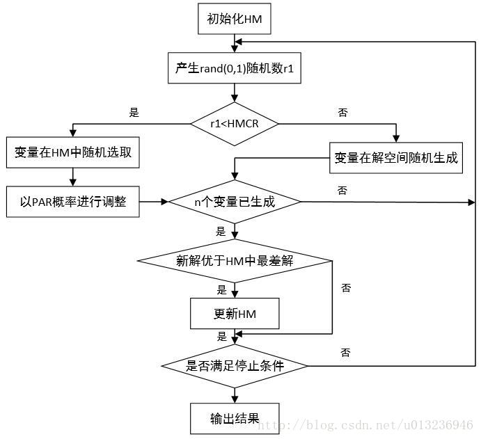
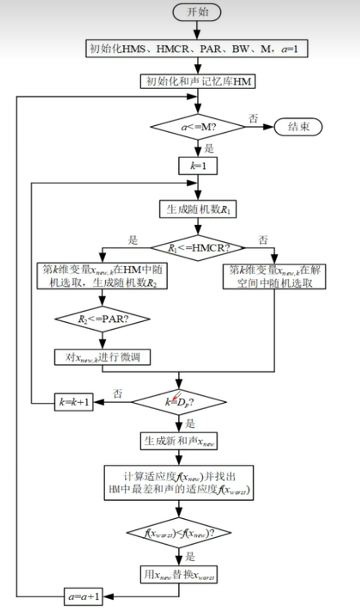


### 代码实现
这里我们以求目标值的根号为例：
```python showLineNumbers
import numpy as np


def objective_function(y, x):
    """目标函数"""
    return (y**2 - x) ** 2


def harmony_search(x, hms=10, hmcr=0.9, par=0.3, max_iter=1000):
    """_summary_
    hms: 和声记忆大小
    hmcr: 和声记忆更新概率
    par: 音调调整参数
    max_iter: 最大迭代次数
    """
    # 初始化Harmony Memory
    HM = np.random.uniform(0, x, hms)
    # 和声适应度
    HM_fitness = np.array([objective_function(y, x) for y in HM])

    for iteration in range(max_iter):
        # 生成一个随机数与和声记忆更新概率比较
        if np.random.rand() < hmcr:
            # 如果随机数小于hmcr，则从Harmony Memory中选择一个音调作为新音调
            new_harmony = np.random.choice(HM)
            # 并根据概率调整音调
            if np.random.rand() < par:
                # 调整音调
                new_harmony += np.random.uniform(-0.01, 0.01)
        else:
            # 如果随机数大于hmcr，则随机生成一个音调作为新音调
            new_harmony = np.random.uniform(0, x)

        new_fitness = objective_function(new_harmony, x)

        # 更新和声记忆如果有更好的和声
        if new_fitness < np.max(HM_fitness):
            worst_index = np.argmax(HM_fitness)
            HM[worst_index] = new_harmony
            HM_fitness[worst_index] = new_fitness

        if iteration % 100 == 0:
            best_harmony = HM[np.argmin(HM_fitness)]
            print(
                f"迭代次数 {iteration}, 最好的和声为: {best_harmony}, 适应度: {np.min(HM_fitness)}"
            )

    # 返回最好的和声
    best_harmony = HM[np.argmin(HM_fitness)]
    return best_harmony

x = 25
result = harmony_search(x)
print(f"对 {x} 开根的值为： {result}")
```
结果如下：

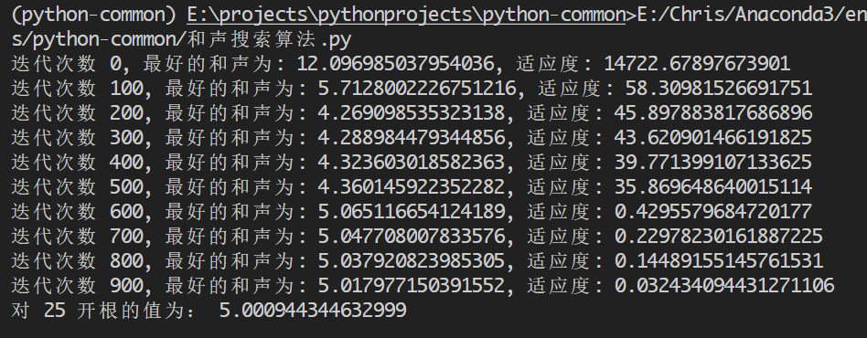

## 遗传算法

遗传算法（Genetic Algorithm, GA）是一种基于自然选择和遗传机制的优化算法和搜索算法。它模仿了生物进化的过程，通过“选择”、“交叉”和“变异”等操作来逐步优化问题的解。遗传算法在求解复杂问题、特别是那些难以通过传统算法解决的优化问题方面非常有效。

### 染色体

即一个解，由一系列基因组成。

### 种群

生成一组随机的初始解，称为种群，每个解称为个体（Individual）。

### 交叉

### 选择

根据适应度值选择一些个体作为父代，适应度高的个体被选择的概率更高。常用的方法有轮盘赌选择和锦标赛选择。

#### 轮盘赌选择

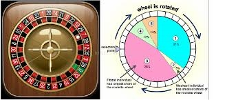

轮盘赌选择策略是适应度值越好的个体被选择的概率越大。在利用轮盘赌选择策略时，首先需要解决的是如何将适应度值转化为选择概率。具体步骤：

1. 累加种群的适应度值，并将累加值作为分母。
2. 将每个个体的适应度值作为分子，得到每个个体被选择的概率。
3. 归一化处理

#### 锦标赛选择

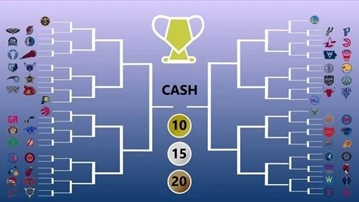

锦标赛方法选择策略每次从种群中取出一定数量个体，然后选择其中最好的一个进入子代种群。重复该操作，直到新的种群规模达到原来的种群规模。

### 变异

### 算法流程

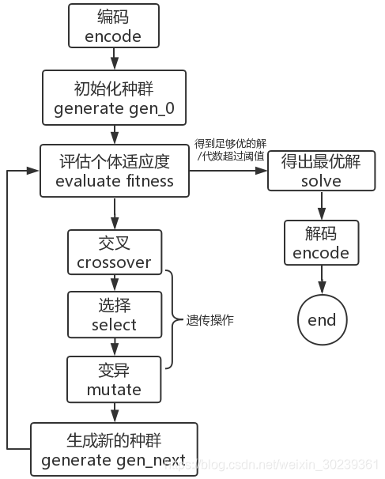

### 代码实现

## 强化学习

### 强化学习是什么？

强化学习是一种机器学习方法，旨在使智能体通过与环境的交互来学习最佳行为策略，以最大化某种奖励信号的累积

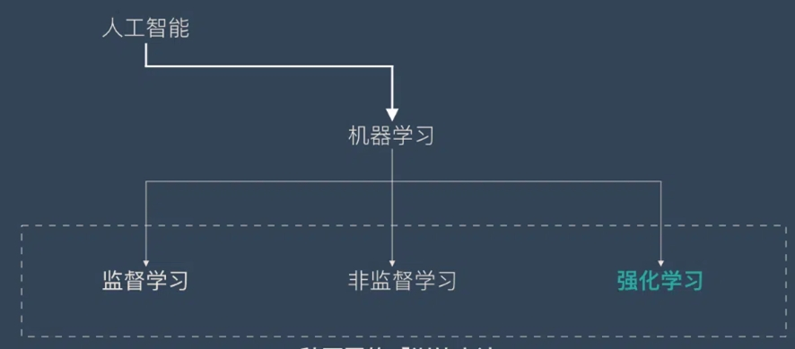

### 强化学习的核心组成

1. 环境（Environment）：强化学习问题所处的外部环境，包括状态空间、动作空间、奖励空间等。
2. 智能体（Agent）：在强化学习问题中，智能体是一个能够根据环境状态和奖励信号进行决策和动作选择的模型。
3. 策略（Policy）：智能体在环境中的行为策略，包括选择动作的规则和参数。
4. 价值函数（Value Function）：智能体在环境中的价值函数，用于评估不同状态和动作组合的预期奖励。

### 马尔可夫决策过程(MDP)

马尔可夫决策过程（Markov Decision Process，MDP）是描述强化学习问题的一种数学模型。在 MDP 中，智能体在环境中进行决策，并根据环境的反馈来更新自己的策略和价值函数。

#### 状态

#### 动作

#### 奖励

#### 状态转移概率

### Q-learning

Q-learning 是强化学习中的一种经典算法，用于解决马尔可夫决策过程（MDP）问题。Q-learning 通过学习来估计每个状态-动作对的 Q 值，从而选择最优的动作。它是一种基于值函数的学习方法，旨在学习一种策略，使得在给定状态下选择最优的动作。

该算法的核心思想是使用一个表格来存储每个状态-动作对的 Q 值，并根据 Q 值来选择动作。每次选择动作时，选择具有最大 Q 值的动作。

这里举一个机器人走路的例子，找到每一个点到终点的最短路径：

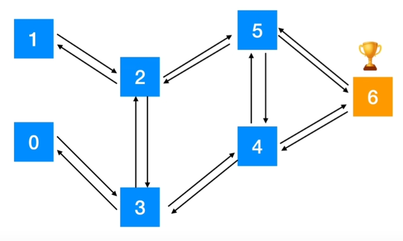

我们可以构建一个 r 表，来判断机器人在每一个点上说能做出的选择。

1. 如果能走，但是不是终点，则得 1 分。
2. 如果不能走，则得-1 分。
3. 如果能走，并且到达终点，则得到 100 分。

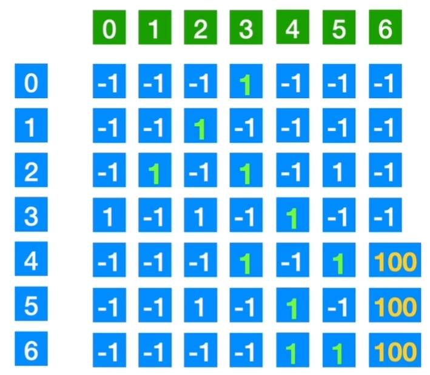

纵坐标为机器人所在的点，横坐标为机器人下一步可以走的点。即纵坐标为当前的状态，横坐标为下一个状态。关键的问题是如何评价机器人在一个状态 s（State）的时候，选择了某一个 a（Action）的好坏。所以我们需要构建 Q 值表，即表示在给定状态下采取特定动作所能获得的期望累积奖励。

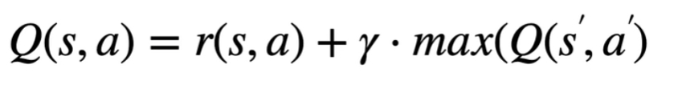

- Q（s,a）为 Q 值表的值
- r（s,a）为选择表的值
- γ 为自定义的贪婪参数，从后向前推，层数越多消耗的也就越多。
- Q（s’,a’）为到新状态后的 Q 值

例如，我们设置 γ 贪婪参数为 0.8,

1. Q(2,1)=r(2,1)+0.8*max(Q(1,`*`\))
2. Q(5,4) = r(5,4)+0.8*max(Q(5,`*`))

例子代码：
示例代码：

```python
import numpy as np

# 机器人的路径r表，从1到6
r = np.array([[-1,-1,-1,0,-1,-1,-1],
              [-1,-1,0,-1,-1,-1,-1],
              [-1,0,-1,0,-1,0,-1],
              [0,-1,0,-1,0,-1,-1],
              [-1,-1,-1,0,-1,0,100],
              [-1,-1,0,-1,0,-1,100],
              [-1,-1,-1,-1,0,0,100]])
r = np.matrix(r)
# 贪婪因子
gamma = 0.8
# Q表
q = np.zeros((7,7))
q = np.matrix(q)
# 开始训练出Q表
for i in range(1000):
    # 随机选择一个起始状态
    state = np.random.randint(0,6)
    while state != 6:
        # 可能的动作列表
        possible_actions = []
        # 找到所有可能的动作
        for action in range(7):
            if r[state,action] >= 0:
                possible_actions.append(action)
        # 随机选择一个动作
        action = possible_actions[np.random.randint(0,len(possible_actions))]
        # 更新Q表
        q[state,action] = r[state,action] + gamma * q[action].max()
        state = action
# 输出Q表
print(q)
# 选择一个起始状态
state = 1
# 选择一个动作表
action = np.argmax(q[state])
# 输出路径
path = []
path.append(state)
while action != 6:
    state = action
    action = np.argmax(q[state])
    path.append(state)
path.append(6)
print('机器人的路径为：',path)
```

所以得到的 Q 表的含义是机器人在 s 状态的时候，选择某个 a 时的好坏的评价指标。

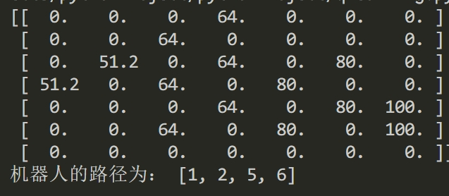

## 强化学习算法与启发式算法相结合


## 布局计算

### 约束函数

约束函数是 Facility Layout Problem 中的一个重要组成部分，它用于定义问题的约束条件。在 Facility Layout Problem 中，约束函数通常用于限制设施的位置和大小，以确保它们不重叠，并且不会超出指定的区域范围。

### 计算位置

```c
%%%返回位置关系%%%
function result = location(x2)
%距离关系矩阵
A=x2;
[~,m] = size(A);
%区域形状长宽
Zong=[22,11];
%各个小区域形状长宽
Ge=[4,2.5;  4,2;  2,2;   3,2;     3,2;
    7,2;    6,2;   6,2;   3,3;     3,3];
%分层位置
FenCeng=[];
%层高
CengGao=[];
cmax=0;
%各个区域中心位置
Weizhi=[];
%单层区块总长
changlist=[];
chang=1;
k=1;
for i=A
    if Ge(i,1)+chang>=Zong(1)
        FenCeng=[FenCeng,k];
        CengGao=[CengGao,cmax+1];
        changlist=[changlist,chang];
        chang=1;
        cmax=0;
        x=chang+Ge(i,1)/2;
        y=sum(CengGao)+Ge(i,2)/2;
        xy=[x,y];
        Weizhi=[Weizhi;xy];
    else
        x=chang+Ge(i,1)/2;
        y=sum(CengGao)+Ge(i,2)/2;
        xy=[x,y];
        Weizhi=[Weizhi;xy];
    end
    if k==m
        chang = chang + Ge(i,1) + 1;
        CengGao=[CengGao,cmax+1];
        changlist=[changlist,chang];
    end
    cmax = max(cmax,Ge(i,2));
    chang = chang + Ge(i,1) + 1;
    k=k+1;
end
%位置的蛇形变换
bh=1;%基数不变化，偶数变化
for j=1:m
    if ismember(j,FenCeng);
        bh=bh+1;
    end
    if mod(bh,2)==0
        newx=changlist(bh)-Weizhi(j,1);
        newy=Weizhi(j,2);
        Weizhi(j,:)=[newx,newy];
    end
end
result = Weizhi;
```

输入参数为 x2，x2 是设施序列。输出参数为 result，result 是位置关系矩阵。中间通过循环计算每个设施的位置坐标，并将计算结果存储在 Weizhi 中。最后将 Weizhi 赋值给 result。具体的计算过程为：

1. 遍历输入矩阵中的每个小区域
2. 检查当前的区域在放入之后会不会超过总长度，如果超过了则换层，并重新计算位置
3. 对每层的区域进行蛇形变换
4. 最后返回每个小区域的中心位置坐标

蛇形变换的效果：蛇形变换被用来调整小区域的位置，使得它们在整个大区域中更加紧凑地排列，从而更有效地利用了可用空间。

蛇形变换：
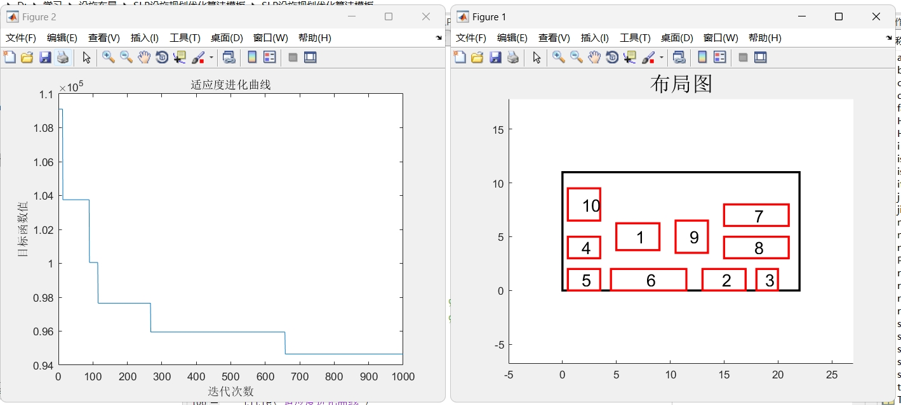
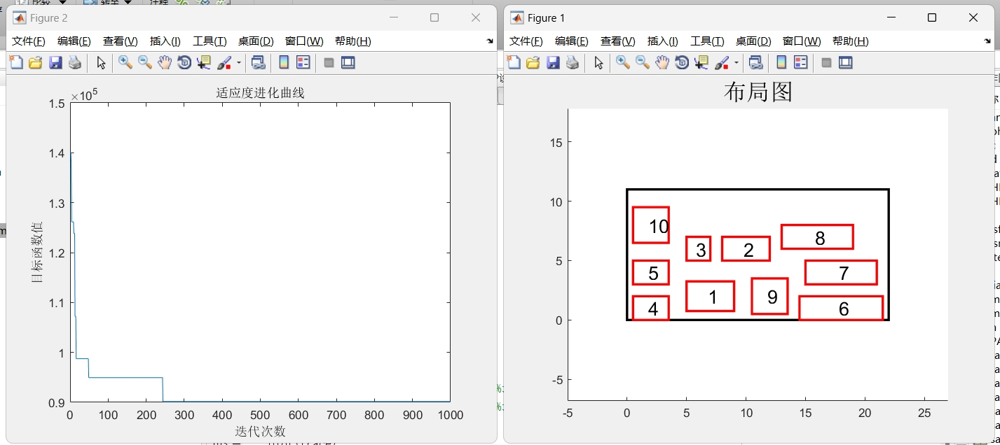

未蛇形变换
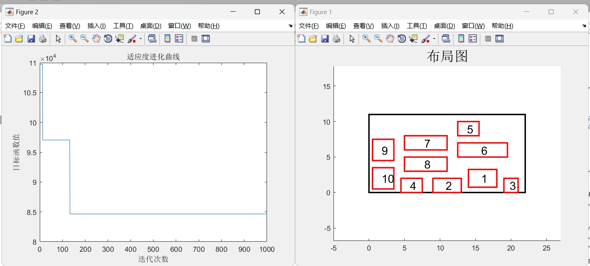
可以看到蛇形变换的效果：蛇形变换被用来调整小区域的位置，使得它们在整个大区域中更加紧凑地排列，从而更有效地利用了可用空间。

## 距离计算

```c {13} showLineNumbers
%%%返回距离从至矩阵%%%
function result = distance(x1, wz)%距离关系矩阵
[~,m] = size(x1);
A = x1;
%各个位置距离矩阵
Jvlibiao = [];
for i=1:m
    for j=1:m
        y1 = A==i;%元素1
        y2 = A==j;%元素2
        x1 = wz(y1,:);%y1（元素1）的位置坐标
        x2 = wz(y2,:);%y2（元素2）的位置坐标
        juli = abs(x1(1)-x2(1)) + abs(x1(2)-x2(2));
        Jvlibiao(i,j) = juli;
    end
end
result = Jvlibiao;
```

输入参数为 x1 和 wz，x1 是设施序列，wz 是每个设施的位置坐标。输出参数为 result，result 是距离关系矩阵。中间通过循环计算每两个设施之间的曼哈顿距离，并将计算结果存储在 Jvlibiao 中。最后将 Jvlibiao 赋值给 result。

## 运输成本（目标函数）

```c {19,21} showLineNumbers
%目标函数
function result = func1(x)
%位置调用
wz = location2(x);
%两区域间距离矩阵
Jvli = distance(x, wz);
%物流强度矩阵
Pinlv = [0, 2200, 0, 0, 0, 0, 0, 0, 0, 0;
         0, 0, 1100, 0, 0, 0, 0, 0, 0, 0;
         0, 0, 0, 900, 600, 0, 0, 0, 0, 0;
         0, 0, 0, 0, 0, 200, 0, 0, 0, 0;
         0, 0, 0, 0, 0, 3300, 0, 0, 0, 0;
         0, 0, 0, 0, 0, 0, 1800, 100, 0, 0;
         0, 400, 600, 0, 0, 0, 0, 0, 2000, 0;
         0, 0, 0, 0, 0, 0, 0, 0, 0, 800;
         0, 0, 0, 0, 0, 0, 0, 0, 0, 0;
         0, 0, 0, 0, 0, 0, 0, 0, 0, 0];
%最终物流强度矩阵
Zcb = Jvli .* Pinlv;
%最终物流强度
sumcb = sum(Zcb(:));
%返回目标函数结果
result = sumcb;
```

有了设施的布局位置，以及每个设施之间的曼哈顿距离，那么我们就可以计算所有的物流强度总和，物流强度等同于运输成本，即获得了我们的目标函数。

## 总体算法实现

我们先看总体的代码实现，如下：

```c
% 初始化
clear;                %清除所有变量
close all;                %清图
clc;                      %清屏
HMS=3;                    %和声库的大小
HMCR=0.2;                %直接随机生成新解概率
PAR=0.2;                  %微调概率
Tmax=1000;                 %创作次数
%矩阵大小
%m=15;
m=10;
% 和声记忆库初始化
X=zeros(HMS,m);
%随机生成初始和声库
for i=1:HMS
    for j=1:m
        X(i,:)=randperm(m);
    end
end
% 函数值
yfun=[func1(X(1,:)), func1(X(2,:)), func1(X(3,:))];
%yfun
[yBest,n]=min(yfun);
xBest=X(n,:);
% 迭代周期为Tmax
for iter=1:Tmax
   %%%以遗传方式产生新解%%%%
   % 新解以遗传方式产生
   father=X(round(rand()*(HMS-1))+1,:);
   mather=X(round(rand()*(HMS-1))+1,:);
   % 循环判断父本母本是否为同一个体，是则更换
   for i=1:5
       if father==mather
           mather=X(round(rand()*(HMS-1))+1,:);
       else
           break;
       end
   end
   jiaodian=randi([1,m]);%染色体交叉位点
   ranlf=father(1:jiaodian);%父本染色体左片段
   ranlm=mather(1:jiaodian);%母本染色体左片段
   ranrf=father(jiaodian+1:m);%父本染色体右片段
   ranrm=mather(jiaodian+1:m);%母本染色体右片段
   %交叉产生子代
   ism = ismember(mather, ranrf);
   mather = mather(~ism);
   san1=[mather,ranrf];
   isf = ismember(father, ranrm);
   father = father(~isf);
   san2=[father,ranrm];
   %子代适应度
   san=[san1;san2];
   sanfun=[func1(san(1,:)),func1(san(2,:))];
   %yfun
   [sanBest,t]=min(sanfun);
   xnew=san(t,:);
   % 以概率PAR进行变异
   if rand()<PAR
       [c,d]=size(xnew);
       u=randi([1,d]);
       v=randi([1,d]);
       bh=xnew(u);
       xnew(u)=xnew(v);
       xnew(v)=bh;
   end
   %%%遗传产生新解结束%%%
   if rand()<HMCR
       xnew = randperm(m);
   end
   % 计算新乐器组合的和声为ynew
   ynew=func1(xnew);
   % 更新和声库，判断新解是否比和声库中最差的解更好，是则替换
   [ylow,n]=max(yfun);
   for j=1:HMS
       if ynew<ylow
           X(j,:)=xnew;
           break;
       end
   end
   for j=1:HMS
       % 记录最美的和声
       if yBest>func1(X(j,:))
          yBest=func1(X(j,:));
          xBest=X(j,:);
       end
   end
   % 记录每个周期的最美和声
   trace(iter)=yBest;
   tracef(iter,:)=xBest;
   disp(iter);
end
% 绘制布局图
drawing(xBest,0);
% 绘制结果
disp('最优解：');
disp(xBest);                        %最好和声组合
trace(end)                          %最好和声
figure
plot(trace)
xlabel('迭代次数')
ylabel('目标函数值')
title('适应度进化曲线')
```

1. 首先是初始化，设定算法参数，包括和声库大小（HMS）、直接随机生成新解概率（HMCR）、微调概率（PAR）、创作次数（Tmax）等。
2. 然后计算初始解的目标函数值，选择最小的作为初始解。
3. 接下来是迭代过程，首先以遗传方式产生新解，然后以概率 PAR 进行变异，最后更新和声库，判断新解是否比和声库中最差的解更好，是则替换。
4. 每次迭代，记录每个周期的最美和声，并绘制适应度进化曲线。
5. 最后，绘制布局图，并输出最优解。

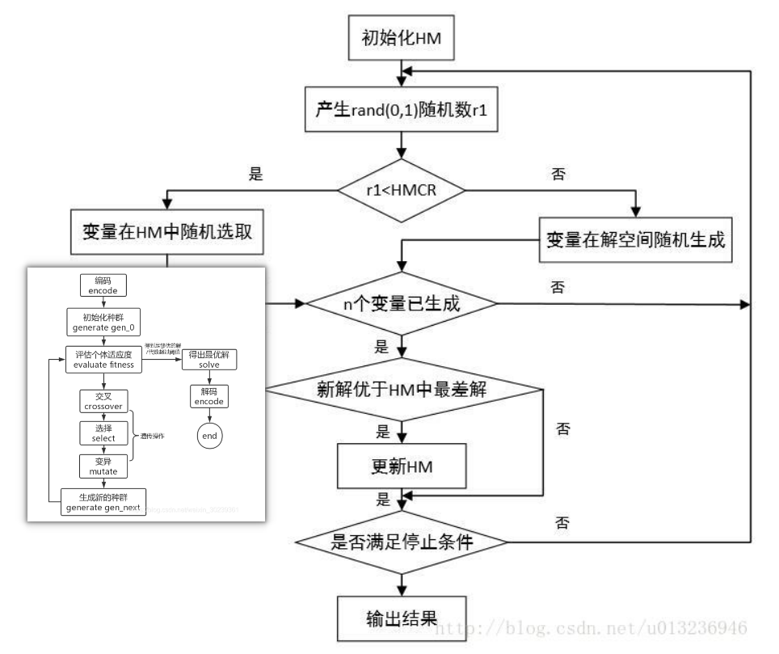

## 参考

[和声搜索算法](https://blog.csdn.net/u013236946/article/details/72722455)

[遗传算法](https://blog.csdn.net/LOVEmy134611/article/details/111639624)
