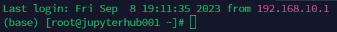

# 搭建开发环境
Anaconda官网：[Anaconda | The World’s Most Popular Data Science Platform](https://www.anaconda.com/)

Miniconda：[Miniconda Download](https://docs.conda.io/en/latest/miniconda.html)
## 安装MiniAnaconda
:::tip 提示

相比于Anaconda我更推荐Miniconda，因为Miniconda更加小巧，更加方便，新手可以使用Anaconda。

:::
官方安装文档：[Installing Miniconda](https://docs.conda.io/projects/miniconda/en/latest/miniconda-install.html)

清华镜像源：[清华镜像源Miniconda3](https://mirrors.tuna.tsinghua.edu.cn/anaconda/miniconda/)
```bash
curl -O https://repo.anaconda.com/miniconda/Miniconda3-latest-Linux-x86_64.sh
```

下载之后，赋予可执行权限

```shell
chmod +x ./Miniconda3-py39_4.12.0-Linux-x86_64.sh
```

一路按回车，要输入yes的时候输入即可，在要输入安装路径的时候可以安装到`/opt/module/miniconda3`,最后询问是否选择初始化，选择**yes**即可。

验证是否安装成功，重新进入终端，看是否有conda即可。


配置环境变量
```bash
export PATH=/opt/module/miniconda3/bin:$PATH
```

刷新环境变量`source /etc/profile`

:::tip 
**提示：** 参考，可以知道，如果要单用户使用的话，配置shell脚本在`/etc/profile.d`文件夹下，如果要多用户使用的话，则配置在`/etc/profile`文件中。
:::

:::warning 注意
如果没有出现(base)，可以使用`source ~/.bashrc` 命令来刷新`bashrc`即可。
或者在`/opt/module/miniconda3/bin`目录下使用`./conda init`执行一下，然后再退出重新进入即可 **(这个方法好用！！！)**
:::

## Conda常用命令
### 创建虚拟环境
``` bash
# 创建虚拟环境
conda create -n envname
# 在指定位置创建虚拟环境，这里需要管理员权限，所以使用管理员打开CMD
conda create --prefix E:\software\DevelopTools\Anaconda\envs\yoloenvs python=3.9
```
:::warning 注意
这里使用`conda create --prefix E:\software\DevelopTools\Anaconda\envs\yoloenvs python=3.9` 命令来创建虚拟环境，这个路径一定要在**现有的环境路径中**
:::

### 激活虚拟环境(切换环境)
```bash
conda activate your_env_name
```

### 删除指定的虚拟环境
```bash
conda remove -n your_env_name --all
```

### 退出虚拟环境
```bash
conda deactivate
```

### 查看虚拟环境
```bash
conda info --envs
```

### 查看当前环境
```bash
conda info --envs
```

### 复制虚拟环境
```bash
conda create -n your_new_env_name --clone your_env_name
```
### 退出虚拟环境
```bash
conda deactivate
```
    
`