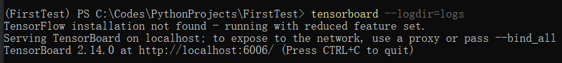
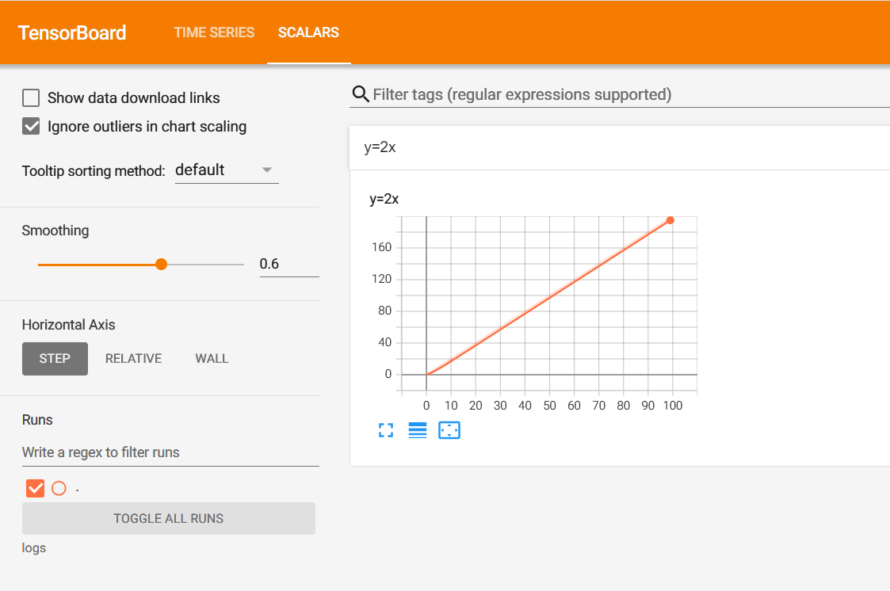

# TensorBoard的使用
用于显示数据图。

# 安装TensorBoard

```bash
pip install tensorboard
```

# 使用TensorBoard

```python
from torch.utils.tensorboard import SummaryWriter

writer = SummaryWriter('logs')
for i in range(10):
    writer.add_scalar('y=2x', 2*i, i)

writer.close()
```

会创建一个logs的文件夹，里面包含了TensorBoard的一些实现文件。

在conda的环境中执行tensorborad的启动命令

```bash
tensorboard --logdir=logs
```

运行成功！！！

使用Tensorboard加载图片

```python
from torch.utils.tensorboard import SummaryWriter
import numpy as np
from PIL import Image

writer = SummaryWriter('logs')
image_path = r'C:\Codes\PythonProjects\FirstTest\data\images\test.png'
img_PIL = Image.open(image_path)
# 转换成numpy数组
img_array = np.array(img_PIL)
writer.add_image("test", img_array, 1, dataformats='HWC')

writer.close()
```

* HWC：代表height，width，通道数
* 最后一定要加上`writer.close()` 否则输出无法显示出来
* 显示的图片对通道数有一定的要求，不能大于3