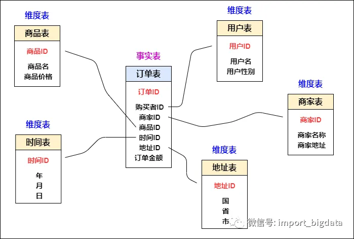
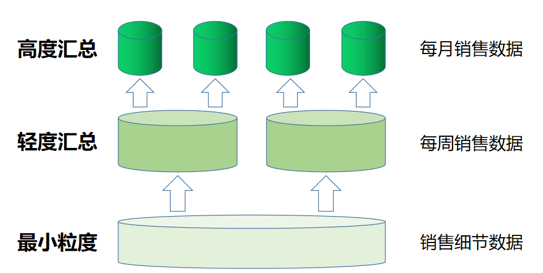
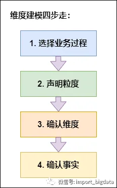

## OLTP VS XOLAP

### OLTP

### MOLAP

### ROLAP

### HOLAP

## 数仓分层

### 为什么要分层

数仓的每一层都有对应的作用，方便在使用时更好的定位与了解。

1. 数据追踪：清晰的知道数据之间的转换，更好的追踪问题
2. 减少重复开发：下游可以使用上游的数据，而无需重复开发获取
3. 复杂问题简单化：将任务拆解为多个步骤来完成

### 分为哪些层

#### ODS 层

#### DIM 层

#### DWD 层

#### DWS 层

#### ADS 层

## 数据模型建设

### 维度模型

维度建模就是一种组织数据仓库的形式、模型，用这种方式组织搭建的数据仓库，对快速支持数据分析有着巨大的帮助，目前也是比较主流的数仓模型。核心概念包括：

1. 事实表
2. 维度表
3. 粒度

### 事实表

事实表，我们按照最小粒度来理解其实就是一个行为，比如一个用户下了一个订单，这是一个下订单的行为，内容就包括了：订单 ID，用户 ID，商品 ID，商家 ID，时间，地址等信息。

### 维度表

维度表是事实表的一部分，用于补充和完善事实表，可以理解为事实表这个行为所发生的环境信息。

### 粒度

即数据仓库中保存的数据的细化的程度的级别。

### 维度建模的过程

维度建模四步走：

1. 选择业务过程，其实很好理解，数据仓库的建设是为了帮助管理层做决策，那么

## 基础概念

在数仓（数据仓库）建模中，ER 模型（实体-关系模型）和维度模型是两种常见的建模方法，用于表示和组织数据。下面分别介绍它们的基本概念：

1. **ER 模型（实体-关系模型）：**

   - **实体（Entity）：** 表示在数据仓库中要处理的事物或对象，通常对应于业务中的实际实体，如顾客、产品、订单等。
   - **关系（Relationship）：** 表示实体之间的联系或关联，它们描述了实体之间的关系，例如，一个订单实体与顾客实体之间可能存在关系。
   - **属性（Attribute）：** 是实体和关系的特征或属性，描述了它们的性质。例如，一个顾客实体可能有属性包括姓名、地址、电话号码等。

   ER 模型通过实体、关系和属性的组合来描述数据的结构，以及它们之间的关系。这种模型通常用于关系型数据库设计，采用实体、关系和属性的表达方式，例如，在关系型数据库中可以通过表来表示实体和关系。

2. **维度模型：**

   - **事实表（Fact Table）：** 包含业务度量（通常是数值型数据）的表。例如，销售额、数量等。事实表包含外键，链接到一个或多个维度表。
   - **维度表（Dimension Table）：** 包含描述事实表中数据的维度的表。维度是用于对数据进行分析的标签或分类，例如，时间、地理位置、产品等。
   - **指标（Measure）：** 是事实表中的数值型数据，它们是业务的度量，例如销售额、数量等。

   维度模型以星型或雪花型结构来表示，其中事实表位于中心，周围是连接到事实表的维度表。这种模型有助于快速查询和分析，因为它提供了明确的层次结构，可以轻松理解和使用。

总的来说，**ER 模型强调实体、关系和属性，用于设计关系型数据库的结构**；而**维度模型强调事实表、维度表和指标，用于建立适合分析和报表的数据结构**。在实际的数仓建模中，这两种模型可能结合使用，根据不同的需求选择合适的建模方法。

## ER 模型

## 数据库规范化

数据库规范化是使用一系列范式设计数据库（通常是关系型数据库）的过程，其目的是
减少数据冗余，增强数据的一致性。
这一系列范式就是指在设计关系型数据库时，需要遵从的不同的规范。关系型数据库的
范式一共有六种，分别是第一范式（1NF）、第二范式（2NF）、第三范式（3NF）、巴斯科德范式（BCNF）、第四范式(4NF）和第五范式（5NF）。遵循的范式级别越高，数据冗
余性就越低。

### 函数依赖

#### 完全函数依赖

通过 AB 能够得到 C，但是 AB 单独不能得到 C，则 C 完全依赖于 A 和 B。

例如：通过学号和课程可以确定成绩，但是学号和课程不能确定成绩，则成绩完全依赖于学号和课程。

#### 部分函数依赖

通过 AB 能够得到 C，并且 AB 单独也能得到 C，则 C 部分依赖于 A 和 B。

例如：通过学号和课程得到姓名，其实可以直接通过学号得到姓名，则姓名部分依赖于学号和课程。

#### 传递函数依赖

通过 A 能够得到 B，通过 B 能够得到 C，但是 C 得不到 A，则 C 传递依赖于 A。即 A->B->C，C!->A。

例如：通过学号能够得到姓名，通过姓名能够得到班级，但是通过班级不能得到学号，则班级传递依赖于学号。

### 第一范式

1NF 的核心原则就是：属性不可分割。

### 第二范式

2NF 的核心原则就是：不能存在“部分函数依赖”。

### 第三范式

3NF 的核心原则就是：不能存在“传递函数依赖”。

## 维度模型

### 事实表

事实表分为：

1. 事务事实表：记录业务中发生的事件，例如订单、交易等。
2. 周期快照事实表：记录某个时间点的数据，例如每日快照、每月快照等。
3. 累积快照事实表：记录某个时间点之前的累计数据，例如累计快照。

### 维度表
