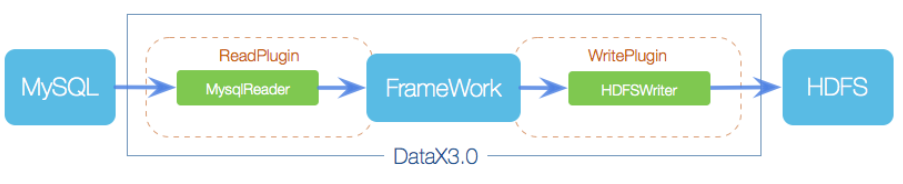
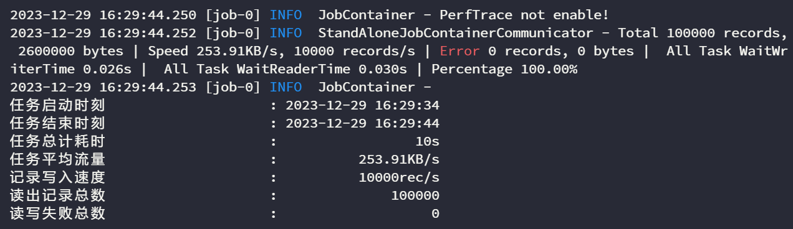
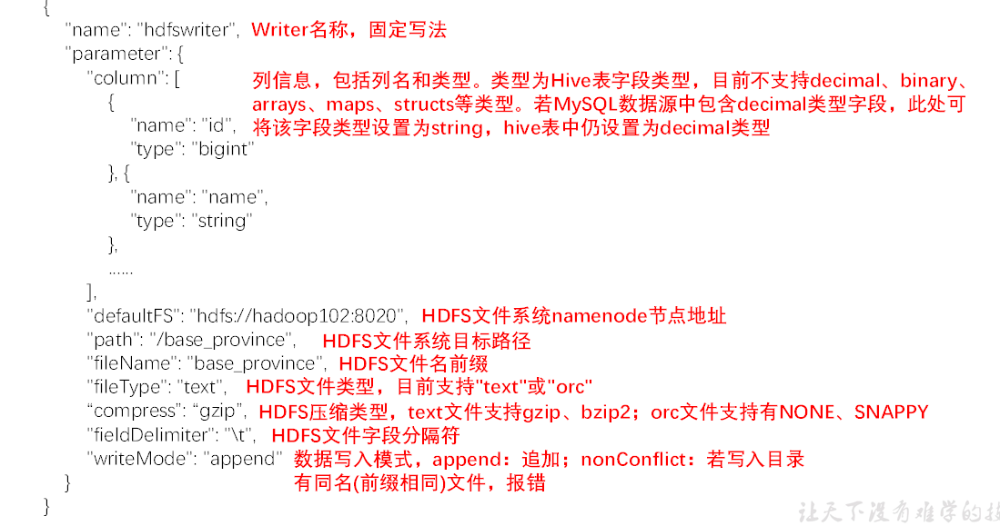
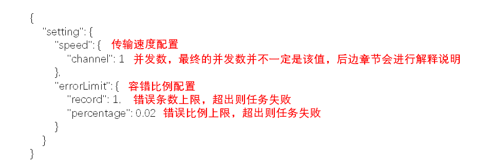

# DataX

## 参考

[GitHub - alibaba/DataX: DataX 是阿里云 DataWorks 数据集成的开源版本。](https://github.com/alibaba/DataX)

## 概念

DataX 是一个通用的数据同步框架，由阿里巴巴集团开发和使用。它旨在实现不同数据源之间的高效数据同步功能，包括 MySQL、Oracle、SqlServer、Postgre、HDFS、Hive、ADS、HBase、TableStore(OTS)、MaxCompute(ODPS)、DRDS 和 OceanBase 数据库等各种异构数据源[[1]](https://www.oceanbase.com/docs/enterprise-oceanbase-database-cn-10000000000362445)。

## DataX 核心架构

DataX 的设计理念是将数据源的同步抽象为 Reader 插件和 Writer 插件，通过 Framework 作为数据传输通道，实现数据的读取和写入。DataX 的插件体系非常丰富，支持主流的关系型数据库、NoSQL 数据库和大数据计算系统。


## 参数调优

### 空值处理

HFDS Writer 并未提供 nullFormat 参数：也就是用户并不能自定义 null 值写到 HFDS 文件中的存储格式。默认情况下，HFDS Writer 会将 null 值存储为空字符串（‘’），而 Hive 默认的 null 值存储格式为\N。所以后期将 DataX 同步的文件导入 Hive 表就会出现问题。

通俗点来说就是：**DataX 同步过来的数据，如果某列的值为 null，那么 HFDS Writer 会将该列存储为空字符串（‘’），而 Hive 默认的 null 值存储格式为\N。所以后期将 DataX 同步的文件导入 Hive 表就会出现问题。**

解决方案：
1. 修改 DataX的HFDS Writer 的配置，将 null 值存储为空字符串（‘’）。
2. 修改 Hive 表的配置，将 null 值存储为空字符串（‘’）。

**方法一：修改 DataX的HFDS Writer 的配置，将 null 值存储为空字符串（‘’）：**

- 修改DataX HDFS Writer 的源码，增加自定义的null值存储格式，参考[记Datax3.0解决MySQL抽数到HDFSNULL变为空字符的问题_datax nullformat-CSDN博客](https://blog.csdn.net/u010834071/article/details/105506580 "记Datax3.0解决MySQL抽数到HDFSNULL变为空字符的问题_datax nullformat-CSDN博客")

**方法二：修改 Hive 表的配置，将 null 值存储为空字符串（‘’）**
- 在Hive表中建表的时候指定null值的存储格式为空字符串''
```sql {12} showLineNumbers
DROP TABLE IF EXISTS base_province;
CREATE EXTERNAL TABLE base_province
(
    `id`         STRING COMMENT '编号',
    `name`       STRING COMMENT '省份名称',
    `region_id`  STRING COMMENT '地区ID',
    `area_code`  STRING COMMENT '地区编码',
    `iso_code`   STRING COMMENT '旧版ISO-3166-2编码，供可视化使用',
    `iso_3166_2` STRING COMMENT '新版IOS-3166-2编码，供可视化使用'
) COMMENT '省份表'
    ROW FORMAT DELIMITED FIELDS TERMINATED BY '\t'
    NULL DEFINED AS ''
    LOCATION '/base_province/';
```
## DataX的安装与配置
下载DataX的安装包：可以去[GitHub - alibaba/DataX: DataX是阿里云DataWorks数据集成的开源版本。](https://github.com/alibaba/DataX)找最新版来使用。
:::danger
如果使用老版本，则需要使用Python2版本，不太方便。
:::

下载DataX
```bash
curl -O https://datax-opensource.oss-cn-hangzhou.aliyuncs.com/202308/datax.tar.gz
```

将其移动到`/opt/software`下，然后解压到`/opt/module`中。

```bash
tar -zxvf datax.tar.gz -C /opt/module/
```

检查是否安装成功
```bash
python /opt/module/datax/bin/datax.py /opt/module/datax/job/job.json
```

显示如下的内容则运行成功


## DataX的使用
本质上就是用户只需要根据自己的需求根据**数据源**和**目的地**来选择相应的**Reader**和**Writer**，然后将Reader和Writer的信息配置到一个**Json**文件中，然后再提交数据同步任务即可。
```bash
python bin/datax.py <path/to/your/job.json>
```
### MYSQLReader
MySQLReader官方文档：[MysqlReader 插件文档](https://github.com/alibaba/DataX/blob/master/mysqlreader/doc/mysqlreader.md)

MySQLReader有两种模式，分别为**TableMode**和**QuerySQLMode**。

1. **TableMode**：使用table，column，where等属性声明需要同步的数据
2. **QuerySQLMode**，使用一条SQL语句声明需要同步的数据

### TableMode
配置文件如下
```json showLineNumbers
{
    "job": {
        "content": [
            {
                "reader": {
                    "name": "mysqlreader",
                    // 需要同步的数据表的参数
                    "parameter": {
                        // 同步的数据表的列
                        "column": [
                            "id",
                            "name",
                            "region_id",
                            "area_code",
                            "iso_code",
                            "iso_3166_2",
							"create_time",
							"operate_time"
                        ],
                        // 同步条件
                        "where": "id>=3",
                        "connection": [
                            {
                                "jdbcUrl": [
                                    "jdbc:mysql://hadoop102:3306/gmall?useUnicode=true&allowPublicKeyRetrieval=true&characterEncoding=utf-8"
                                ],
                                // 同步的数据表的名称
                                "table": [
                                    "base_province"
                                ]
                            }
                        ],
                        "password": "000000",
                        "splitPk": "",
                        "username": "root"
                    }
                },
                "writer": {
                    "name": "hdfswriter",
                    "parameter": {
                        "column": [
                            {
                                "name": "id",
                                "type": "bigint"
                            },
                            {
                                "name": "name",
                                "type": "string"
                            },
                            {
                                "name": "region_id",
                                "type": "string"
                            },
                            {
                                "name": "area_code",
                                "type": "string"
                            },
                            {
                                "name": "iso_code",
                                "type": "string"
                            },
                            {
                                "name": "iso_3166_2",
                                "type": "string"
                            },
                            {
                                "name": "create_time",
                                "type": "string"
                            },
                            {
                                "name": "operate_time",
                                "type": "string"
                            }
                        ],
                        "compress": "gzip",
                        "defaultFS": "hdfs://hadoop102:8020",
                        "fieldDelimiter": "\t",
                        "fileName": "base_province",
                        "fileType": "text",
                        "path": "/base_province",
                        "writeMode": "append"
                    }
                }
            }
        ],
        "setting": {
            "speed": {
                "channel": 1
            }
        }
    }
}
```
HDFS-Writer参数说明


seting参数说明

**提交任务**

:::warning
使用DataX向HDFS同步数据时，需**确保目标路径已存在**
:::

创建目标路径
```bash
hadoop fs -mkdir /base_province
```

进入DataX目录，并执行
```bash
cd /opt/module/datax
python bin/datax.py job/base_province.json
```
### QuerySQLMode
同样的也是编写`json`配置文件
```json
{
    "job": {
        "content": [
            {
                "reader": {
                    "name": "mysqlreader",
                    "parameter": {
                        "connection": [
                            {
                                "jdbcUrl": [
                                    "jdbc:mysql://hadoop102:3306/gmall?useUnicode=true&allowPublicKeyRetrieval=true&characterEncoding=utf-8"
                                ],
                                "querySql": [
                                    "select id,name,region_id,area_code,iso_code,iso_3166_2,create_time,operate_time from base_province where id>=3"
                                ]
                            }
                        ],
                        "password": "000000",
                        "username": "root"
                    }
                },
                "writer": {
                    "name": "hdfswriter",
                    "parameter": {
                        "column": [
                            {
                                "name": "id",
                                "type": "bigint"
                            },
                            {
                                "name": "name",
                                "type": "string"
                            },
                            {
                                "name": "region_id",
                                "type": "string"
                            },
                            {
                                "name": "area_code",
                                "type": "string"
                            },
                            {
                                "name": "iso_code",
                                "type": "string"
                            },
                            {
                                "name": "iso_3166_2",
                                "type": "string"
                            },
                            {
                                "name": "create_time",
                                "type": "string"
                            },
                            {
                                "name": "operate_time",
                                "type": "string"
                            }
                        ],
                        "compress": "gzip",
                        "defaultFS": "hdfs://hadoop102:8020",
                        "fieldDelimiter": "\t",
                        "fileName": "base_province",
                        "fileType": "text",
                        "path": "/base_province",
                        "writeMode": "append"
                    }
                }
            }
        ],
        "setting": {
            "speed": {
                "channel": 1
            }
        }
    }
}
```
### DataX传参
通常情况下，离线数据同步任务需要每日定时重复执行，<span style={{color:'red'}}>故HDFS上的目标路径通常会包含一层日期</span>，以对每日同步的数据加以区分，也就是说每日同步数据的目标路径不是固定不变的，因此DataX配置文件中HDFS Writer的path参数的值应该是动态的。为实现这一效果，就需要使用DataX传参的功能。

DataX传参的用法如下，在JSON配置文件中使用`${param}`引用参数，在提交任务时使用`-p"-Dparam=value"`传入参数值，具体示例如下。

在HDFSWriter中
```json {6} showLineNumbers
"compress": "gzip",
"defaultFS": "hdfs://hadoop102:8020",
"fieldDelimiter": "\t",
"fileName": "base_province",
"fileType": "text",
"path": "/base_province/${dt}",
"writeMode": "append"
```
先创建目标路径
```bash
hadoop fs -mkdir /base_province/2022-06-08
```
在DataX根目录下执行
```bash
python bin/datax.py -p"-Ddt=2022-06-08" job/base_province.json
```
## DataX配置文件生成器
在进行大数据项目的处理当中，datax经常用在每日的全量数据同步，那么针对于每一个表，我们都需要写一个json配置文件，而大型项目往往有许多的表，一个一个写显然效率非常的低下，所以我们可以做一个DataX的配置生成器，可以自动的生成我们需要的配置文件。

将生成器上传到`/opt/module/gen_datax_config`目录下，修改`configuration.properties`配置文件。

```properties showLineNumbers
mysql.username=root
mysql.password=000000
mysql.host=hadoop102
mysql.port=3306
mysql.database.import=gmall
# mysql.database.export=gmall
mysql.tables.import=activity_info,activity_rule,base_trademark,cart_info,base_category1,base_category2,base_category3,coupon_info,sku_attr_value,sku_sale_attr_value,base_dic,sku_info,base_province,spu_info,base_region,promotion_pos,promotion_refer
# mysql.tables.export=
is.seperated.tables=0
hdfs.uri=hdfs://hadoop102:8020
import_out_dir=/opt/module/datax/job/import
# export_out_dir=
```
- `mysql.username`：MySQL用户名
- `mysql.password`：MySQL密码
- `mysql.host`：MySQL主机地址
- `mysql.port`：MySQL端口号
- `mysql.database.import`：需要同步的MySQL数据库名
- `mysql.database.export`：需要导出的MySQL数据库名
- `mysql.tables.import`：需要同步的MySQL表名
- `mysql.tables.export`：需要导出的MySQL表名
- `is.seperated.tables`：是否需要分表同步，0表示不分表，1表示分表
- `hdfs.uri`：HDFS主机地址
- `import_out_dir`：同步数据的目标路径
- `export_out_dir`：导出数据的目标路径

运行生成器Jar包
```bash
java -jar datax-config-generator-1.0-SNAPSHOT-jar-with-dependencies.jar
```

观察结果是否生成，然后再测试生成的配置能否正常运行

```bash
ll /opt/module/datax/job/import
```


## 实操
### 同步MySQL数据到HDFS
数据源为MySQL，所以要使用MySQLReader
目的地为HDFS，所以使用HDFSWriter
