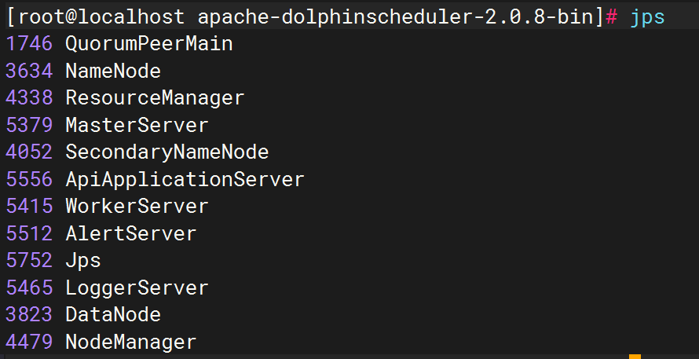

## 创建元数据库

```sql
CREATE DATABASE `dolphinscheduler` CHARACTER SET utf8mb4 COLLATE utf8mb4_general_ci;
```

## 配置一键部署脚本

```bash
vim /opt/module/apache-dolphinscheduler-2.0.8-bin/conf/config/install_config.conf
```

```properties
ips="localhost" # 集群所有机器的ip
masters="localhost" # 集群所有机器的master节点
workers="localhost:default" # 集群所有机器的worker节点
alertServer="localhost" # 集群所有机器的alertServer节点
apiServer="localhost" # 集群所有机器的apiServer节点
#　pythonGatewayServers="ds1"　＃　注释掉
installPath="/opt/module/dolphinscheduler" # 安装路径
deployUser="root" # 部署用户(需要sudo权限以及免密钥登录)
javaHome="/opt/module/jdk8" # 指定java路径
DATABASE_TYPE="mysql" # 指定数据库类型
SPRING_DATASOURCE_URL="jdbc:mysql://110.41.50.108:3306/dolphinscheduler?useSSL=false&allowPublicKeyRetrieval=true&serverTimezone=UTC" # 指定数据库连接
SPRING_DATASOURCE_USERNAME="root" # 指定数据库用户名
SPRING_DATASOURCE_PASSWORD="ar352878987" # 指定数据库密码
registryPluginName="zookeeper"
registryServers="localhost:2181" # 指定zookeeper连接集群地址
resourceStorageType="HDFS" # 指定资源存储类型，在运行中需要用到的文件资源
resourceUploadPath="/dolphinscheduler" # 指定资源上传路径
defaultFS="hdfs://localhost:8020" # 指定hdfs连接地址
resourceManagerHttpAddressPort="8088" # 指定resourceManager的http地址和端口
yarnHaIps="" # 没有启用HA，需要置空
singleYarnIp="localhost" # 指定yarn的ip
hdfsRootUser="root" # 指定hdfs的root用户
```

## 初始化数据库

使用 dolphinscheduler 自带的 sql 脚本初始化数据库，首先需要将 MySQL 驱动拷贝到 `lib` 目录下

```bash
/opt/module/apache-dolphinscheduler-2.0.8-bin/script/create-dolphinscheduler.sh
```

## 执行一键部署脚本

启动 Hadoop（HDFS 和 YARN）

```bash
hdfs-local start
```

启动 Zookerper

```bash
/opt/module/zookeeper/bin/zkServer.sh start
```

启动 DolphinScheduler

```bash
/opt/module/apache-dolphinscheduler-2.0.8-bin/install.sh
```



访问[http://192.168.10.100:12345/dolphinscheduler](http://192.168.10.100:12345/dolphinscheduler)

初始账号密码：admin/dolphinscheduler123

## 启停命令

一键启停

```bash
/opt/module/dolphinscheduler/bin/start-all.sh
/opt/module/dolphinscheduler/bin/stop-all.sh
```
