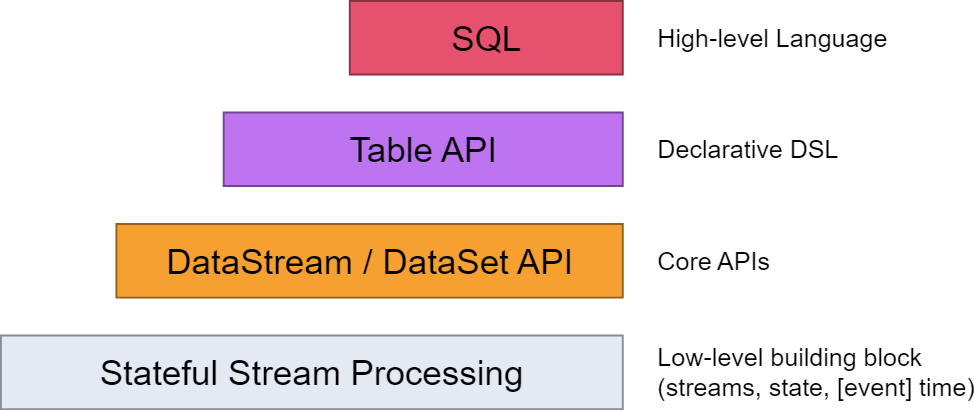
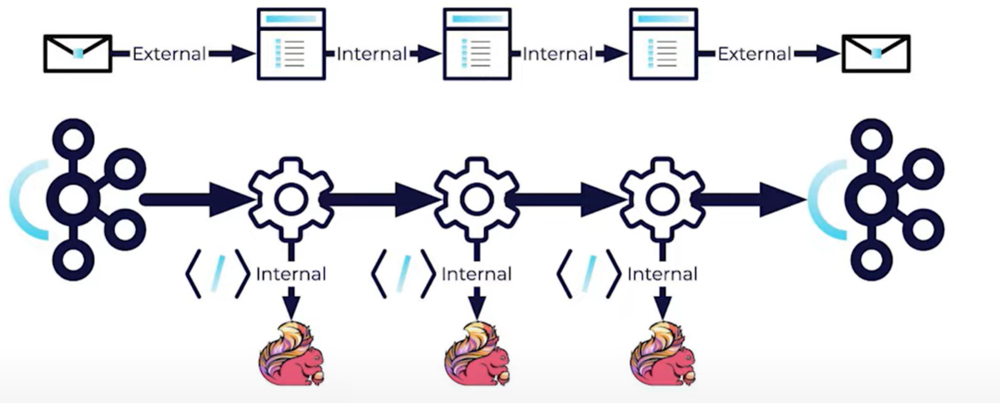
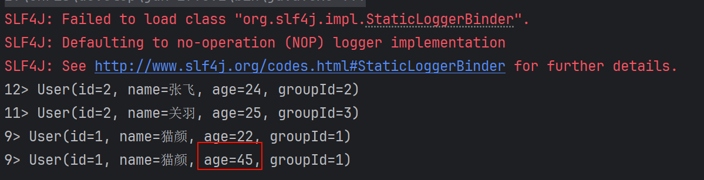
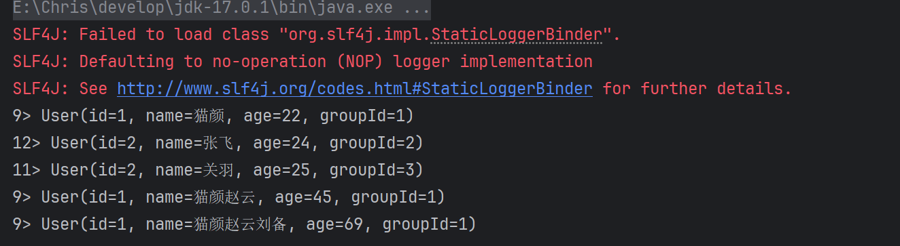
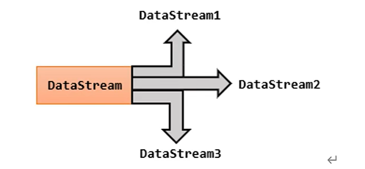

[Flink 面试题](https://www.cnblogs.com/crazymakercircle/p/17619152.html)

[Flink 核心概念大盘点](https://www.bilibili.com/video/BV18S4y1L7DU/)

[Flink 1.18 中文文档](https://nightlies.apache.org/flink/flink-docs-release-1.18/zh/)

## Flink 中的 API

Flink 为流式/批式处理应用程序的开发提供了不同级别的抽象。



- Table API 提供了更高的抽象级别。它是基于表的概念，允许用户以声明性的方式处理数据，类似于 SQL。用户可以使用 SQL-like 语法进行数据转换和分析，这使得复杂的数据处理操作更易于理解和实现。
- DataStream API 提供了更低的抽象级别，直接处理数据流（events）。它允许用户通过编程方式详细控制每个数据项的处理逻辑，适合于需要精细操作的场景。
- Table API 适用于结构化数据处理，特别是当处理逻辑可以用 SQL 表达式清晰表达时。它适合进行聚合、连接、过滤等操作。
- DataStream API 适用于需要对数据流进行详细处理的场景，如对数据流进行复杂的转换、自定义的窗口操作或需要处理时间特性的场景。

## Flink 的流式 API 的执行顺序

1. 创建执行环境
2. 定义数据源
3. 将数据源转换为数据流，即将数据源加载到环境中
4. 设置时间特性以及水位线
5. 对数据流进行转换操作（转换操作包括 map、flatMap、filter、keyBy、window、reduce、aggregate 等。可以对数据流进行分组、窗口化等操作。）
6. 定义数据流的处理逻辑
7. 定义输出
8. 触发执行

## Flink Data Source

官方文档：

[DataStream Connectors](https://nightlies.apache.org/flink/flink-docs-release-1.14/zh/docs/connectors/datastream/overview/)

[Data Sources](https://nightlies.apache.org/flink/flink-docs-release-1.14/zh/docs/dev/datastream/overview/#data-sources)

每个 Flink 数据流都以一个 Source（或可能多个）开始。这就是数据的由来。该数据可以通过**编程方式创建，可以从文件或数据库中读取，也可以来自 Apache Kafka 等流媒体平台**。根据源的性质，数据流可能是<span style={{color:'red',fontWeight:'bold'}}>有限的</span>，也可能是<span style={{color:'red',fontWeight:'bold'}}>无限的</span>。了解其中的差异对于在流中实现某些类型的操作非常重要。

一些比较基本的 Source 和 Sink 已经内置在 Flink 里，比如常见的基于文件，集合以及套接字，例子如下：

readTextFile(path) - 读取文本文件，例如遵守 TextInputFormat 规范的文件，逐行读取并将它们作为字符串返回。

```java
DataSource<String> stringDataSource = env.readTextFile("input/word.txt");
```

:::warning
但是 `readTextFile` 方法已经被弃用，现在新的 Source 架构推荐使用`FileSource`-->[FileSystem](https://nightlies.apache.org/flink/flink-docs-release-1.19/docs/connectors/datastream/filesystem/)
:::

readFile(fileInputFormat, path) - 按照指定的文件输入格式读取（一次）文件。

fromCollection(Collection) - 从 Java Java.util.Collection 创建数据流。集合中的所有元素必须属于同一类型。

fromElements(T ...) - 从给定的对象序列中创建数据流。所有的对象必须属于同一类型。

```java
DataSource<Integer> integerDataSource = env.fromElements(1, 2, 3, 4);
```

generateSequence(from, to) - 基于给定间隔内的数字序列*并行*生成数据流。

```java
 DataSource<Long> longDataSource = env.generateSequence(1, 10);
```

---

但是，当我们需要与第三方进行交互的时候，我们就需要使用到 DataStream Connectors 即数据流连接器。

### 数据生成器

Flink 从 1.11 开始提供了一个内置的 DataGen，用于生成一些随机数。

```java
        // 数据生成器
DataGeneratorSource<String> source =
        new DataGeneratorSource<>(
                index -> "String" + index,
                10,
                RateLimiterStrategy.perSecond(1),
                Types.STRING
        );
```

也可以使用这种写法

```java
DataGeneratorSource<String> source =
                new DataGeneratorSource<>(
                        new GeneratorFunction<Long, String>() {
                            @Override
                            public String map(Long aLong) throws Exception {
                                return "Number" + aLong;
                            }
                        },
                        10,
                        RateLimiterStrategy.perSecond(1),
                        Types.STRING
                );
```

- 第一个参数是`GeneratorFunction`方法，重写了 map 方法。
- 自增的范围
- 限速策略，比如每秒生成几条数据
- 返回类型

### 文件数据源

首先我们需要添加依赖：

```xml
<dependency>
    <groupId>org.apache.flink</groupId>
    <artifactId>flink-connector-files</artifactId>
    <version>1.19.0</version>
</dependency>
```

:::warning
1.19.0 似乎镜像没有更新，所以我先使用的是 1.18.1 版本
:::

```java
FileSource<String> source  = FileSource.forRecordStreamFormat(
                new TextLineInputFormat(),
                new Path("input/word.txt")
        ).build();
```

### Kafka 数据源

```java

```

:::warning
对于第三方生成的数据，例如数据生成器，文件以及 Kafka，生成的都是第三方的数据源，我们需要通过`env.fromSource`方法来加载之后，才能得到 flink 可以使用的数据源。
:::

## Flink 序列化

Flink 的序列化包含两种，分别是外部序列化和内部序列化。



- 当数据被拉入流，并从另一端推出的时候，有可能在中间使用了外部的系统，所以对象正在被外部系统使用，即为外部序列化。
- 但是当数据在 Flink 的算子之间传输的时候，也需要将其序列化，此时即为内部序列化。

如果一个类满足旧 Java 对象（POJO）的标准，那么 Flink 将会更有效的方式序列化它。

POJO 定义标准：

1. 类是公共的`public`
2. 要有默认构造函数
3. 所有的字段必须是公共的，或者有 getter 和 setter 方法。
4. 要有一个合适的序列化器。

否则，Flink 将会使用较慢的`Kryo`序列化器，可能使得性能降低 75%。可以通过序列化器注册自己的类型来改进`Kryo`序列化，但是仍然比不上 POJO 序列化器。

当然也可以禁用`kryo`序列化器，需要确保数据类型符合 POJO 要求，或者使用自定义的序列化器，一般使用`Avro`序列化器。

## 基本算子

### Map

Map 转换算子，接收一个元素，并返回一个元素。有三种写法，分别是使用匿名实现类，或者使用 lambda 表达式，也可以自定义一个自己的 MapFunction，然后使用我们自己的 Function 来对数据进行处理。

```java
// 数据处理
SingleOutputStreamOperator<String> map = datasource.map(new MapFunction<String, String>() {
    @Override
    public String map(String s) throws Exception {
        return "Number:" + s;
    }
});
SingleOutputStreamOperator<String> map1 = datasource.map(new MyMapFunction());
map1.print();
```

或者使用 lambda 表达式

```java
DataStream<String> map = source.map(s -> s.toUpperCase());
```

使用自己的 MapFunction，定义一个类`MyMapFunction`

```java
public class MyMapFunction implements MapFunction<String, String> {
        @Override
        public String map(String s) throws Exception {
            return "Number::" + s;
        }
    }
```

```java
SingleOutputStreamOperator<String> map = datasource.map(new MyMapFunction());
```

### Filter

fliter 转换算子，对每一个数据进行判断，为 true 则正常输出，为 false 则元素被过滤掉。

```java
// 数据过滤
        SingleOutputStreamOperator<String> filteredData = datasource.filter(new FilterFunction<String>() {
            @Override
            public boolean filter(String s) throws Exception {
                if (Long.parseLong(s) % 2 == 0) {
                    return true;
                } else {
                    return false;
                }
            }
        });
```

### FlatMap

扁平映射，将数据流中的整体拆分为一个个的个体使用，一进多出。它与 map 算子的主要区别在于 map 每次处理一个元素，产生一个元素；而 flatMap 可以从每个输入元素产生任意多个输出元素（包括零个）。

例如如下的例子：将一个字符串拆分为一个一个一个的单词，使用 flatMap 算子。

```java
// 创建数据源
DataStreamSource<String> dataSource = env.fromElements("Hello,World", "Hello,Flink");
// 处理数据
    SingleOutputStreamOperator<String> words = dataSource.flatMap(new FlatMapFunction<String, String>() {
    @Override
    public void flatMap(String s, Collector<String> collector) throws Exception {
        for (String word : s.split(",")) {
            collector.collect(word);
        }
    }
});
// 打印数据
words.print();
```

:::tip
FlatMap 使用`Collector`来收集数据，调用几次就输出几条。
:::

## 聚合算子

### 分区与分组

分组（Grouping）和分区（Partitioning）是处理数据流时常用的两种不同的操作，它们在数据处理中扮演着不同的角色。下面简要介绍它们的区别：

**分区：**

1. 分区是指在分布式数据处理环境中，根据数据的特定属性（如键值）将数据分散到不同的计算节点上进行处理的一种方式。这主要用于优化数据处理的并行度和效率。
2. 分区操作将数据物理上分散到不同的节点上，可以使得数据的处理在不同节点上并行进行，从而提高数据处理的速度和效率。
3. 在 Flink 的流处理 API 中，数据流的分区通过 partitionBy 方法或其他方法如 rebalance、rescale 等进行设置。

**分组：**

1. 分组通常用于数据集或数据流的批处理中，它按照某个或某些键（Key）将数据分组，以便对这些分组后的数据进行聚合操作（如求和、求平均值等）。
2. 分组操作会在数据上引入一个逻辑上的分界，让具有相同键值的数据项集中到一起，使得后续操作可以在这些集中的数据项上进行。

### KeyBy

可以通过 KeyBy 关键字对数据进行重新分区，分区之后分配到对应的子任务当中。

```java
DataStreamSource<User> userDataStreamSource = env.fromElements(
        new User(1, "猫颜", 22, 1),
        new User(1, "赵云", 23, 1),
        new User(2, "张飞", 24, 2),
        new User(2, "关羽", 25, 3)
)
// KeyBy分组
 KeyedStream<User, Integer> userIntegerKeyedStream = userDataStreamSource.keyBy(new KeySelector<User, Integer>() {
     @Override
    public Integer getKey(User user) throws Exception {
        return user.getGroupId();
    }
 });
```

keyBy 的语法即，使用一个`KeySelector`重写其中的 getKey 方法，来设定每个字段的 Key 是怎么来的，然后根据这个 Key 来进行分区。

#### KeyBy 底层实现原理

KeyBy 得到的数据类型是键控流（KeyedStream）所以泛型有两个类型，分别是数据类型以及 Key 的类型。

KeyBy 底层通过**对 Key 的值进行 Hash，再做一次 mumurHash，取模运算，再通过 Job 的并行度**，就可以知道每个 Key 应该分配到哪个子任务当中了。

### 简单聚合

:::warning
简单聚合算子只有在 keyBy 之后才能使用，否则会报错。
:::

```java
// 创建DataStream。这里只是一个例子，实际上数据可能来自文件、数据库或消息队列等。
DataStreamSource<User> userDataStreamSource = env.fromElements(
        new User(1, "猫颜", 22, 1),
        new User(1, "赵云", 23, 1),
        new User(2, "张飞", 24, 2),
        new User(2, "关羽", 25, 3)
);

// KeyBy分组
KeyedStream<User, Integer> userIntegerKeyedStream = userDataStreamSource.keyBy(new KeySelector<User, Integer>() {
    @Override
    public Integer getKey(User user) throws Exception {
        return user.getGroupId();
    }
});
// 聚合
SingleOutputStreamOperator<User> age = userIntegerKeyedStream.sum("age");
```

输出如下：



### Reduce 规约聚合

用于将数据流中的元素组合成单一的结果。该操作通常在 KeyedStream 上执行，意味着数据会首先根据某个键进行分组。reduce 操作会对每个键对应的分组内的元素进行规约，通常用于计算总和、最大值、最小值等聚合操作。reduce 函数通过两个同类型的输入元素返回一个同类型的单个结果元素，这个过程会不断重复，直到每个分组中的所有元素被规约为一个元素。

:::tip

1. 通常在 KeyedStream 上执行，即在 KeyBy 后。
2. 输入和输出都是同一个类型。
   :::

```java
// 创建DataStream。这里只是一个例子，实际上数据可能来自文件、数据库或消息队列等。
DataStreamSource<User> userDataStreamSource = env.fromElements(
        new User(1, "猫颜", 22, 1),
        new User(1, "赵云", 23, 1),
        new User(1, "刘备", 24, 1),
        new User(2, "张飞", 24, 2),
        new User(2, "关羽", 25, 3)
);

// KeyBy分组
KeyedStream<User, Integer> userIntegerKeyedStream = userDataStreamSource.keyBy(new KeySelector<User, Integer>() {
    @Override
    public Integer getKey(User user) throws Exception {
        return user.getGroupId();
    }
});
// Reduce聚合
SingleOutputStreamOperator<User> reduce = userIntegerKeyedStream.reduce(new ReduceFunction<User>() {
    @Override
    public User reduce(User user, User t1) throws Exception {
        return new User(user.getGroupId(), user.getName() + t1.getName(), user.getAge() + t1.getAge(), user.getGroupId());
    }
});
// 打印结果
reduce.print();
```

输出结果如下：


其实实现的思想即传递进去两个参数，然将这两个参数进行合并，然后返回合并后的结果，并且将这个过程不断重复于每一个分组中的元素。

## 分区

分区数量，我们可以通过 env.setParallelism(num)来设置分区数量。

分区（partition）是 Flink 中数据流的一个基本概念。它用于将数据流划分为多个子流（substreams），每个子流可以并行处理，以提高数据处理的效率。

在 Flink 中有如下几种分区方式：

1. 随机分区（shuffle()）
2. 轮询分区（rebalance()）:如果是数据倾斜的场景，当数据源进来之后，可以使用 rebalance()来解决数据源倾斜问题。
3. 缩放分区（rescale()）
4. 广播（broadcast()）

### 自定义分区

可以通过`partitionCustom()`方法来自定义自己的分区策略。如下，自定义一个自己的分区器：

#### 自定义分区器

通过继承自`Partitioner`类，重写`partition(K key, int numPartitions)`方法来实现自定义的分区。其中的两个字段很好理解：

- key：数据的 Key，就比如前面分组中的 KeyBy 中的 KeySelecter，来选择 Key。
- numPartitions：分区数，即有多少个分区，可以通过`env.setParallelism`来设置。

我们来举个例子，使用数据生成器，生成 1-10 作为数据源，然后使用其值作为 Key，使用 3 个分区，将其均匀的分到 3 个分区中。

首先来看环境搭建以及数据生成器：

```java
// env
StreamExecutionEnvironment env = StreamExecutionEnvironment.getExecutionEnvironment();
env.setParallelism(3);
// 创建数据源
// 数据生成器
DataGeneratorSource<String> source =
        new DataGeneratorSource<>(
                new GeneratorFunction<Long, String>() {
                    @Override
                    public String map(Long aLong) throws Exception {
                        return String.valueOf(aLong);
                    }
                },
                10,
                RateLimiterStrategy.perSecond(1),
                Types.STRING
        );

DataStreamSource<String> dataGen = env.fromSource(source, WatermarkStrategy.noWatermarks(), "DataGen");
```

然后我们需要自定义一个分区器，将 key 转换为整数，然后再对分区数进行取余操作，即可得到分区结果。

```java
public class MyPartitioner implements Partitioner<String> {

    @Override
    public int partition(String key, int numPartitions) {
        return Integer.parseInt(key) % numPartitions;
    }
}
```

然后我们需要使用我们的自定义分区器，以及设置 key 选择器：

```java
dataGen.partitionCustom(new MyPartitioner(), new KeySelector<String, String>() {
            @Override
            public String getKey(String value) throws Exception {
                return value;
            }
        }).print();
```

## 分流



### 简单分流

使用 filter 过滤器进行筛选，本质上是是将原始数据流 stream 复制多份，然后对每一份分别做筛选。

```java
public static void main(String[] args) throws Exception {
    // env
    StreamExecutionEnvironment env = StreamExecutionEnvironment.getExecutionEnvironment();

    // 创建数据源
    // 数据生成器
    DataGeneratorSource<Long> source =
            new DataGeneratorSource<>(
                    new GeneratorFunction<Long, Long>() {
                        @Override
                        public Long map(Long aLong) throws Exception {
                            return aLong;
                        }
                    },
                    10,
                    RateLimiterStrategy.perSecond(1),
                    Types.LONG
            );

    DataStreamSource<Long> dataGen = env.fromSource(source, WatermarkStrategy.noWatermarks(), "DataGen");
    SingleOutputStreamOperator<Long> filter = dataGen.filter(x -> x % 2 == 0);
    SingleOutputStreamOperator<Long> filter1 = dataGen.filter(x -> x % 2 == 1);

    filter.print("偶数");
    filter1.print("奇数");

    env.execute("ShuntDemo");
}
```

### 侧输出流

## Sink

## Window 窗口

概念：Flink 是一种流式计算引擎，主要是来处理无界数据流的，数据源源不断、无穷无尽。想要更加方便高效地处理无界流，一种方式就是将无限数据切割成有限的“数据块”进行处理，这就是所谓的“窗口”（Window）。

## 窗口的分类

### 驱动类型

窗口是截取有界数据的一种方式，那么我们以什么样的标准来定义**开始和结束**呢？这就叫做窗口的驱动类型。

#### 时间窗口

按照时间来定义窗口的开始与结束。

#### 计数窗口

按照数据条数来定义窗口的开始与结束。

### 按照窗口分配数据的规则

#### 滚动窗口

#### 滑动窗口

#### 会话窗口

#### 全局窗口

## 窗口函数 API

可以分为**按键分区**和**非按键分区**：

- 按键分区：将数据流按照 Key 进行分区，然后对 KeyedStream 来开窗，就是对每一个 key 上都定义了一组窗口，各自进行独立的计算。
- 非按键分区：可以理解为只有一个组，即一个分区，然后在这一个分区上进行开窗。使用`windowAll`方法。

即在调用窗口函数前是否有 KeyBy 操作。

窗口函数的操作主要有两个部分：

- 窗口分配器（Window Assigner）
- 窗口函数（Window Function）

```java
stream.keyBy(keySelector)
    .window(windowAssigner)
    .aggregate(windowFunction)
```

## 窗口分配器

窗口分配器就是在指定窗口的类型，定义数据应该被分配到哪个窗口。

**滚动处理时间窗口**

```java
TumblingEventTimeWindows.of(Duration.ofSeconds(5))
```

:::tip
老版本使用的是`Time.seconds(5)`，而新版本使用的是`Duration.ofSeconds(5)`。
:::

## 窗口函数

使用窗口分配器来将数据聚合起来，使用窗口函数来对聚合的数据进行计算。

### 增量聚合 Reduce

`reduce`聚合是作用在整个数据流的元素上，用户需要自定义的规约函数来进行聚合操作。在处理无限流的时候，我们需要先使用窗口进行拆分，再使用`Reduce`进行聚合。

```java
    public static void main(String[] args) throws Exception {
        // env
        StreamExecutionEnvironment env = StreamExecutionEnvironment.getExecutionEnvironment();
        // 创建DataStream。这里只是一个例子，实际上数据可能来自文件、数据库或消息队列等。
        DataStreamSource<User> userDataStreamSource = env.fromElements(
                new User(1, "猫颜", 22, 1),
                new User(1, "赵云", 23, 1),
                new User(1, "刘备", 24, 1),
                new User(2, "张飞", 24, 2),
                new User(2, "关羽", 25, 3)
        );

        // KeyBy分组
        KeyedStream<User, Integer> userIntegerKeyedStream = userDataStreamSource.keyBy(new KeySelector<User, Integer>() {
            @Override
            public Integer getKey(User user) throws Exception {
                return user.getGroupId();
            }
        });
        // Reduce聚合
        SingleOutputStreamOperator<User> reduce = userIntegerKeyedStream.reduce(new ReduceFunction<User>() {
            @Override
            public User reduce(User user, User t1) throws Exception {
                return new User(user.getGroupId(), user.getName() + t1.getName(), user.getAge() + t1.getAge(), user.getGroupId());
            }
        });
        // 打印结果
        reduce.print();

        // 执行任务
        env.execute();
    }
```

### 增量聚合 Aggregate

Reduce 聚合的问题是：就是聚合状态的类型、输出结果的类型都必须和输入数据类型一样。而`aggregate`聚合就突破了这个限制，

## 处理函数

处理函数的背景：

处理函数的使用：基于 DataStream 调用`process`方法，并传入`ProcessFunction`对象作为参数。

### 基本处理函数

#### ProcessFunction

### 窗口处理函数

窗口处理函数是基于`WindowedStream`直接调用即可。


## 总结与提问

### Flink 的模型是什么样的？

Source->Transformation->Sink

从数据流开始，经过数据转换，再输出即可。

### Flink 的并行度是什么？怎么设置？

[并行执行](https://nightlies.apache.org/flink/flink-docs-master/zh/docs/dev/datastream/execution/parallel/)

在 Flink 中，"并行度"（Parallelism）是指 Flink 任务执行时，能够并行运行的算子（例如，map、reduce 等）或任务实例的数量。

全局并行度：在执行环境上设置并行度

```java
StreamExecutionEnvironment env = StreamExecutionEnvironment.getExecutionEnvironment();
env.setParallelism(10); // 设置全局并行度为10
```

算子级别并行度：为特定的算子设置并行度

```java
DataStream<String> text = env.readTextFile("path/to/text");
text.flatMap(new MyFlatMapFunction())
    .setParallelism(5); // 为这个flatMap算子设置并行度为5
```

配置文件设置：在`flink-conf.yaml`配置文件中设置

```yaml
parallelism.default: 10
```

命令提交设置：在命令行提交任务时，使用`-p`参数来设置并行度

```bash
$ bin/flink run -p 10 examples/streaming/WordCount.jar
```

### 三中时间语意是什么？分别的应用场景

- Event Time：这是实际应用最常见的时间语义，指的是事件创建的时间，往往跟 watermark 结合使用。
- Processing Time：指每一个执行基于时间操作的算子的本地系统时间，与机器相关。适用场景：没有事件时间的情况下，或者对实时性要求超高的情况
- Ingestion Time：指数据进入 Flink 的时间。适用场景：存在多个 Source Operator 的情况下，每个 Source Operator 可以使用自己本地系统时钟指派 Ingestion Time。后续基于时间相关的各种操作， 都会使用数据记录中的 Ingestion Time

## 案例

### 简单的自定义水位线+窗口

```java
    public static void main(String[] args) throws Exception {
        // env
        StreamExecutionEnvironment env = StreamExecutionEnvironment.getExecutionEnvironment();
        // socket数据流
        DataStreamSource<String> stringDataStreamSource = env.socketTextStream("110.41.50.108", 9000);

        // 自定义水位线生成策略
        WatermarkStrategy<String> stringWatermarkStrategy = WatermarkStrategy.<String>forMonotonousTimestamps().withTimestampAssigner(new SerializableTimestampAssigner<String>() {
            @Override
            public long extractTimestamp(String element, long recordTimestamp) {
                System.out.println("数据=" + element + ",时间戳=" + recordTimestamp);
                return Integer.parseInt(element);
            }
        });
        // 数据流应用水位线生成策略
        SingleOutputStreamOperator<String> stringSingleOutputStreamOperator = stringDataStreamSource.assignTimestampsAndWatermarks(stringWatermarkStrategy);

        // 滑动窗口
        AllWindowedStream<String, TimeWindow> stringTimeWindowAllWindowedStream = stringSingleOutputStreamOperator.windowAll(TumblingEventTimeWindows.of(Duration.ofSeconds(5)));

        // 计算
        SingleOutputStreamOperator<String> reduce = stringTimeWindowAllWindowedStream.reduce(
                (s, s2) -> s + "," + s2
        );
        // 打印
        reduce.print();

        // 执行任务
        env.execute();
    }
```
