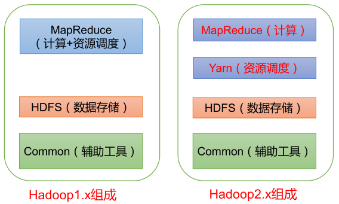
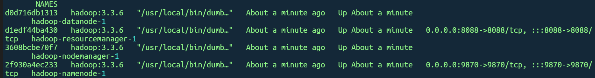
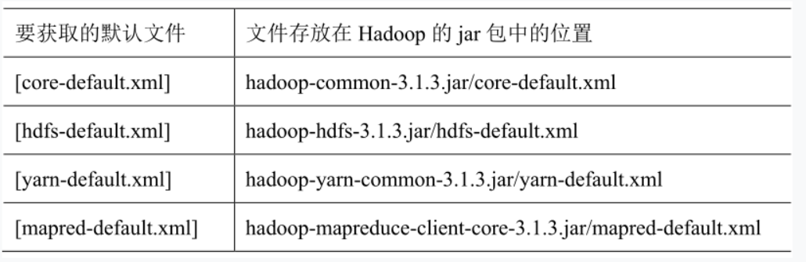
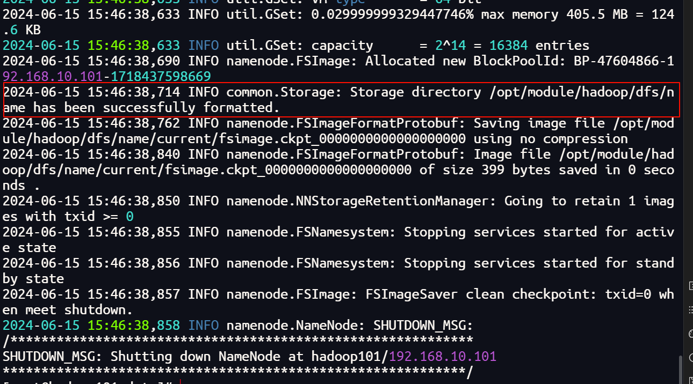
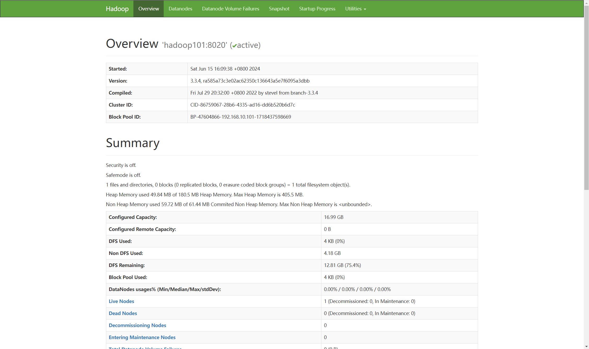
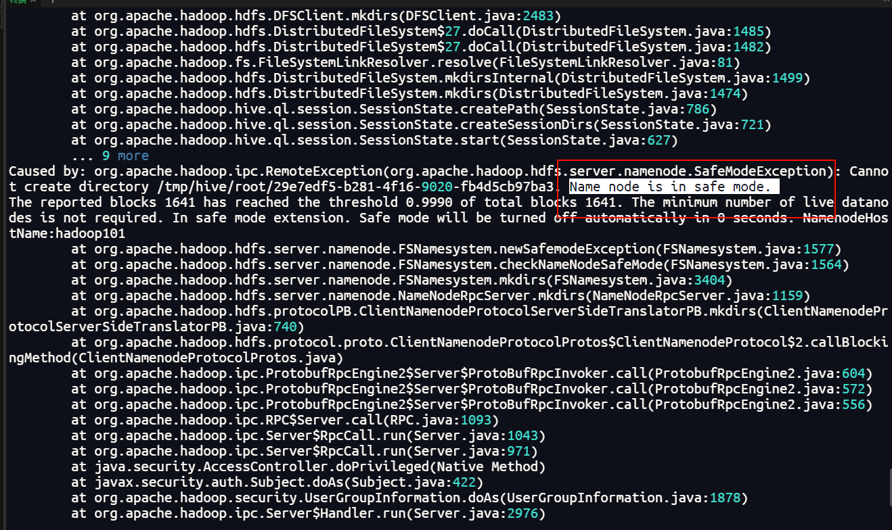

# Hadoop

## Hadoop 组成



## 安装 Hadoop

:::info
对于复杂的软件的安装一定要参考官方文档！！！
:::

安装到`/opt/module/hadoop`中，配置环境变量

```bash
export JAVA_HOME=/opt/module/jdk8
export HADOOP_HOME=/opt/module/hadoop
export PATH=$PATH:$HADOOP_HOME/bin
export PATH=$PATH:$HADOOP_HOME/sbin

# 我想用root用户来操作，如果不使用root用户操作，则无需下面的环境变量
export HDFS_NAMENODE_USER=root
export HDFS_DATANODE_USER=root
export HDFS_SECONDARYNAMENODE_USER=root
export YARN_RESOURCEMANAGER_USER=root
export YARN_NODEMANAGER_USER=root
```

:::tip
建议在 Hadoop 的环境变量中也添加上 Java 的环境变量，因为 Hadoop 的很多命令都需要依赖 Java 的环境变量。
:::

刷新环境变量

```bash
source /etc/profile
```

使用`hadoop`命令验证是否安装成功。

### Docker 安装 Hadoop

在`/opt/docker/hadoop`目录下创建`config`文件

```txt
CORE-SITE.XML_fs.default.name=hdfs://namenode
CORE-SITE.XML_fs.defaultFS=hdfs://namenode
HDFS-SITE.XML_dfs.namenode.rpc-address=namenode:8020
HDFS-SITE.XML_dfs.replication=1
MAPRED-SITE.XML_mapreduce.framework.name=yarn
MAPRED-SITE.XML_yarn.app.mapreduce.am.env=HADOOP_MAPRED_HOME=$HADOOP_HOME
MAPRED-SITE.XML_mapreduce.map.env=HADOOP_MAPRED_HOME=$HADOOP_HOME
MAPRED-SITE.XML_mapreduce.reduce.env=HADOOP_MAPRED_HOME=$HADOOP_HOME
YARN-SITE.XML_yarn.resourcemanager.hostname=resourcemanager
YARN-SITE.XML_yarn.nodemanager.pmem-check-enabled=false
YARN-SITE.XML_yarn.nodemanager.delete.debug-delay-sec=600
YARN-SITE.XML_yarn.nodemanager.vmem-check-enabled=false
YARN-SITE.XML_yarn.nodemanager.aux-services=mapreduce_shuffle
CAPACITY-SCHEDULER.XML_yarn.scheduler.capacity.maximum-applications=10000
CAPACITY-SCHEDULER.XML_yarn.scheduler.capacity.maximum-am-resource-percent=0.1
CAPACITY-SCHEDULER.XML_yarn.scheduler.capacity.resource-calculator=org.apache.hadoop.yarn.util.resource.DefaultResourceCalculator
CAPACITY-SCHEDULER.XML_yarn.scheduler.capacity.root.queues=default
CAPACITY-SCHEDULER.XML_yarn.scheduler.capacity.root.default.capacity=100
CAPACITY-SCHEDULER.XML_yarn.scheduler.capacity.root.default.user-limit-factor=1
CAPACITY-SCHEDULER.XML_yarn.scheduler.capacity.root.default.maximum-capacity=100
CAPACITY-SCHEDULER.XML_yarn.scheduler.capacity.root.default.state=RUNNING
CAPACITY-SCHEDULER.XML_yarn.scheduler.capacity.root.default.acl_submit_applications=*
CAPACITY-SCHEDULER.XML_yarn.scheduler.capacity.root.default.acl_administer_queue=*
CAPACITY-SCHEDULER.XML_yarn.scheduler.capacity.node-locality-delay=40
CAPACITY-SCHEDULER.XML_yarn.scheduler.capacity.queue-mappings=
CAPACITY-SCHEDULER.XML_yarn.scheduler.capacity.queue-mappings-override.enable=false
```

在同一个目录下创建`dcoker-compose.yaml`文件

```yaml
version: "2"
services:
  namenode:
    image: hadoop:3.3.6
    hostname: namenode
    command: ["hdfs", "namenode"]
    ports:
      - 9870:9870
    env_file:
      - ./config
    environment:
      ENSURE_NAMENODE_DIR: "/tmp/hadoop-root/dfs/name"
  datanode:
    image: hadoop:3.3.6
    command: ["hdfs", "datanode"]
    env_file:
      - ./config
  resourcemanager:
    image: hadoop:3.3.6
    hostname: resourcemanager
    command: ["yarn", "resourcemanager"]
    ports:
      - 8088:8088
    env_file:
      - ./config
    volumes:
      - ./test.sh:/opt/test.sh
  nodemanager:
    image: hadoop:3.3.6
    command: ["yarn", "nodemanager"]
    env_file:
      - ./config
```



## 前置配置

### SSH 免密登录

基本语法：

```bash
# 进入另一台机器
ssh 另一台机器的IP
# 从另一台机器中登出
exit
```

免密登录的原理

1. A 服务器生成密钥对，包含一个公钥和一个私钥。
2. A 访问 B 服务器，数据使用私钥加密，并且将公钥拷贝给 B 服务器。
3. B 服务器使用公钥来解密数据，并且将数据使用 A 的公钥来加密传递给 A。
4. A 服务器使用私钥解密 B 传过来的数据。

生成公钥和私钥

```bash
# 进入到用户文件夹下的.ssh文件夹内
cd /home/maoyan/.ssh
# 或者
cd ~/.ssh
# 生成公钥和私钥
ssh-keygen -t rsa
```

- id_rsa 是私钥
- id_rsa.phb 是公钥

将公钥拷贝到要免密登录的主机上

```bash
ssh-copy-id hadoop102
ssh-copy-id hadoop103
ssh-copy-id hadoop104
```

:::warning
同样的反过来以及自己也需要配置 SSH 免密登录，例如 hadoop101 配置了 hadoop102 的免密登录，那么 hadoop102 也要配置 hadoop101 的免密登录。同时 hadoop101 也需要配置自己的免密登录。
:::

## Hadoop 运行模式

Hadoop 有三种运行模式：

- 本地模式
- 伪分布式模式
- 完全分布式模式

**本地模式** 就是单机运行模式，通常用于本地开发测试。

**伪分布式模式** 就是单机运行模式，但是配置成分布式模式。

**完全分布式模式** 就是多台机器运行模式，也是生产环境运行的模式。

### 本地模式(官方 WordCount)

创建一个测试输入文件夹

```bash
mkdir /opt/module/hadoop/testinput
```

创建一个`word.txt`文本文件，输入如下的内容：

```bash
vim word.txt

maoyan hello
maoyan world
yarn
hadoop
```

使用 hadoop 的 jar 命令, 使用`../share/hadoop/mapreduce/hadoop-mapreduce-examples-3.3.6.jar` 的 jar 包, 执行 wordcount 任务, 输入数据为 testinput 下, 输出结果在 testoutput 下。

```bash
hadoop jar ../share/hadoop/mapreduce/hadoop-mapreduce-examples-3.3.6.jar wordcount ../testinput/ ../testoutput

# 或者具体点是这样的
hadoop jar /opt/module/hadoop/share/hadoop/mapreduce/hadoop-mapreduce-examples-3.3.4.jar wordcount /opt/module/hadoop/testinput/ /opt/module/hadoop/testoutput
```

输出文件夹中有两个文件, 一个是计算结果, 一个是标注.


### 伪分布式模式

官方文档：[Pseudo-Distributed Operation](https://hadoop.apache.org/docs/stable/hadoop-project-dist/hadoop-common/SingleCluster.html#Pseudo-Distributed_Operation)

使用伪分布式模式搭建 Hadoop，那么我们不需要安装多个节点，只需要在一台机器上模拟多个节点，从而完成一些操作的测试。所以直接开始配置 4 个核心的配置文件即可。


core-site.xml

```xml
<configuration>
    <property>
        <name>fs.defaultFS</name>
        <value>hdfs://localhost:9000</value>
    </property>
    <!-- 指定 NameNode的日志和数据测存储目录-->
    <property>
	    <name>hadoop.tmp.dir</name>
	    <value>/opt/module/hadoop/data</value>
    </property>
    <property>
        <name>hadoop.proxyuser.root.hosts</name>
        <value>*</value>
    </property>
    <property>
        <name>hadoop.proxyuser.root.groups</name>
        <value>*</value>
    </property>
</configuration>
```

hdfs-site.xml

```XML
<configuration>
    <property>
        <name>dfs.replication</name>
        <value>1</value>
    </property>
</configuration>
```

检查能否 ssh 连接到自己的主机`ssh localhost`

格式化文件系统

```bash
bin/hdfs namenode -format
```

启动 NameNode 和 DataNode

```bash
sbin/start-dfs.sh
```

### 单节点上的 YARN

在伪分布式的基础上配置 yarn 的相关参数

mapred-site.xml

```xml
<configuration>
    <property>
        <name>mapreduce.framework.name</name>
        <value>yarn</value>
    </property>
    <property>
        <name>mapreduce.application.classpath</name>
        <value>$HADOOP_MAPRED_HOME/share/hadoop/mapreduce/*:$HADOOP_MAPRED_HOME/share/hadoop/mapreduce/lib/*</value>
    </property>
</configuration>
```

yarn-site.xml

```xml
<configuration>
    <property>
        <name>yarn.nodemanager.aux-services</name>
        <value>mapreduce_shuffle</value>
    </property>
    <property>
        <name>yarn.nodemanager.env-whitelist</name>
        <value>JAVA_HOME,HADOOP_COMMON_HOME,HADOOP_HDFS_HOME,HADOOP_CONF_DIR,CLASSPATH_PREPEND_DISTCACHE,HADOOP_YARN_HOME,HADOOP_HOME,PATH,LANG,TZ,HADOOP_MAPRED_HOME</value>
    </property>
</configuration>
```

启动 Yarn

```bash
sbin/start-yarn.sh
```

ResourceManager 的访问地址为 http://localhost:8088/

### <span style={{color:'red',fontWeight:'bold'}}>完全分布式运行(重点)</span>

#### core-site.xml

我们首先配置核心配置文件-->`core-site.xml`

```bash
# 设置NameNode的数据存储目录
mkdir /opt/module/hadoop/data
vim /opt/module/hadoop/etc/hadoop/core-site.xml
```

```xml
<!-- 指定 NameNode 的地址 -->
<property>
	<name>fs.defaultFS</name>
	<value>hdfs://hadoop101:8020</value>
</property>
<!-- 指定 NameNode的日志和数据测存储目录-->
<property>
	<name>hadoop.tmp.dir</name>
	<value>/opt/module/hadoop/data</value>
</property>
```

#### hdfs-site.xml

然后配置 HDFS 的配置文件-->`hdfs-site.xml`

```bash
mkdir -p ./dfs/data
mkdir -p ./dfs/name
vim /opt/module/hadoop/etc/hadoop/hdfs-site.xml
```

```xml
<!-- NameNode数据的存储位置-->
<property>
    <name>dfs.namenode.name.dir</name>
    <value>/opt/module/hadoop/dfs/name</value>
 </property>
<!-- DataNode的数据存储位置-->
<property>
    <name>dfs.datanode.data.dir</name>
    <value>/opt/module/hadoop/dfs/data</value>
 </property>
 <!-- 关闭安全检查 -->
 <property>
    <name>dfs.permissions.enabled</name>
    <value>false</value>
 </property>
 <!-- 允许网页预览 -->
<property>
    <name>dfs.webhdfs.enabled</name>
    <value>true</value>
</property>
```

#### mapred-site.xml

然后配置 MapReduce 的配置文件-->`mapred-site.xml`

```bash
vim /opt/module/hadoop/etc/hadoop/mapred-site.xml
```

```xml
<!-- 指定MR运行在YARN上 -->
<property>
    <name>mapreduce.framework.name</name>
    <value>yarn</value>
</property>
```

#### yarn-site.xml

然后配置 YARN 的配置文件-->`yarn-site.xml`

yarn 的 classpath 通过 hadoop 的 classpath 来获得所有的 classpath 目录，然后配置到 yarn 的配置文件中，所以首先获得 hadoop 的 classpath 目录。

```bash
hadoop classpath
```

```bash
vim /opt/module/hadoop/etc/hadoop/yarn-site.xml
```

```xml
<!-- 指定MR走shuffle -->
<property>
    <name>yarn.nodemanager.aux-services</name>
    <value>mapreduce_shuffle</value>
</property>
<!-- 指定ResourceManager的地址 -->
<property>
    <name>yarn.resourcemanager.hostname</name>
    <value>hadoop101</value>
</property>
<!-- 指定Classpath -->
<property>
    <name>yarn.application.classpath</name>
    <value>/opt/module/hadoop/etc/hadoop:/opt/module/hadoop/share/hadoop/common/lib/*:/opt/module/hadoop/share/hadoop/common/*:/opt/module/hadoop/share/hadoop/hdfs:/opt/module/hadoop/share/hadoop/hdfs/lib/*:/opt/module/hadoop/share/hadoop/hdfs/*:/opt/module/hadoop/share/hadoop/mapreduce/*:/opt/module/hadoop/share/hadoop/yarn:/opt/module/hadoop/share/hadoop/yarn/lib/*:/opt/module/hadoop/share/hadoop/yarn/*</value>
</property>

```

#### 配置 workers 文件

最后配置 workers 文件-->`workers`

```bash
vim /opt/module/hadoop/etc/hadoop/workers
```

```bash
hadoop101
```

## 初始化 Hadoop 文件系统

在使用 Hadoop 集群之前，需要初始化 HDFS 文件系统。初始化的文件系统将会生成在`hadoop.tmp.dir`配置的`/opt/module/hadoop/data`目录下。

```bash
hdfs namenode -format
```

当初始化完成之后，在输出的结果中会提示`successfully formatted`，表示文件系统初始化成功。



## 启动 Hadoop / Yarn

在 hadoop 的 sbin 目录下启动 HDFS

```bash
# 启动hdfs
/opt/module/hadoop/sbin/start-dfs.sh
# 停止hdfs
/opt/module/hadoop/sbin/stop-dfs.sh
```

在配置了 ResourceManager 的节点中启动 YARN。

```bash
# 启动Yarn
/opt/module/hadoop/sbin/start-yarn.sh
# 停止Yarn
/opt/module/hadoop/sbin/stop-yarn.sh
```

通过`jps`命令查看进程是否启动成功。


我们也可以访问 Web 端来查看 Hadoop 的集群状态。[http://192.168.10.101:9870](http://192.168.10.101:9870)



## 遇到的问题

### 想用 Root 用户启动 Hadoop

参考-->[HDFS_NAMENODE_USER, HDFS_DATANODE_USER & HDFS_SECONDARYNAMENODE_USER not defined](https://stackoverflow.com/questions/48129029/hdfs-namenode-user-hdfs-datanode-user-hdfs-secondarynamenode-user-not-defined)

虽然为了安全起见，一般都是有的是创建一个 Hadoop 用户，然后用这个用户来启动 Hadoop，但是有时候需要用 Root 用户来启动 Hadoop，例如 Hadoop 无法使用其他的用户访问 SSH 服务。

我们可以在环境变量中添加

```bash
vim /etc/profile.d/hadoop-env.sh
```

```bash
export HDFS_NAMENODE_USER=root
export HDFS_DATANODE_USER=root
export HDFS_SECONDARYNAMENODE_USER=root
export YARN_RESOURCEMANAGER_USER=root
export YARN_NODEMANAGER_USER=root
```

### 进入到了 Safe Mode

由于操作不当等问题，使得 HDFS 进入了 Safe Mode，导致无法进行任何操作。例如我启动 Hive，但是报错如下：



执行如下命令即可

```bash
hdfs dfsadmin -safemode leave
```


如图即退出了安全模式
