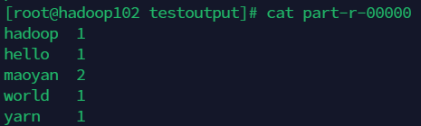

# Hadoop

## Hadoop 组成


## 安装 Hadoop

安装到`/opt/module/hadoop`中，配置环境变量

```bash
export HADOOP_HOME=/opt/module/hadoop
export PATH=$PATH:$HADOOP_HOME/bin
export PATH=$PATH:$HADOOP_HOME/sbin
```

刷新环境变量

```bash
source /etc/profile
```

使用`hadoop`命令验证是否安装成功。

## Hadoop 运行模式

Hadoop 有三种运行模式：

- 本地模式
- 伪分布式模式
- 完全分布式模式

**本地模式** 就是单机运行模式，通常用于本地开发测试。

**伪分布式模式** 就是单机运行模式，但是配置成分布式模式。

**完全分布式模式** 就是多台机器运行模式，也是生产环境运行的模式。

### 本地模式(官方 WordCount)

创建一个测试输入文件夹

```bash
mkdir /opt/module/hadoop/testinput
```

创建一个`word.txt`文本文件，输入如下的内容：

```bash
vim word.txt

maoyan hello
maoyan world
yarn
hadoop
```

使用 hadoop 的 jar 命令, 使用`../share/hadoop/mapreduce/hadoop-mapreduce-examples-3.3.6.jar` 的 jar 包, 执行 wordcount 任务, 输入数据为 testinput 下, 输出结果在 testoutput 下。

```bash
hadoop jar ../share/hadoop/mapreduce/hadoop-mapreduce-examples-3.3.6.jar wordcount ../testinput/ ../testoutput
```

输出文件夹中有两个文件, 一个是计算结果, 一个是标注.




