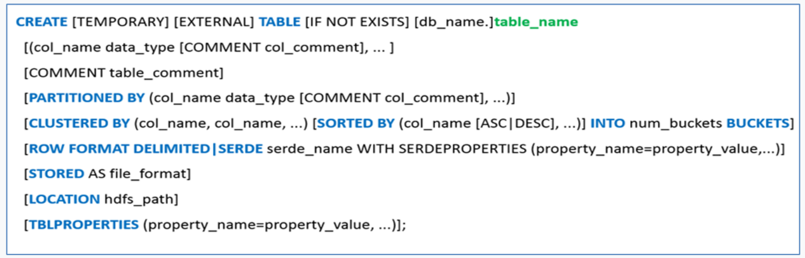
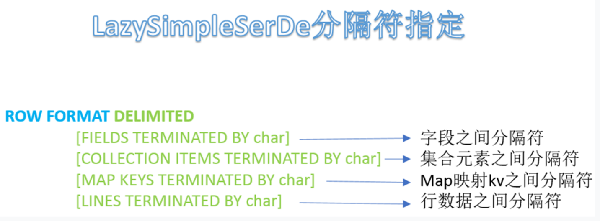
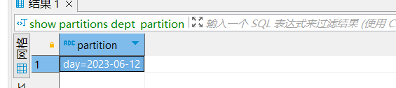
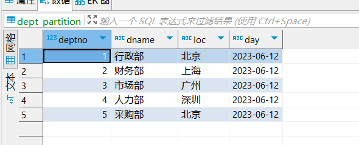

# Hive 的使用

## 数据类型

### 原生数据类型

### 复杂数据类型

### 类型转换

## 建表语法



ROW FORMAT 这一行所代表的是跟读写文件、序列化 SerDe 相关的语法，功能有二：

1. 使用哪个 SerDe 类进行序列化；
2. **如何指定分隔符**。



## 内外部表

使用如下命令查看表的类型：

```bash
describe formatted <tablename>
```

### 内部表

1. 被 Hive 拥有和管理的托管表
2. 删除表时会删除表和数据。

### 外部表

1. 数据不是 Hive 拥有或管理的，只管理表元数据的生命周期。
2. 使用 external 关键字
3. 删除外部表只会删除元数据，而不会删除实际数据

### 总结

1. 内部表：被 Hive 拥有和管理的托管表，删除表时会删除表和数据。
2. 外部表：数据不是 Hive 拥有或管理的，只管理表元数据的生命周期。

Q：创建内部表和外部表的区别？

A：创建内部表的时候会将数据移动到 Hive 指定的目录下，而创建外部表不会移动数据，只会创建表的元数据。

## 分区表

<span style={{color:'red',fontWeight:'bold'}}>Q: </span>分区的本质是什么？

<span style={{color:'green',fontWeight:'bold'}}>A: </span>不同分区对应着不同的文件夹，同一分区的数据存储在同一个文件夹下

分区语法树--partitioned by

:::danger
分区的字段不能是表中已经存在的字段！！！
:::

创建分区表

```sql
create table dept_partition(
    deptno int,    --部门编号
    dname  string, --部门名称
    loc    string  --部门位置
)
partitioned by (day string)
row format delimited fields terminated by '\t';
```

准备数据：dept_20230612.log

:::warning
建表的时候设置的分隔符为`\t`即`Tab`键，所以准备数据的时候也要使用 Tab 键。
:::

```txt
1       行政部  北京
2       财务部  上海
3       市场部  广州
4       人力部  深圳
5       采购部  北京
```

导入数据，并指定分隔符为空格

```sql
load data local inpath '/opt/module/hive/test/dept_20230612.log' into table dept_partition partition(day='2023-06-12')
```

查询分区数据

:::warning
如果表已经创建了分区，那么在查询的时候建议加上分区条件，否则会抛出异常
:::

```sql
select * from dept_partition where day='2023-06-12';
```

### 分区表基本操作

#### 查看所有的分区信息

```sql
show partitions dept_partition;
```



#### 增加分区

### 多重分区

例如我们原先使用日期来分区，但是数据量很大，所以我们更精细化一些，使用小时来分区。

```sql
create table dept_partition2(
    deptno int,    -- 部门编号
    dname string, -- 部门名称
    loc string     -- 部门位置
)
partitioned by (day string, hour string)
row format delimited fields terminated by '\t';
```

装载数据

```sql
load data local inpath '/opt/module/hive/test/dept_20230612.log' into table dept_partition2 partition(day='2023-06-12', hour='12');
```

查询数据

```sql
select * from dept_partition2 where day='2023-06-12' and hour='12';
```

### 动态分区

动态分区是指：在 insert 或者加载数据的时候，不需要用户手动指定分区，而是通过每行数据的最后一个字段的值来动态的决定。使用动态分区，可只用一个 insert 语句将数据写入多个分区。

#### 开启动态分区

动态分区功能总开关（默认 true，开启）

```sql
set hive.exec.dynamic.partition=true
```

##### 严格模式和非严格模式

动态分区的模式，默认 strict（严格模式），要求必须指定至少一个分区为静态分区，nonstrict（非严格模式）允许所有的分区字段都使用动态分区。

```sql
set hive.exec.dynamic.partition.mode=nonstrict
```

创建分区表

```sql {5}
create table dept_partition_dynamic(
    deptno int,
    dname string
)
partitioned by (loc string)
row format delimited fields terminated by '\t';
```

可以清楚的看到，这里使用 loc 来作为分区字段。

我们将上面的 dept_partition 表中的数据导入到 dept_partition_dynamic 表中，并使用动态分区。dept_partition 表中的数据内容如下



:::tip
这里的 day 字段是分区字段，并不在表的列中。
:::

```sql
SET hive.exec.dynamic.partition = true;
SET hive.exec.dynamic.partition.mode = nonstrict;

-- 分开执行
insert into table dept_partition_dynamic partition(loc)
select deptno, dname, loc from dept_partition;
```

### 总结

- 分区表的本质：不同分区对应不同的文件夹，同一分区的数据存储在同一个文件夹下。
- 创建分区表：使用 partitioned by 语法，指定分区字段（不能是表中已有字段）。
- 多重分区：可以通过多个字段（如日期和小时）进行分区，以实现更精细的数据划分。
- 动态分区：
  - 开启动态分区：设置 hive.exec.dynamic.partition=true。
  - 模式选择：
    - 严格模式（默认）：至少一个分区字段为静态分区。
    - 非严格模式：允许所有分区字段使用动态分区，设置 hive.exec.dynamic.partition.mode=nonstrict。

## 分桶表

分区提供一个隔离数据和优化查询的便利方式。不过，并非所有的数据集都可形成合理的分区。对于一张表或者分区，Hive 可以进一步组织成桶，也就是更为细粒度的数据范围划分，**分区针对的是数据的存储路径，分桶针对的是数据文件**。

分桶表的基本原理是，首先为每行数据计算一个指定字段的数据的 hash 值，然后模以一个指定的分桶数，最后将取模运算结果相同的行，写入同一个文件中，这个文件就称为一个分桶（bucket）。

### 语法规则

建表语句

```sql {5,6}
create table stu_buck(
    id int,
    name string
)
clustered by(id)
into 4 buckets
row format delimited fields terminated by '\t';
```

数据装载，我们在`/opt/module/hive/test`目录中创建测试文件`students.txt`

```txt
1001 张三
1002 李四
1003 王五
1004 闰土
1005 小明
1006 王强
```

```sql
load data local inpath '/opt/module/hive/test/students.txt' into table stu_buck;
```

查询数据

```sql
select * from stu_buck;
```

### 分桶表的优化

#### 分桶排序表

Hive 的分桶排序表是一种优化技术，用于提高大数据存储和查询的效率。它将数据表按照指定的列进行分桶（bucket），每个桶内的数据再按照指定的列进行排序，这样就可以在查询时快速定位到需要的数据，减少数据扫描的时间。

```sql {4,5}
create table stu_buck_sort(
    id int,
    name string
)clustered by(id) sorted by(id)
into 4 buckets
row format delimited fields terminated by '\t';
```

通过 id 进行分桶之后，再通过 id 进行排序

:::tip
使用分桶排序表的主要优点是可以提高查询效率，特别是在大数据量的情况下。相比于无序表，分桶排序表在查询时可以<span style={{color:'green',fontWeight:'bold'}}>跳过不需要的数据</span>，减少数据扫描的时间。
:::

### 总结

- 分区针对的是数据的存储路径，分桶针对的是数据文件
- 分桶使用的语法规则是使用`clustered by`指定使用哪个字段进行分桶，使用`into`指定分桶的数量
- 分桶表的优化技术是分桶排序表，使用`sorted by`指定使用哪个字段进行排序

## load 加载数据

语法规则：

```sql
LOAD DATA [LOCAL] INPATH 'filepath' [OVERWRITE] INTO TABLE tablename [PARTITION (partcol1=val1, partcol2=val2 ...)]

LOAD DATA [LOCAL] INPATH 'filepath' [OVERWRITE] INTO TABLE tablename [PARTITION (partcol1=val1, partcol2=val2 ...)] [INPUTFORMAT 'inputformat' SERDE 'serde'] (3.0 or later)
```

- LOCAL

1. 指定了 LOCAL，将在本地的文件目录查找文件路径。
2. 没有指定 LOCAL：将在 HDFS 中查找文件路径，即 hadoop 中的 fs.default.name 参数。

- OVERWRITE：目标表（或者分区）中的已经存在的数据会被删除

例如：

```sql
-- 将Linux的文件加载到Hive表中
load data local inpath '/opt/module/hive/test/test.log' into table test_table;

-- 将Linux的文件加载到Hive表中，并指定分隔符
load data local inpath '/opt/module/hive/test/test.log' into table test_table fields terminated by ',';

-- 将Linux的文件加载到Hive表中，并指定分隔符和存储格式
load data local inpath '/opt/module/hive/test/test.log' into table test_table fields terminated by ',' stored as textfile;

-- 将HDFS的文件加载到Hive表中
load data inpath '/user/hive/warehouse/student' into table student;
```

## 插入数据

本质上是使用 MapReduce 将数据写入到 Hive 表中的。

## 拉链表

## Hive 函数

### 自定义函数

用户的自定义函数分为三类：

1. UDF（User Defined Function）：输入输出为一行，返回一个值。
2. UDAF（User Defined Aggregation Function）：用户聚合函数，类似于 count 等，输入输出为多进一出。
3. UDTF（User Defined Table-Generating Function）：用户自定义表生成函数，输入为一行，输出为多行。

自定义函数的实现方式大致如下：

1. 继承 Hive 提供的类

```java
org.apache.hadoop.hive.ql.udf.generic.GenericUDF
org.apache.hadoop.hive.ql.udf.generic.GenericUDTF
```

2. 实现类中的抽象方法
3. 在 Hive 中使用自定义的函数
4. 在 Hive 中删除自定义函数

### 创建 UDF 自定义函数

我们以一个计算字符串长度的函数为例，来演示如何创建一个自定义函数，函数名称为：`get_string_len`。

1. **创建一个 Maven 项目，并在 pom.xml 中添加依赖。**

```xml
<dependency>
    <groupId>org.apache.hive</groupId>
    <artifactId>hive-exec</artifactId>
    <version>3.1.3</version>
</dependency>
```

2. **创建一个类，继承 org.apache.hadoop.hive.ql.udf.generic.GenericUDF。**

```java
public class GetStringLen extends GenericUDF {

    public GetStringLen() {
    }

    @Override
    public ObjectInspector initialize(ObjectInspector[] arguments) throws UDFArgumentException {
        return ObjectInspectorFactory.getStandardListObjectInspector(

)
```

3. **创建临时函数**

   临时函数指的是这个函数只跟会话相关，<span style={{color:'red',fontWeight:'bold'}}>跟库没有关系，当会话结束之后，临时函数就自动被删除了</span>。

- 首先将函打包为`jar`包，并上传到`hive`的`datas`目录下
- 然后进入 hive 中，使用 add 命令将`jar`包添加到`hive`的`classpath`中

```sql
add jar /opt/module/hive/datas/GetStringlen.jar;
```

- 创建临时函数，并与开发好的 Java Class 相关联。

```sql
create temporary function get_string_len as "com.maoyan.hive.udf.GetStringLen";
```

- 然后即可使用自定义的函数

```sql
select get_string_len('abcd')
```

- 删除临时函数

```sql
drop temporary function get_string_len;
```

4. **创建永久函数**

在 Hive 的主目录下，我这里使用的是`/opt/module/hive`，在此目录下创建`auxlib`目录。然后将 jar 包上传到此目录下，然后重启 Hive。

接下来就可以创建我们的永久函数了。

```sql
create function get_string_len as 'com.maoyan.hive.udf.GetStringLen'
```

删除永久函数

```sql
drop function get_string_len;
```

### 创建 UDTF 自定义函数

### 总结

#### 创建 UDF 自定义函数

Q：UDF 函数是什么？

A：输入输出一进一出的函数。

Q：UDF 函数的实现方式？

A：继承 org.apache.hadoop.hive.ql.udf.generic.GenericUDF 类。

## 文件格式

## Hive 的数据压缩

## Hive 调优

Hive 的优化需要与业务需求相结合，根据数据类型，分布，质量等实际情况来进行优化。Hive 的底层是 mapReduce，所以 Hadoop 的优化也是 Hive 优化的基础。Hive 的优化包含 Hive 的参数优化，数据倾斜的解决，HQL 优化等方面。

## 题目练习
