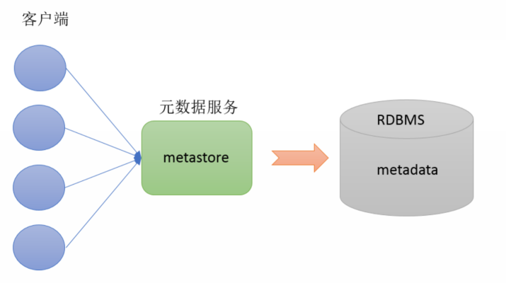
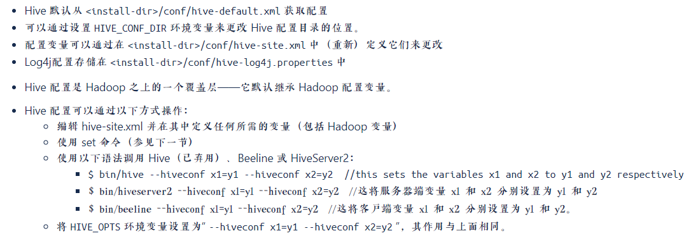
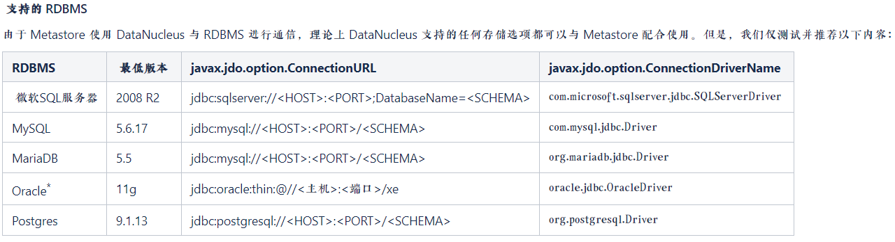
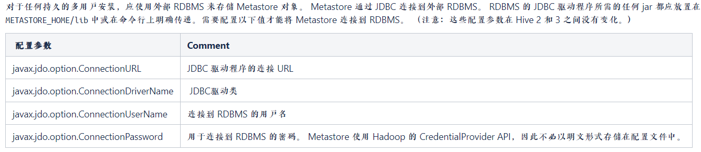
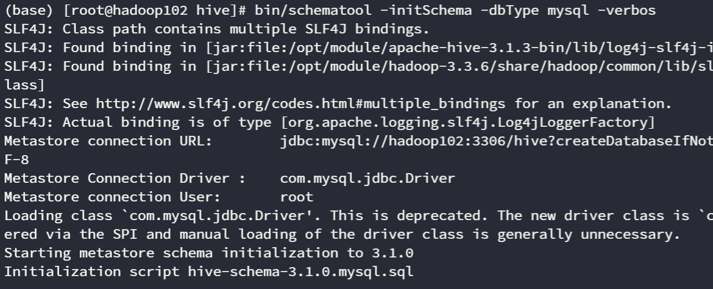
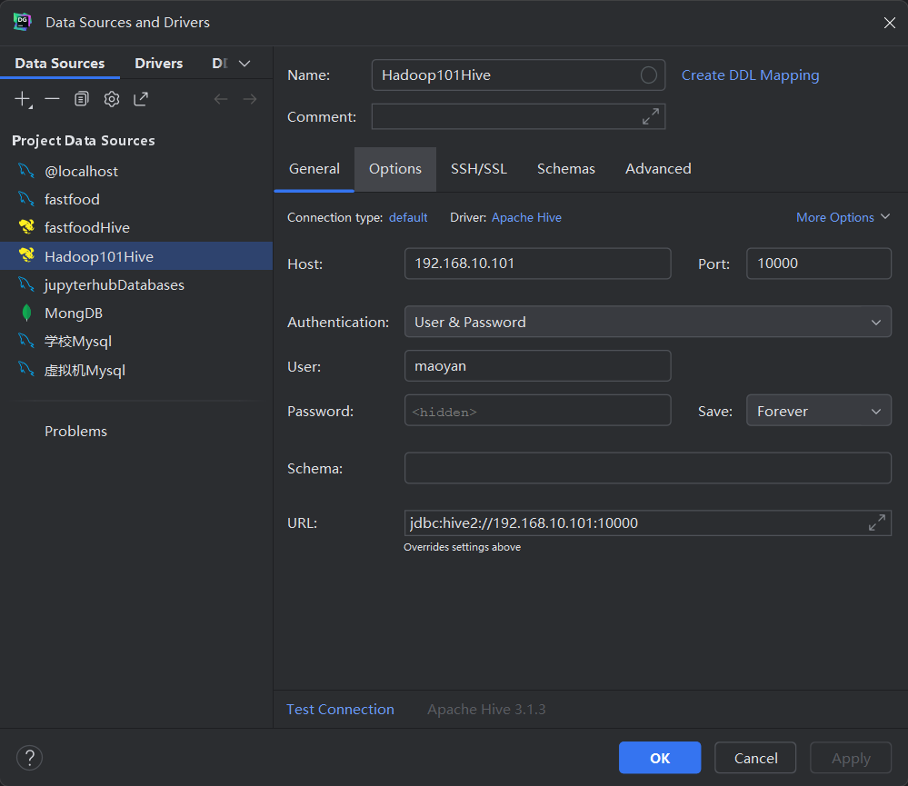

# Hive

## 概述

分布式统计分析的需求非常的大，而主要使用的是 MapReduce，但是 MapReduce 只支持程序（Java，Python 等）开发，而不支持 SQL 开发。

本质：**将 SQL 语句翻译成 MapReduce 程序**。

用处：**可以快速方便的统计分析 HDFS 中的数据**。

## 架构

- MateStore（元数据存储）
- SQL 解析器（Driver 驱动）
- 用户界面（用户和 Hive 交互）

## MateStore

**Metadata** 即元数据。元数据包含用 Hive 创建的 database、table、表的字段等元信息。元数据存储在关系型数据库中。如 Hive 内置的 Derby、第三方如 MySQL 等。


Metastore 有三种配置方式，分别是内嵌模式、本地模式、远程模式。

### 内嵌模式

内嵌模式（Embedded Metastore）是 Metastore 默认部署模式。此种模式下，元数据存储在内置的 Derby 数据库，并且 Derby 数据库和 metastore 服务都嵌入在主 HiveServer 进程中，当启动 HiveServer 进程时，Derby 和 Metastore 都会启动。不需要额外起 Metastore 服务。但是一次只能支持一个活动用户，适用于测试体验，不适用于生产环境。

### 本地模式

本地模式（Local Metastore）下，Hive Metastore 服务与主 HiveServer 进程在同一进程中运行，但是存储元数据的数据库在单独的进程中运行，并且可以在单独的主机上。Metastore 服务将通过 JDBC 与 Metastore 数据库进行通信。 本地模式采用外部数据库来存储元数据，推荐使用 MySQL。Hive 根据 hive.metastore.uris 参数值来判断，如果为空，则为本地模式。缺点是每启动一次 Hive 服务，都内置启动了一个 Metastore 服务。

### 远程模式

远程模式（Remote Metastore）下，Metastore 服务在其自己的单独 JVM 上运行，而不在 HiveServer 的 JVM 中运行。如果其他进程希望与 Metastore 服务器通信，则可以使用 Thrift Network API 进行通信。在生产环境中，建议用远程模式来配置 Hive Metastore。在这种情况下，其他依赖 Hive 的软件都可以通过 Metastore 访问 Hive。由于还可以完全屏蔽数据库层，因此这也带来了更好的可管理性/安全性。**远程模式下，需要配置 hive.metastore.uris 参数来指定 Metastore 服务运行的机器 ip 和端口，并且需要单独手动启动 Metastore 服务**。

## 安装

:::tip
Hive 是单机工具，只需要部署在一台服务器即可。Hive 虽然是单机的，但是它可以提交分布式运行的 MapReduce 程序运行.Hive 需要使用元数据服务，即需要提供一个关系型数据库，我们也选择一台服务器安装关系型数据库即可
:::



### 配置 Hadoop

Hive 控制的数据实际上是存储在 HDFS 中的，所以需要配置 Hadoop，使得 Hive 可以操作 HDFS 中的数据。在`core-site.xml`配置文件中配置。

```xml
<property>
	<name>hadoop.proxyuser.maoyan.hosts</name>
	<value>*</value>
</property>
<property>
	<name>hadoop.proxyuser.maoyan.groups</name>
	<value>*</value>
</property>
<!--这里建议把maoyan和root都添加上去-->
<property>
	<name>hadoop.proxyuser.root.hosts</name>
	<value>*</value>
</property>
<property>
	<name>hadoop.proxyuser.root.groups</name>
	<value>*</value>
</property>
```

:::warning
注意这里的 hadoop.proxyuser.maoyan.hosts，中见的 maoyan 是用户名！！！
:::

### 下载解压 Hive

使用 Hadoop 的用户来下载并解压，保证 Hive 的所属组以及用户是 Hadoop 用户。

### 配置 MySQL 驱动包

下载对应版本的 MySQL 驱动包，并将其放到 Hive 的 lib 目录下。[MySQL 驱动包](https://repo1.maven.org/maven2/mysql/mysql-connector-java/)

### 配置 Hive 的环境变量

在`/etc/profile.d`目录下创建 hive_env.sh，在其中写入

```bash
export HIVE_HOME=/opt/module/hive
export PATH=$HIVE_HOME/bin:$PATH
```

刷新环境变量

```bash
source /etc/profile.d/hive_env.sh
```

检测是否安装成功

```bash
hive --version
```

### 关联 Hadoop

可以在 Hive 的 conf 目录下，也可以在/etc/profile.d 目录下，新建一个 hive-env.sh 文件，写入如下的环境变量内容。（建议在 hive 的 conf 下创建 hive-env.sh 文件）

```bash
export HADOOP_HOME=/opt/module/hadoop
export HIVE_CONF_DIR=/opt/module/hive/conf
export HIVE_AUX_JARS_PATH=/opt/module/hive/lib
```

### 配置 Hive

官方推荐的数据库如下：

配置文件详解：[AdminManual Metastore 3.0 Administration - Apache Hive - Apache Software Foundation](https://cwiki.apache.org/confluence/display/Hive/AdminManual+Metastore+3.0+Administration "AdminManual Metastore 3.0 Administration - Apache Hive - Apache Software Foundation")

在 Hive 的 conf 目录下，新建 hive-site.xml 文件,写入如下的内容.
:::warning
`<!--高版本Mysql使用的驱动是com.mysql.cj.jdbc.Driver-->`

`<value>com.mysql.cj.jdbc.Driver</value>`
:::

```xml
<configuration>
<!--连接的数据库，我这里使用的是云服务器额数据库-->
  <property>
    <name>javax.jdo.option.ConnectionURL</name>
    <value>jdbc:mysql://110.41.50.108:3306/hive</value>
  </property>
<!--使用的Mysql驱动-->
  <property>
    <name>javax.jdo.option.ConnectionDriverName</name>
    <!-- <value>com.mysql.jdbc.Driver</value> -->
<!--高版本Mysql使用的驱动是com.mysql.cj.jdbc.Driver-->
	  <value>com.mysql.cj.jdbc.Driver</value>
  </property>
  <!--访问mysql数据库的用户名-->
  <property>
    <name>javax.jdo.option.ConnectionUserName</name>
    <value>root</value>
  </property>
  <!--访问mysql数据库的密码-->
  <property>
    <name>javax.jdo.option.ConnectionPassword</name>
    <value>ar352878987</value>
  </property>
  <property>
    <name>hive.server2.thrift.bind.host</name>
    <value>hadoop101</value>
  </property>
  <!-- 设置元数据库的端口地址 -->
  <property>
    <name>hive.metastore.uris</name>
    <value>thrift://hadoop101:9083</value>
  </property>
  <!-- 设置HiveServer2的端口 -->
  <property>
    <name>hive.server2.thrift.port</name>
    <value>10000</value>
  </property>
  <property>
    <name>hive.metastore.event.db.notification.api.auth</name>
    <value>false</value>
  </property>
</configuration>
```

如下是配置解释：


## 常见的其他的配置元素

### 数据仓库位置修改

Hive 的默认仓库在 HDFS 的/user/hive/warehouse 路径下，可以在 hive-site.xml 配置文件中更改

```xml
 <property>
    <name>hive.metastore.metadb.dir</name>
    <value><地址></value>
  </property>
```

### HiveCLI 中显示数据库的，名称及列名

显示数据库：

```xml
 <property>
    <name>hive.cli.print.current.db</name>
    <value>true</value>
  </property>
```

显示列的名称

```xml
 <property>
    <name>hive.cli.print.header</name>
    <value>true</value>
  </property>
```

## 初始化元数据库

在启动 Hive 之前，以及**更改了 Hive 的配置文件之后**，需要初始化 Hive 所需的元数据库。

在 Mysql 中新建一个数据库：hive

```sql
CREATE DATABASE hive CHARSET utf8mb4;
```

执行元数据库初始化的命令：

```bash
cd /opt/module/hive
bin/schematool -initSchema -dbType mysql -verbos
```



## 启动 Hive

我们知道 Hive 控制的是 Hadoop 中的数据，所以我们同样的需要 Hadoop 用户才能启动 Hive，并且在启动 Hive 之前需要已经启动了 Hadoop。Hadoop 的启动见-->[Hadoop](../hadoop)

### 启动 MetaStore

那么我们知道，Hive 中的 MetaStore 是元数据，保存了 Hive 创建的数据库、表、视图、函数等信息，所以我们需要启动 Hive 的 MetaStore 服务，才能让 Hive 正常工作。

启动 Hive 的 MetaStore 服务：

前台启动：

```bash
bin/hive --service metastore
```

后台启动：

```bash
nohup /opt/module/hive/bin/hive --service metastore >> /opt/module/hive/logs/metastore.log 2>&1 &
```

:::tip
后台启动将 Hive 的日志输出到指定的文件中，方便查看。
:::

### 启动 Hive

Hive Shell 方式：

```bash
bin/hive
```

Hive ThriftServer 方式（可以使用第三方的客户端，比如 DataGrip）：

```bash
bin/hive --service hiveserver2
```

## DataGrip 链接 Hive

:::warning
这里无需输入密码，直接使用 Hadoop 用户即可连接。
:::



## 测试 Hive

官方文档中表明：

由于目录已经存在，所以设置一下权限即可

```bash
hadoop fs -chmod g+w /tmp
hadoop fs -chmod g+w /user/hive/warehouse
```

创建测试表

```sql
CREATE TABLE test(id INT, name STRING, gender STRING);
```

插入测试数据

```sql
INSERT INTO test VALUES(1,'maoyan','男');
```

Hive 第一次插入数据会非常的慢。

查询数据

```sql
SELECT gender, COUNT(*) AS cnt FROM test GROUP BY gender;
```

## Hive 脚本

## Hive On Spark

首先，我们需要理解两个概念：

- Hive on Spark： Hive 作为元数据存储，且负责 SQL 的解析与优化，语法是 HQL 语法，执行引擎是 Spark。
- Spark on Hive： Hive 只作为元数据村吃，Spark 作为执行引擎，且负责 SQL 的解析与优化，语法是 Spark SQL 语法。

将 Spark-3.3.1-bin-without-hadoop.tgz 解压到 /opt/module/spark 目录下。

在 /opt/module/spark/conf 目录下创建 spark-env.sh 文件，并添加以下内容：

```bash
export JAVA_HOME=/opt/module/jdk
export HADOOP_HOME=/opt/module/hadoop
export HIVE_HOME=/opt/module/hive
```

配置 Spark 的环境变量

```bash
vim /etc/profile.d/spark.sh
```

添加以下内容：

```bash
export SPARK_HOME=/opt/module/spark
export PATH=$PATH:$SPARK_HOME/bin:$SPARK_HOME/sbin
```

生效环境变量

```bash
source /etc/profile.d/spark.sh
```

在 hive 的配置文件目录 `/opt/module/hive/conf` 中创建 spark 的配置文件 `spark-defaults.conf`，并添加以下内容：

```bash
spark.master                    yarn
spark.eventLog.enabled           true
spark.eventLog.dir               hdfs://hadoop101:8020/spark-logs
spark.yarn.jars                  hdfs://hadoop101:8020/spark-jars/*
spark.executor.memory            1g
spark.driver.memory              1g
```

在 HDFS 中创建 `spark-logs` 和 `spark-jars` 目录

```bash
hadoop fs -mkdir -p /spark-logs
hadoop fs -mkdir -p /spark-jars
```

将 `/opt/module/spark/jars` 目录下的所有 jar 包上传到 `/spark-jars` 目录下。

```bash
hadoop fs -put /opt/module/spark/jars/* /spark-jars
```

在 hive 的配置文件目录 `/opt/module/hive/conf` 中创建 spark 的配置文件 `hive-site.xml`，并添加以下内容：

```xml
<property>
	<name>hive.execution.engine</name>
	<value>spark</value>
</property>
<property>
```


## 常见问题

### JsonSerDe 异常

在 ODS 层使用了 JsonSerDe 的序列化器，当时有的表字段无法显示，需要在 Hive 中的配置文件中添加此序列化器。

在 hive-site.xml 中添加

```xml
<property>
	<name>metastore.storage.schema.reader.impl</name>
	<value>org.apache.hadoop.hive.metastore.SerDeStorageSchemaRead
 er</value>
</property>
```
