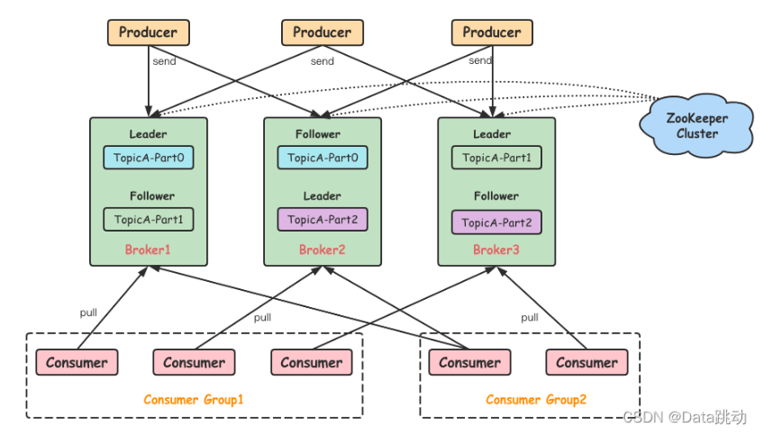

## Kafka 架构



- 每个 Kafka 集群由一个或多个 Broker 组成，每个 Broker 是一个 Kafka 服务实例，可以理解为一台服务器
- 每个 Broker 都有一个唯一的 ID，称为 `broker.id`
- 每个 Broker 都有一个或多个主题（Topic），每个主题有多个分区（Partition）
- 每个分区有多个副本（Replica），其中一个副本是 Leader，其他副本是 Follower
- 每个分区的 Leader 负责处理所有读写请求，Follower 负责从 Leader 同步数据
- 每个分区的副本不会部署在同一台服务器上，目的是为了保证数据的安全性

## 生产者

生产者（Producer）是 Kafka 的客户端，用于向 Kafka 集群发送数据，生产者将数据发送到指定的 Topic，然后由 Kafka 集群中的消费者（Consumer）进行消费。

创建生产者

```bash
bin/kafka-console-producer.sh --bootstrap-server localhost:9092 --topic <topic>
```

## ----------消费者----------

消费者（Consumer）是 Kafka 的客户端，用于从 Kafka 集群中读取数据，消费者从指定的 Topic 中读取数据，然后进行消费。

## 消费者组

消费者组（Consumer Group）是一组消费者，用于共同消费一个或多个主题（Topic）的数据，消费者组中的消费者共享一个或多个分区（Partition）的数据。

使用`--group <group-id>`指定消费者组，使用`--topic <topic>`指定主题。

- 消费者组中的消费者共享一个或多个分区（Partition）的数据
- 同一个组内，分担数据的最小单位是分区（Partition），一个分区（Partition）只能被一个消费者（Consumer）消费
- 组内成员的增加和减少，会触发 Rebalance 操作，Rebalance 操作会重新分配分区（Partition）的数据

## 消费策略

消费策略决定了消费者从哪里开始消费数据。


## 消费者组再均衡分区分配策略

在以下几种情况下，消费者组会进行再均衡：

- 消费者组中的消费者数量发生变化
- 消费者组中的消费者订阅的主题发生变化
- 消费者组中的消费者订阅的主题的分区发生变化

### Range Strategy

Range 策略是 Kafka 默认的再均衡策略，它将主题的分区分配给消费者组中的消费者，每个消费者分配到的分区数相同，如果分区数不能被消费者数整除，那么前面几个消费者会多分配到一个分区。

例如：TOPIC——A 有 5 个分区，TOPIC——B 有 3 个分区，消费者组有 2 个消费者 C1 和 C2，那么消费者组中的消费者分配到的分区数为：

1. 首先对 TOPIC-A 进行分配，5/2=2 余 1，那么先对 C1 分配两个，再对 C2 分配两个，最后一个留给 C1
   ```text
   - C1： TOPIC——A1，TOPIC——A2，TOPIC——A5
   - C2： TOPIC——A3，TOPIC——A4
   ```
2. 然后对 TOPIC-B 进行分配，3/2=1 余 1，那么先对 C1 分配一个，再对 C2 分配一个，最后一个留给 C1
   ```text
   - C1： TOPIC——A1，TOPIC——A2，TOPIC——A5，TOPIC——B1，TOPIC——B3
   - C2： TOPIC——A3，TOPIC——A4，TOPIC——B2
   ```

:::note
Range 策略的优点是简单，容易理解，缺点是如果共同订阅的主题比较多，那么排在前面的消费者会分配到更多的分区，这样会导致消费者之间的负载不均衡。
:::

### Round-Robin Strategy

就是将不同主题的分区合并为一个列表，然后按照 Hash 排序，再使用轮训的方式分配给消费者。

例如：TOPIC-A 有 5 个分区，TOPIC-B 有 3 个分区，消费者组有 2 个消费者 C1 和 C2，那么消费者组中的消费者分配到的分区数为：

1. 首先将 TOPIC-A 和 TOPIC-B 的分区合并为一个列表，并按照 Hash 排序：
   ```text
   - TOPIC-A1
   - TOPIC-A2
   - TOPIC-A3
   - TOPIC-A4
   - TOPIC-A5
   - TOPIC-B1
   - TOPIC-B2
   - TOPIC-B3
   ```
2. 然后按照轮训的方式分配给消费者：
   ```text
   - C1： TOPIC-A1，TOPIC-A3，TOPIC-A5，TOPIC-B2
   - C2： TOPIC-A2，TOPIC-A4，TOPIC-B1，TOPIC-B3
   ```

### Sticky Strategy

Sticky 策略的优点是分区分配的更加均匀，缺点是分区分配的更加复杂，需要记录每个消费者分配到的分区，以及每个分区被分配到的消费者。
