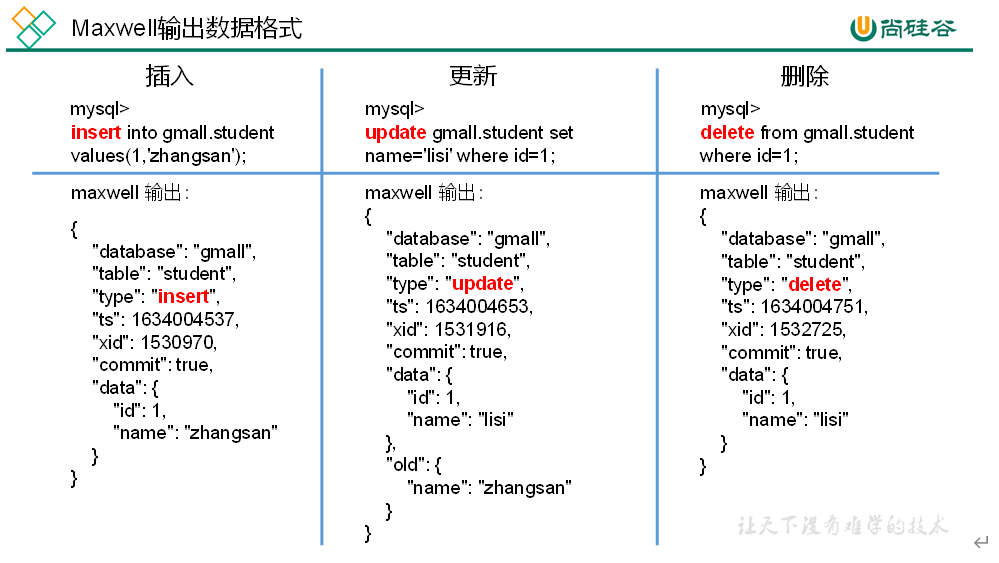
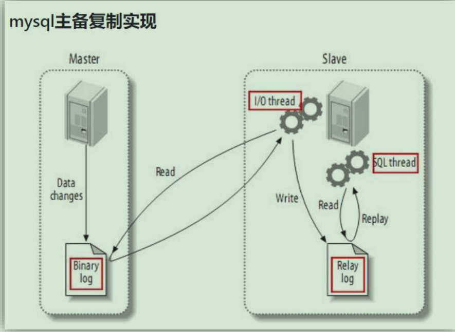
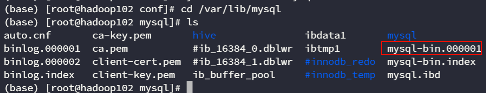

# Maxwell

## Maxwell 概念

Maxwell 是一个用于 MySQL 数据库的开源数据变更捕获工具。它的主要作用是**监控 MySQL 数据库的变更，捕获这些变更并将它们以易于处理的格式发送到其他系统**，例如消息队列或文件。这有助于实现实时数据同步、日志分析等应用场景。

抓取 Mysql 的变更数据，封装为 Json 格式，再发送给 Kafka 消息队列。

## Maxwell 输出格式


| **字段** | **解释** |
| ----- | ---------------------------------------------------------------------------------------------------- |
| **database** | 变更数据所属的数据库 |
| **table** | 表更数据所属的表 |
| **type** | 数据变更类型 |
| **ts** | 数据变更发生的时间 |
| **xid** | 事务 id |
| **commit** | 事务提交标志，可用于重新组装事务 |
| **data** | 对于 insert 类型，表示插入的数据；对于 update 类型，标识修改之后的数据；对于 delete 类型，表示删除的数据 |
| old | 对于 update 类型，表示修改之前的数据，只包含变更字段 |

## 工作原理

### MySQL 的主从复制原理



1. Master 主库将改变记录，写到二进制日志(binary log)中
2. Slave 从库向 mysql master 发送 dump 协议，将 master 主库的 binary log events 拷贝到它的中继日志(relay log)；
3. Slave 从库读取并重做中继日志中的事件，将改变的数据同步到自己的数据库。
   :::tip
   主库先执行变更操作，再将日志写入到 Binlog 文件中。
   :::

### Maxwell 的工作原理

Maxwell 的工作原理很简单，<span style={{backgroundColor: '#a6e22e', color: '#000000', padding: '1px 3px', borderRadius: '2px'}}>**就是把自己伪装成 MySQL 的一个 slave，然后以 slave 的身份假装从 MySQL(master)复制数据。**</span>

## MySQL 中的 Binlog

### Binlog 简介

Binlog 是 MySQL 数据库的二进制日志文件，记录了数据库的增删改操作。

### Binlog 格式

MySQL 支持多种 Binlog 格式，每种格式记录的内容和方式都不相同。

- `ROW `格式：记录**每一行数据**的变化，是最常用的格式。
- `STATEMENT` 格式：记录**每一条 SQL 语句**的执行，但是不记录每一行数据的变化。
- `MIXED` 格式：混合了 ROW 和 STATEMENT 两种格式，根据不同的情况选择不同的格式。

### 开启 Binlog

找到 MySQL 的配置文件`/etc/my.cnf`，在其中添加以下配置：

```
[mysqld]
server_id=1
log-bin=mysql-bin
binlog_format=row
# 启用binlog的数据库，需根据实际情况作出修改
binlog-do-db=<数据库名>
```

配置信息

- `server_id`：用于唯一标识一个 MySQL 实例，通常设置为服务器 IP 地址的最后一段。
- `log-bin`：指定 Binlog 文件的名称，默认情况下，Binlog 文件会被保存在 MySQL 数据目录中。
- `binlog_format`：指定 Binlog 的格式，可以是 ROW、STATEMENT 或 MIXED。
- `binlog-do-db`：指定需要记录 Binlog 的数据库，多个数据库之间使用逗号分隔。

### 查看 Binlog 是否开启

在 MySQL 命令行中输入以下命令：

```
SHOW VARIABLES LIKE 'log_bin';
```

如果返回值为 ON，则表示 Binlog 已经开启。

### Docker MySQL 开启 Binlog

进入到 mysql 容器中，并在容器中安装 vim 用于编辑文件。

```bash
# 进入Mysql容器
docker exec -it my-mysql bash
# 安装
```

编辑 MySQL 的配置文件，一般为`/etc/mysql/conf.d/mysqld.cnf`或者`/etc/mysql/my.cnf`。在[mysqld]块中添加相关配置即可。

## Maxwell 的安装

### 先决条件

Kafka 和 Mysql
:::warning
**Maxwell 的 1.30.0 及以后都不支持 JDK8**
:::

正常解压即可，我们统一把包下载到`/opt/software`下，把 Maxwell 安装到`/opt/module`下。

## 配置 Maxwell

### 配置 Binlog

在前面的安装完成 MySQL，以及配置好 MySQL 的 Binlog 后，我们可以重启一下 MySQL。

```bash
systemctl restart mysqld
```

在`/var/lib/mysql`路径下，可以看到`mysql-bin.000001`文件


### 创建 Maxwell 元数据库

Maxwell 需要一个数据库来存储一些元数据信息，比如 Maxwell 启动时需要连接到 MySQL，并获取 Binlog 信息。

```sql
CREATE DATABASE maxwell;
```

## Maxwell 启停脚本

创建文件`mxw.sh`

```bash
#!/bin/bash

MAXWELL_HOME=/opt/module/maxwell

status_maxwell(){
    result=`ps -ef | grep com.zendesk.maxwell.Maxwell | grep -v grep | wc -l`
    return $result
}

start_maxwell(){
    status_maxwell
    if [[ $? -lt 1 ]]; then
        echo "启动Maxwell"
        $MAXWELL_HOME/bin/maxwell --config $MAXWELL_HOME/config.properties --daemon
    else
        echo "Maxwell正在运行"
    fi
}

stop_maxwell(){
    status_maxwell
    if [[ $? -gt 0 ]]; then
        echo "停止Maxwell"
        ps -ef | grep com.zendesk.maxwell.Maxwell | grep -v grep | awk '{print $2}' | xargs kill -9
    else
        echo "Maxwell未在运行"
    fi
}

case $1 in
    start )
        start_maxwell
    ;;
    stop )
        stop_maxwell
    ;;
    restart )
       stop_maxwell
       start_maxwell
    ;;
esac
```

## Maxwell 案例

### 监控 Mysql 的变化并输出到控制台

运行 Maxwell 监控 Mysql 的变化，并输出到控制台。

```bash
bin/maxwell --user='root' --password='000000' --host='hadoop102' --producer=stdout
```

- `--user`：MySQL 的用户名。
- `--password`：MySQL 的密码。
- `--host`：MySQL 的地址。
- `--producer`：指定输出数据的格式，可以是 stdout、kafka、file 等。

### 监控 Mysql 的变化并输出到 Kafka

运行 Maxwell 监控 Mysql 的变化，并输出到 Kafka。

```bash
bin/maxwell --user='root' --password='000000' --host='hadoop102' --producer=kafka --kafka_topic=maxwell
```

- `--kafka_topic`：指定 Kafka 主题。

## 增量数据同步

首先，启动 Kafka-->

然后，修改配置文件`vim /opt/module/maxwell/config.properties`：

```properties
#Maxwell数据发送目的地，可选配置有stdout|file|kafka|kinesis|pubsub|sqs|rabbitmq|redis
producer=kafka
# 目标Kafka集群地址
kafka.bootstrap.servers=hadoop102:9092,hadoop103:9092,hadoop104:9092
#目标Kafka topic，可静态配置，例如:maxwell，也可动态配置，例如：%{database}_%{table}
kafka_topic=topic_db

# MySQL相关配置
host=hadoop102
user=maxwell
password=maxwell
jdbc_options=useSSL=false&serverTimezone=Asia/Shanghai&allowPublicKeyRetrieval=true

# 过滤gmall中的z_log表数据，该表是日志数据的备份，无须采集
filter=exclude:gmall.z_log
# 指定数据按照主键分组进入Kafka不同分区，避免数据倾斜
producer_partition_by=primary_key
```

## 全量数据同步

有时只有增量数据是不够的，我们可能需要使用到 MySQL 数据库中从历史至今的一个完整的数据集。这就需要我们在进行增量同步之前，先进行一次历史数据的全量同步。这样就能保证得到一个完整的数据集。

### Maxwell-bootstrap

Maxwell 提供了 bootstrap 功能来进行历史数据的全量同步，命令如下：

```bash
/opt/module/maxwell/bin/maxwell-bootstrap --database gmall --table user_info --config /opt/module/maxwell/config.properties
```

- `--database`：指定数据库名称。
- `--table`：指定表名称。
- `--config`：指定配置文件路径。
  输出格式如下：

```json
{
    "database": "fooDB",
    "table": "barTable",
    "type": "bootstrap-start",
    "ts": 1450557744,
    "data": {}
}
{
    "database": "fooDB",
    "table": "barTable",
    "type": "bootstrap-insert",
    "ts": 1450557744,
    "data": {
        "txt": "hello"
    }
}
{
    "database": "fooDB",
    "table": "barTable",
    "type": "bootstrap-insert",
    "ts": 1450557744,
    "data": {
        "txt": "bootstrap!"
    }
}
{
    "database": "fooDB",
    "table": "barTable",
    "type": "bootstrap-complete",
    "ts": 1450557744,
    "data": {}
}
```

:::warning
第一个`bootstrap-start`和最后一个`bootstrap-complete`仅仅作为开始和结束的标志，不包含数据，中间的类型才包含数据。
:::


