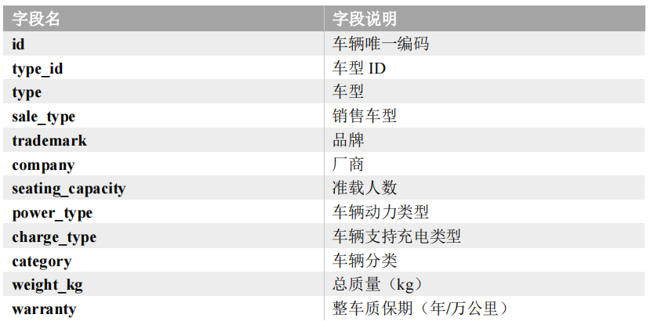
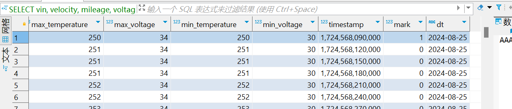
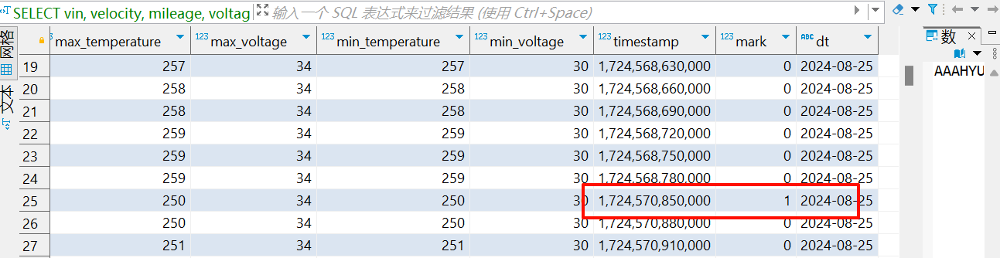

## 模拟数据

```sql
create database car_data charset utf8mb4 collate utf8mb4_general_ci
```

```bash
java -jar \
car-data-1.0.1-jar-with-dependencies.jar \
-c 1 \
-d 2024-08-25 \
-n root \
-p ar352878987 \
-u jdbc:mysql://110.41.50.108:3306/car_data
```

## 数据采集

### 数据生成

我们可以使用数据生成器的 jar 包来生成测试数据。

:::info
用到了数据库`car_data`，所以需要先创建数据库。
:::

```bash
cd /opt/module/car-data/

java -jar \
car-data-1.0-jar-with-dependencies.jar \
-c 1 \
-d 2023-08-25 \
-n root \
-p ar352878987 \
-u jdbc:mysql://110.41.50.108:3306/car_data
```

### 日志数据采集

这里我们使用 Flume 将车辆的日志文件同步到 HDFS 中。Flume 的配置文件如下：

```properties
# Name the components on this agent
a1.sources = r1
a1.sinks = k1
a1.channels = c1

# Describe/configure the source
a1.sources.r1.type = TAILDIR
# 定义f1变量
a1.sources.r1.filegroups = f1
# 给f1变量赋值
a1.sources.r1.filegroups.f1 = /opt/module/car-data/data/data.*
# 偏移量文件（定位文件）
a1.sources.r1.positionFile = /opt/module/flume/taildir-files/car_taildir_position.json

# 配置 Channel
a1.channels.c1.type = file
a1.channels.c1.checkpointDir = /opt/module/flume/checkpoint/behavior1
a1.channels.c1.dataDirs = /opt/module/flume/data/behavior1
a1.channels.c1.maxFileSize = 2146435071
a1.channels.c1.capacity = 1000000
a1.channels.c1.keep-alive = 6

# 配置 Sink (HDFS)
a1.sinks.k1.type = hdfs
a1.sinks.k1.hdfs.path = /origin_data/car_data_full/2024-08-25
a1.sinks.k1.hdfs.filePrefix = log
a1.sinks.k1.hdfs.round = false
a1.sinks.k1.hdfs.rollInterval = 30
a1.sinks.k1.hdfs.rollSize = 134217728
a1.sinks.k1.hdfs.rollCount = 0
a1.sinks.k1.hdfs.fileType = CompressedStream
a1.sinks.k1.hdfs.codeC = gzip

# Bind the source and sink to the channel
a1.sources.r1.channels = c1
a1.sinks.k1.channel = c1
```

执行 flume 命令同步日志数据到 HDFS。

```bash
#!/bin/bash
case $1 in
"start")
echo " --------启动 日志数据 flume-------"
nohup /opt/module/flume/bin/flume-ng agent -n a1 -c /opt/module/flume/conf -f /opt/module/flume/data/car/car_flume_hdfs.conf >/dev/null 2>&1 &
;;
"stop")
echo " --------停止 日志数据 flume-------"
ps -ef | grep car_flume_hdfs | grep -v grep |awk '{print \$2}' | xargs -n1 kill
;;
esac
```

### 业务数据采集

我们需要将 MySQL 中的业务数据同步到 HDFS 中，即 MySQL->HDFS。

那么我们需要 DataX 的配置文件，我们可以使用 DataX 配置生成器来生成见-->[datax 配置文件生成器](../datax/#datax配置文件生成器)

生成 DataX 的配置文件所用的配置文件如下：

```properties
mysql.username=root
mysql.password=ar352878987
mysql.host=110.41.50.108
mysql.port=3306
mysql.database.import=car_data
# mysql.database.export=car_data
mysql.tables.import=car_info,car_state
# mysql.tables.export=car_info
is.seperated.tables=0
hdfs.uri=hdfs://localhost:9000
import_out_dir=/opt/module/datax/job/import
# export_out_dir=d:/output/export
```

当配置文件生成完成之后，我们可以执行执行脚本来进行同步。

mysql-to-hdfs.sh

```bash
#!/bin/bash
if [ "$#" -ne 1 ]
then
echo "参数错误！"
exit 1
fi
targetdir="/origin_data/car_info_full/$1"
# 确保HDFS目录存在且为空
hadoop fs -rm -r "${targetdir}"
hadoop fs -mkdir -p "${targetdir}"

# 执行DataX任务
/opt/module/datax/bin/datax.py /opt/module/datax/job/car_info.json -p"-Dtargetdir=${targetdir}"
```

赋予执行权限`chmod +x mysql-to-hdfs.sh`

执行脚本: `mysql-to-hdfs.sh 2024-08-25`

## 日志数据与维度表

在我们的 MySQL 中只需要存储维度数据



## ODS 层

ODS 层（Operation Data Store 原始数据层）是数据仓库的最底层，存储原始数据，数据仓库中的数据都是从 ODS 层抽取出来的。

设计要点如下：

1. ODS 层的表结构设计依托于从业务系统同步过来的数据结构。
2. ODS 层要保存全部历史数据，故其压缩格式应选择压缩比较高的，此处选择 `gzip`。
3. ODS 层表名的命名规范为：ods*表名*单分区增量全量标识`（inc/full）`。

### 车辆日志表（增量表）

日志表由于信息经常发生变化，需要不断的新增数据，所以这里我们使用增量表来进行存储。

```sql {15-24} showLineNumbers
CREATE EXTERNAL TABLE ods_car_data_inc (
    `vin` STRING COMMENT '汽车唯一ID',
    `car_status` INT COMMENT '车辆状态',
    `charge_status` INT COMMENT '充电状态',
    `execution_mode` INT COMMENT '运行模式',
    `velocity` INT COMMENT '车速',
    `mileage` INT COMMENT '里程',
    `voltage` INT COMMENT '总电压',
    `electric_current` INT COMMENT '总电流',
    `soc` INT COMMENT 'SOC',
    `dc_status` INT COMMENT 'DC-DC 状态',
    `gear` INT COMMENT '挡位',
    `insulation_resistance` INT COMMENT '绝缘电阻',
    `motor_count` INT COMMENT '驱动电机个数',
    `motor_list` ARRAY<STRUCT<
        `id`:INT,
        `status`:INT,
        `rev`:INT,
        `torque`:INT,
        `controller_temperature`:INT,
        `temperature`:INT,
        `voltage`:INT,
        `electric_current`:INT
    >> COMMENT '驱动电机列表',
    `fuel_cell_voltage` INT COMMENT '燃料电池电压',
    `fuel_cell_current` INT COMMENT '燃料电池电流',
    `fuel_cell_consume_rate` INT COMMENT '燃料消耗率',
    `fuel_cell_temperature_probe_count` INT COMMENT '燃料电池温度探针总数',
    `fuel_cell_temperature` INT COMMENT '燃料电池温度值',
    `fuel_cell_max_temperature` INT COMMENT '氢系统中最高温度',
    `fuel_cell_max_temperature_probe_id` INT COMMENT '氢系统中最高温度探针号',
    `fuel_cell_max_hydrogen_consistency` INT COMMENT '氢气最高浓度',
    `fuel_cell_max_hydrogen_consistency_probe_id` INT COMMENT '氢气最高浓度传感器代号',
    `fuel_cell_max_hydrogen_pressure` INT COMMENT '氢气最高压力',
    `fuel_cell_max_hydrogen_pressure_probe_id` INT COMMENT '氢气最高压力传感器代号',
    `fuel_cell_dc_status` INT COMMENT '高压 DC-DC 状态',
    `engine_status` INT COMMENT '发动机状态',
    `crankshaft_speed` INT COMMENT '曲轴转速',
    `fuel_consume_rate` INT COMMENT '燃料消耗率',
    `max_voltage_battery_pack_id` INT COMMENT '最高电压电池子系统号',
    `max_voltage_battery_id` INT COMMENT '最高电压电池单体代号',
    `max_voltage` INT COMMENT '电池单体电压最高值',
    `min_temperature_subsystem_id` INT COMMENT '最低电压电池子系统号',
    `min_voltage_battery_id` INT COMMENT '最低电压电池单体代号',
    `min_voltage` INT COMMENT '电池单体电压最低值',
    `max_temperature_subsystem_id` INT COMMENT '最高温度子系统号',
    `max_temperature_probe_id` INT COMMENT '最高温度探针号',
    `max_temperature` INT COMMENT '最高温度值',
    `min_voltage_battery_pack_id` INT COMMENT '最低温度子系统号',
    `min_temperature_probe_id` INT COMMENT '最低温度探针号',
    `min_temperature` INT COMMENT '最低温度值',
    `alarm_level` INT COMMENT '报警级别',
    `alarm_sign` INT COMMENT '通用报警标志',
    `custom_battery_alarm_count` INT COMMENT '可充电储能装置故障总数 N1',
    `custom_battery_alarm_list` ARRAY<INT> COMMENT '可充电储能装置故障代码列表',
    `custom_motor_alarm_count` INT COMMENT '驱动电机故障总数 N2',
    `custom_motor_alarm_list` ARRAY<INT> COMMENT '驱动电机故障代码列表',
    `custom_engine_alarm_count` INT COMMENT '发动机故障总数 N3',
    `custom_engine_alarm_list` ARRAY<INT> COMMENT '发动机故障代码列表',
    `other_alarm_count` INT COMMENT '其他故障总数 N4',
    `other_alarm_list` ARRAY<INT> COMMENT '其他故障代码列表',
    `battery_count` INT COMMENT '单体电池总数',
    `battery_pack_count` INT COMMENT '单体电池包总数',
    `battery_voltages` ARRAY<INT> COMMENT '单体电池电压值列表',
    `battery_temperature_probe_count` INT COMMENT '单体电池温度探针总数',
    `battery_pack_temperature_count` INT COMMENT '单体电池包总数',
    `battery_temperatures` ARRAY<INT> COMMENT '单体电池温度值列表',
    `timestamp` BIGINT COMMENT '日志采集时间'
)
COMMENT '整车日志表'
PARTITIONED BY (
    `dt` STRING COMMENT '统计日期'
)
ROW FORMAT SERDE 'org.apache.hadoop.hive.serde2.JsonSerDe'
LOCATION '/warehouse/car_data/ods/ods_car_data_inc';
```

需要重点学习的就是

```sql
`motor_list` ARRAY<STRUCT<
        `id`：INT,
        `status`：INT,
        `rev`：INT,
        `torque`：INT,
        `controller_temperature`：INT,
        `temperature`：INT,
        `voltage`：INT,
        `electric_current`：INT
    >> COMMENT '驱动电机列表',
```

驱动电机列表，其实可以理解为一个`ArrayList<电机>`即可。

### 汽车信息表（全量表）

汽车的维度信息很少会发生变化，因此我们选择全量表来存储汽车信息。

```sql
drop table if exists ods_car_info_full;
create external table ods_car_info_full
(
 `id` string comment '车辆唯一编码',
 `type_id` string comment '车型 ID',
 `type` string comment '车型',
 `sale_type` string comment '销售车型',
 `trademark` string comment '品牌',
 `company` string comment '厂商',
 `seating_capacity` int comment '准载人数',
 `power_type` string comment '车辆动力类型',
 `charge_type` string comment '车辆支持充电类型',
 `category` string comment '车辆分类',
 `weight_kg` int comment '总质量（kg）',
 `warranty` string comment '整车质保期（年/万公里）'
) comment '整车信息表'
 partitioned by (`dt` string comment '统计日期')
 row format delimited fields terminated by '\t'
 location '/warehouse/car_data/ods/ods_car_info_full';
```

### 数据装载脚本

即我们需要将每日的数据装载到对应的表中，这里的数据是来自于 Hadoop 中的，所有的数据已经存储到 Hadoop 中，再装载到 Hive 中，方便查询。

- 每日日志数据-->日志增量表
- 汽车维度数据-->汽车信息全量表

`hdfs-to-ods.sh`

```bash
#!/bin/bash

APP='car_data'

# 判断第二个参数是否填写 如果填写使用作为日期 如果没有填写 默认使用昨天作为日期
if [ -n "$2" ]; then
    do_date=$2
else
    do_date=$(date -d '-1 day' +%F)
fi

case "$1" in
    "ods_car_data_inc")
        hive -e "
            LOAD DATA INPATH '/origin_data/car_data_full/$do_date'
            INTO TABLE $APP.ods_car_data_inc PARTITION (dt='$do_date');
        "
        ;;
    "ods_car_info_full")
        hive -e "
            LOAD DATA INPATH '/origin_data/car_info_full/$do_date'
            INTO TABLE $APP.ods_car_info_full PARTITION (dt='$do_date');
        "
        ;;
    "all")
        hive -e "
            LOAD DATA INPATH '/origin_data/car_data_full/$do_date'
            INTO TABLE $APP.ods_car_data_inc PARTITION (dt='$do_date');
            LOAD DATA INPATH '/origin_data/car_info_full/$do_date'
            INTO TABLE $APP.ods_car_info_full PARTITION (dt='$do_date');
        "
        ;;
esac
```

然后再赋予脚本执行权限，再执行即可。

```bash
chmod +x hdfs-to-ods.sh
hdfs-to-ods all 2024-06-19
```

## DIM 层

DIM（Dimension） 层是公共维度层，存储模型中需要用到的所有维度信息。

设计要点：

1. DIM 层的设计依据是维度建模理论，该层存储维度模型的维度表。
2. DIM 层的数据存储格式为 orc 列式存储+snappy 压缩。
3. DIM 层表名的命名规范为 dim*表名*全量表或者拉链表标识（full/zip）

### 车辆信息维度表

```sql
drop table if exists dim_car_info_full;
create external table dim_car_info_full
(
 `id` string comment '车辆唯一编码',
 `type_id` string comment '车型 ID',
 `type` string comment '车型',
 `sale_type` string comment '销售车型',
 `trademark` string comment '品牌',
 `company` string comment '厂商',
 `seating_capacity` int comment '准载人数',
 `power_type` string comment '车辆动力类型',
 `charge_type` string comment '车辆支持充电类型',
 `category` string comment '车辆分类',
 `weight_kg` int comment '总质量（kg）',
 `warranty` string comment '整车质保期（年/万公里）'
) comment '车辆信息维度表'
partitioned by (`dt` string comment '统计日期')
 stored as orc
 location '/warehouse/car_data/dim/dim_car_info_full'
 tblproperties ('orc.compress' = 'snappy');
```

数据装载

```sql
INSERT overwrite table dim_car_info_full partition (dt='2024-08-25') SELECT
	id ,
	type_id ,
	`type` ,
	sale_type ,
	trademark ,
	company ,
	seating_capacity ,
	power_type ,
	charge_type ,
	category ,
	weight_kg ,
	warranty
FROM
	ods_car_info_full as o
WHERE
	o.dt = '2024-08-25';
```

### 日志编码维度表

即在日志信息中有很多的状态信息，我们需要一个对应的表来表示这些状态信息是什么样的含义，但是这些状态信息是持久不变的，所以无需使用分区。

```sql
drop table if exists dim_code_full;
create external table dim_code_full
(
 `type` string comment '编码类型',
 `code_id` string comment '编码 ID',
`code_name` string comment '编码名称'
) comment '日志编码维度表'
stored as orc
location '/warehouse/car_data/dim/dim_code_full'
tblproperties ('orc.compress' = 'snappy');
```

数据装载

:::warning
由于 dim 层的表格具有压缩和存储格式，所有不能直接上传文件到 hive 的表格路径，需要先上传文件 car_data_code.txt 到临时表中。
:::

我们现创建临时表

```sql
drop table if exists tmp_code_full;
create external table tmp_code_full
(
 `type` string comment '编码类型',
 `code_id` string comment '编码 ID',
`code_name` string comment '编码名称'
) comment '日志编码维度表'
row format delimited
fields terminated by '\t'
location '/warehouse/car_data/tmp/tmp_code_full';
```

然后我们将状态信息文件上传到 HDFS 中的`/warehouse/car_data/tmp/tmp_code_full`目录下即可。

可以先查询一下临时表中的数据，检验是否正确，如果没有问题则可以将临时表中的数据装载到 dim_code_full 表中。

```sql
select * from tmp_code_full;

-- 装载数据
insert into table dim_code_full select * from tmp_code_full;
-- 检测是否正确装载
SELECT * FROM dim_code_full;
```

## DWD 层

DWD（Data Warehouse Detail） 层是数据仓库的明细层，存放维度模型中的事实表，<span style={{color:'red',fontWeight:'bold'}}>保存各个业务过程中的最小粒度的操作记录</span>。即记录业务的一个过程。

设计要点：

1. DWD 层的设计依据是维度建模理论，该层存储维度模型的事实表。
2. DWD 层的数据存储格式为 orc 列式存储+snappy 压缩。
3. DWD 层表名的命名规范为 dwd*数据域*表名\_单分区增量全量标识（inc/full）
4. 数据来源与 ODS 层的日志数据，在 ODS 层的日志数据中，不同的数据对应不同的业务过程。

我们知道离线数仓的设计原理是根据最终想要展示的数据以及效果，从后向前逐步分析，最后得出离线数仓的架构设计。所以在我们的 DWD 的设计中，我们需要参考业务总线矩阵。

### 电动模式行驶日志

我们需要创建一个电动模式的形式日志表，该表的目的是为了记录车辆在行驶过程中产生的日志信息。所以我们使用增量表。

```sql
DROP TABLE IF EXISTS dwd_car_running_electricity_inc;

CREATE EXTERNAL TABLE dwd_car_running_electricity_inc (
    `vin` STRING COMMENT '汽车唯一ID',
    `velocity` INT COMMENT '车速',
    `mileage` INT COMMENT '里程',
    `voltage` INT COMMENT '总电压',
    `electric_current` INT COMMENT '总电流',
    `soc` INT COMMENT 'SOC',
    `dc_status` INT COMMENT 'DC-DC 状态',
    `gear` INT COMMENT '挡位',
    `insulation_resistance` INT COMMENT '绝缘电阻',
    `motor_count` INT COMMENT '驱动电机个数',
    `motor_list` ARRAY<STRUCT<
        `id`:INT,
        `status`:INT,
        `rev`:INT,
        `torque`:INT,
        `controller_temperature`:INT,
        `temperature`:INT,
        `voltage`:INT,
        `electric_current`:INT
    >> COMMENT '驱动电机列表',
    `fuel_cell_dc_status` INT COMMENT '高压 DC-DC 状态',
    `engine_status` INT COMMENT '发动机状态',
    `crankshaft_speed` INT COMMENT '曲轴转速',
    `fuel_consume_rate` INT COMMENT '燃料消耗率',
    `max_voltage_battery_pack_id` INT COMMENT '最高电压电池子系统号',
    `max_voltage_battery_id` INT COMMENT '最高电压电池单体代号',
    `max_voltage` INT COMMENT '电池单体电压最高值',
    `min_temperature_subsystem_id` INT COMMENT '最低电压电池子系统号',
    `min_voltage_battery_id` INT COMMENT '最低电压电池单体代号',
    `min_voltage` INT COMMENT '电池单体电压最低值',
    `max_temperature_subsystem_id` INT COMMENT '最高温度子系统号',
    `max_temperature_probe_id` INT COMMENT '最高温度探针号',
    `max_temperature` INT COMMENT '最高温度值',
    `min_voltage_battery_pack_id` INT COMMENT '最低温度子系统号',
    `min_temperature_probe_id` INT COMMENT '最低温度探针号',
    `min_temperature` INT COMMENT '最低温度值',
    `battery_count` INT COMMENT '单体电池总数',
    `battery_pack_count` INT COMMENT '单体电池包总数',
    `battery_voltages` ARRAY<INT> COMMENT '单体电池电压值列表',
    `battery_temperature_probe_count` INT COMMENT '单体电池温度探针总数',
    `battery_pack_temperature_count` INT COMMENT '单体电池包总数',
    `battery_temperatures` ARRAY<INT> COMMENT '单体电池温度值列表',
    `timestamp` BIGINT COMMENT '日志采集时间'
)
COMMENT '电动模式行驶日志事实表'
PARTITIONED BY (
    `dt` STRING COMMENT '统计日期'
)
STORED AS ORC
LOCATION '/warehouse/car_data/dwd/dwd_car_running_electricity_inc'
TBLPROPERTIES ('orc.compress' = 'snappy');
```

对于增量表，我们有两个阶段，首先要先进行首日装载，将以前的数据装载，然后正式上线运行后，每日的数据也需要装载。

**首日装载**

```sql {43} showLineNumbers
-- 首日装载
SET hive.exec.dynamic.partition.mode=nonstrict;

INSERT OVERWRITE TABLE car_data.dwd_car_running_electricity_inc
PARTITION(dt)
SELECT
    `vin`,
    `velocity`,
    `mileage`,
    `voltage`,
    `electric_current`,
    `soc`,
    `dc_status`,
    `gear`,
    `insulation_resistance`,
    `motor_count`,
    `motor_list`,
    `fuel_cell_dc_status`,
    `engine_status`,
    `crankshaft_speed`,
    `fuel_consume_rate`,
    `max_voltage_battery_pack_id`,
    `max_voltage_battery_id`,
    `max_voltage`,
    `min_temperature_subsystem_id`,
    `min_voltage_battery_id`,
    `min_voltage`,
    `max_temperature_subsystem_id`,
    `max_temperature_probe_id`,
    `max_temperature`,
    `min_voltage_battery_pack_id`,
    `min_temperature_probe_id`,
    `min_temperature`,
    `battery_count`,
    `battery_pack_count`,
    `battery_voltages`,
    `battery_temperature_probe_count`,
    `battery_pack_temperature_count`,
    `battery_temperatures`,
    `timestamp`,
    `dt`
FROM car_data.ods_car_data_inc
WHERE dt <= '2024-06-19'
  AND car_status = 1
  AND execution_mode = 1;
```

假定的上线时间为`2024-06-19`，我们可以看到，我们从 ods 层中查询了`06-19`前的所有数据，并且过滤了电动模式，然后将数据装载到`dwd_car_running_electricity_inc`表中。

**每日装载**

```sql {4,42} showLineNumbers
SET hive.exec.dynamic.partition.mode=nonstrict;

INSERT OVERWRITE TABLE dwd_car_running_electricity_inc
PARTITION(dt='2024-08-25')
SELECT
    `vin`,
    `velocity`,
    `mileage`,
    `voltage`,
    `electric_current`,
    `soc`,
    `dc_status`,
    `gear`,
    `insulation_resistance`,
    `motor_count`,
    `motor_list`,
    `fuel_cell_dc_status`,
    `engine_status`,
    `crankshaft_speed`,
    `fuel_consume_rate`,
    `max_voltage_battery_pack_id`,
    `max_voltage_battery_id`,
    `max_voltage`,
    `min_temperature_subsystem_id`,
    `min_voltage_battery_id`,
    `min_voltage`,
    `max_temperature_subsystem_id`,
    `max_temperature_probe_id`,
    `max_temperature`,
    `min_voltage_battery_pack_id`,
    `min_temperature_probe_id`,
    `min_temperature`,
    `battery_count`,
    `battery_pack_count`,
    `battery_voltages`,
    `battery_temperature_probe_count`,
    `battery_pack_temperature_count`,
    `battery_temperatures`,
    `timestamp`
FROM ods_car_data_inc
WHERE dt = '2024-08-25'
  AND car_status = 1
  AND execution_mode = 1;
```

```sql
SELECT * FROM dwd_car_running_electricity_inc;
```

可以看到对于每日装载，我们只查询了`2024-08-25`的数据，并且过滤了电动模式，然后将数据装载到`dwd_car_running_electricity_inc`表中。

### 混动模式行驶日志

```sql
drop table if exists dwd_car_running_hybrid_inc;

create external table dwd_car_running_hybrid_inc
(
 `vin` string comment '汽车唯一
ID',
 `velocity` int comment '车速',
 `mileage` int comment '里程',
 `voltage` int comment '总电压',
 `electric_current` int comment '总电流',
 `soc` int comment 'SOC',
 `dc_status` int comment 'DC-DC 状态
',
 `gear` int comment '挡位',
 `insulation_resistance` int comment '绝缘电阻
',
 `motor_count` int comment '驱动电机个
数',
 `motor_list`
array<struct<`id` :int, `status` :int, `rev` :int, `torque` :int,
`controller_temperature` :int, `temperature` :int,
 `voltage`:int, `electric_current` :int>> comment '驱动电机列表',
 `fuel_cell_dc_status` int comment '高压 DC￾DC 状态',
 `engine_status` int comment '发动机状态
',
 `crankshaft_speed` int comment '曲轴转速',
 `fuel_consume_rate` int comment '燃料消耗
率',
 `max_voltage_battery_pack_id` int comment '最高电
压电池子系统号',
 `max_voltage_battery_id` int comment '最高电压
电池单体代号',
 `max_voltage` int comment '电池单体电
压最高值',
 `min_temperature_subsystem_id` int comment '最低电
压电池子系统号',
 `min_voltage_battery_id` int comment '最低电压
电池单体代号',
 `min_voltage` int comment '电池单体电
压最低值',
 `max_temperature_subsystem_id` int comment '最高温
度子系统号',
 `max_temperature_probe_id` int comment '最高温度
探针号',
 `max_temperature` int comment '最高温度值
',
 `min_voltage_battery_pack_id` int comment '最低温
度子系统号',
 `min_temperature_probe_id` int comment '最低温度
探针号',
 `min_temperature` int comment '最低温度值
',
 `battery_count` int comment '单体电池总
数',
 `battery_pack_count` int comment '单体电池
包总数',
 `battery_voltages` array<int> comment '
单体电池电压值列表',
 `battery_temperature_probe_count` int comment '单体电
池温度探针总数',
 `battery_pack_temperature_count` int comment '单体电
池包总数',
 `battery_temperatures` array<int> comment '
单体电池温度值列表',
 `timestamp` bigint comment '日志采
集时间'
)
comment '混动模式行驶日志事实表'
partitioned by (`dt` string comment '统计日期')
stored as orc
location '/warehouse/car_data/dwd/dwd_car_running_hybrid_inc'
tblproperties ('orc.compress' = 'snappy');
```

装载数据，这里就只放每日装载的了。

```sql
insert overwrite table dwd_car_running_hybrid_inc
partition(dt='2024-08-25')
select
 `vin`,
 `velocity`,
 `mileage`,
 `voltage`,
 `electric_current`,
 `soc`,
 `dc_status`,
 `gear`,
 `insulation_resistance`,
 `motor_count`,
 `motor_list`,
 `fuel_cell_dc_status`,
 `engine_status`,
 `crankshaft_speed`,
 `fuel_consume_rate` ,
 `max_voltage_battery_pack_id`,
 `max_voltage_battery_id`,
 `max_voltage`,
 `min_temperature_subsystem_id`,
 `min_voltage_battery_id`,
 `min_voltage`,
 `max_temperature_subsystem_id`,
 `max_temperature_probe_id`,
 `max_temperature`,
 `min_voltage_battery_pack_id`,
 `min_temperature_probe_id`,
 `min_temperature`,
 `battery_count`,
 `battery_pack_count`,
 `battery_voltages`,
 `battery_temperature_probe_count`,
 `battery_pack_temperature_count`,
 `battery_temperatures`,
 `timestamp`
from ods_car_data_inc
where dt='2024-08-25'
and car_status=1
and execution_mode=2;

-- 查看数据
select * from dwd_car_running_hybrid_inc;
```

### 新能源燃料模式行驶日志事实表

```sql
Drop table if exists dwd_car_running_fuel_inc;
create external table dwd_car_running_fuel_inc
(
 `vin` string comment '汽车唯一
ID',
 `velocity` int comment '车速',
 `mileage` int comment '里程',
 `voltage` int comment '总电压',
 `electric_current` int comment '总电流',
 `soc` int comment 'SOC',
 `dc_status` int comment 'DC-DC 状态
',
 `gear` int comment '挡位',
 `insulation_resistance` int comment '绝缘电阻
',
 `fuel_cell_voltage` int comment '燃料电池
电压',
 `fuel_cell_current` int comment '燃料电池
电流',
 `fuel_cell_consume_rate` int comment '燃料消耗
率',
 `fuel_cell_temperature_probe_count` int comment '燃料电池温度探针总数',
 `fuel_cell_temperature` int comment '燃料电池
温度值',
 `fuel_cell_max_temperature` int comment '氢系统中
最高温度',
 `fuel_cell_max_temperature_probe_id` int comment '氢系统
中最高温度探针号',
 `fuel_cell_max_hydrogen_consistency` int comment '氢气最
高浓度',
 `fuel_cell_max_hydrogen_consistency_probe_id` int comment '氢气
最高浓度传感器代号',
 `fuel_cell_max_hydrogen_pressure` int comment '氢气最
高压力',
 `fuel_cell_max_hydrogen_pressure_probe_id` int comment '氢气
最高压力传感器代号',
 `fuel_cell_dc_status` int comment '高压 DC￾DC 状态',
 `engine_status` int comment '发动机状态
',
 `crankshaft_speed` int comment '曲轴转速
',
 `fuel_consume_rate` int comment '燃料消耗
率',
 `max_voltage_battery_pack_id` int comment '最高电
压电池子系统号',
 `max_voltage_battery_id` int comment '最高电压
电池单体代号',
 `max_voltage` int comment '电池单体电
压最高值',
 `min_temperature_subsystem_id` int comment '最低电
压电池子系统号',
 `min_voltage_battery_id` int comment '最低电压
电池单体代号',
 `min_voltage` int comment '电池单体电
压最低值',
 `max_temperature_subsystem_id` int comment '最高温
度子系统号',
 `max_temperature_probe_id` int comment '最高温度
探针号',
 `max_temperature` int comment '最高温度值
',
 `min_voltage_battery_pack_id` int comment '最低温
度子系统号',
 `min_temperature_probe_id` int comment '最低温度
探针号',
 `min_temperature` int comment '最低温度值
',
 `timestamp` bigint comment '日志采
集时间'
)
comment '新能源燃料模式行驶日志事实表'
partitioned by (`dt` string comment '统计日期')
stored as orc
location '/warehouse/car_data/dwd/dwd_car_running_fuel_inc'
tblproperties ('orc.compress' = 'snappy');
```

装载数据

```sql
insert overwrite table dwd_car_running_fuel_inc
partition(dt='2024-08-25')
select
 `vin`,
 `velocity`,
 `mileage`,
 `voltage`,
 `electric_current`,
 `soc`,
 `dc_status`,
 `gear`,
 `insulation_resistance`,
 `fuel_cell_voltage`,
 `fuel_cell_current`,
 `fuel_cell_consume_rate`,
 `fuel_cell_temperature_probe_count`,
 `fuel_cell_temperature`,
 `fuel_cell_max_temperature`,
 `fuel_cell_max_temperature_probe_id`,
 `fuel_cell_max_hydrogen_consistency`,
 `fuel_cell_max_hydrogen_consistency_probe_id`,
 `fuel_cell_max_hydrogen_pressure`,
 `fuel_cell_max_hydrogen_pressure_probe_id`,
 `fuel_cell_dc_status`,
 `engine_status`,
 `crankshaft_speed`,
 `fuel_consume_rate`,
 `max_voltage_battery_pack_id`,
 `max_voltage_battery_id`,
 `max_voltage`,
 `min_temperature_subsystem_id`,
 `min_voltage_battery_id`,
 `min_voltage`,
 `max_temperature_subsystem_id`,
 `max_temperature_probe_id`,
 `max_temperature`,
 `min_voltage_battery_pack_id`,
 `min_temperature_probe_id`,
 `min_temperature`,
 `timestamp`
from ods_car_data_inc
where dt='2024-08-25'
and car_status=1
and execution_mode=3;
-- 查看数据
SELECT * FROM dwd_car_running_fuel_inc;
```

### 充电桩充电日志事实表

```sql
drop table if exists dwd_car_parking_charging_inc;
create external table dwd_car_parking_charging_inc
(
 `vin` string comment '汽车唯一
ID',
 `voltage` int comment '总电压',
 `electric_current` int comment '总电流',
 `soc` int comment 'SOC',
 `dc_status` int comment 'DC-DC 状态
',
 `gear` int comment '挡位',
 `insulation_resistance` int comment '绝缘电阻
',
 `engine_status` int comment '发动机状态
',
 `crankshaft_speed` int comment '曲轴转速
',
 `fuel_consume_rate` int comment '燃料消耗
率',
 `max_voltage_battery_pack_id` int comment '最高电
压电池子系统号',
 `max_voltage_battery_id` int comment '最高电压
电池单体代号',
 `max_voltage` int comment '电池单体电
压最高值',
 `min_temperature_subsystem_id` int comment '最低电
压电池子系统号',
 `min_voltage_battery_id` int comment '最低电压
电池单体代号',
 `min_voltage` int comment '电池单体电
压最低值',
 `max_temperature_subsystem_id` int comment '最高温
度子系统号',
 `max_temperature_probe_id` int comment '最高温度
探针号',
 `max_temperature` int comment '最高温度值
',
 `min_voltage_battery_pack_id` int comment '最低温
度子系统号',
 `min_temperature_probe_id` int comment '最低温度
探针号',
 `min_temperature` int comment '最低温度值
',
 `battery_count` int comment '单体电池总
数',
 `battery_pack_count` int comment '单体电池
包总数',
 `battery_voltages` array<int> comment '
单体电池电压值列表',
 `battery_temperature_probe_count` int comment '单体电
池温度探针总数',
 `battery_pack_temperature_count` int comment '单体电
池包总数',
 `battery_temperatures` array<int> comment '
单体电池温度值列表',
 `timestamp` bigint comment '日志采
集时间'
)
comment '充电桩充电日志事实表'
partitioned by (`dt` string comment '统计日期')
stored as orc
location '/warehouse/car_data/dwd/dwd_car_parking_charging_inc'
tblproperties ('orc.compress' = 'snappy');
```

数据装载

```sql
insert overwrite table dwd_car_parking_charging_inc
partition(dt='2024-08-25')
select
 `vin`,
 `voltage`,
 `electric_current`,
 `soc`,
 `dc_status`,
 `gear`,
 `insulation_resistance`,
 `engine_status`,
 `crankshaft_speed`,
 `fuel_consume_rate`,
 `max_voltage_battery_pack_id`,
 `max_voltage_battery_id`,
 `max_voltage`,
 `min_temperature_subsystem_id`,
 `min_voltage_battery_id`,
 `min_voltage`,
 `max_temperature_subsystem_id`,
 `max_temperature_probe_id`,
 `max_temperature`,
 `min_voltage_battery_pack_id`,
 `min_temperature_probe_id`,
 `min_temperature`,
 `battery_count`,
 `battery_pack_count`,
 `battery_voltages`,
 `battery_temperature_probe_count`,
 `battery_pack_temperature_count`,
 `battery_temperatures`,
 `timestamp`
from ods_car_data_inc
where dt='2024-08-25'
and car_status=2
and charge_status=1;

SELECT * FROM dwd_car_parking_charging_inc;
```

### 行驶充电日志事实表

```sql
drop table if exists dwd_car_running_charging_inc;
create external table dwd_car_running_charging_inc
(
 `vin` string comment '汽车唯一
ID',
 `velocity` int comment '车速',
 `mileage` int comment '里程',
 `voltage` int comment '总电压',
 `electric_current` int comment '总电流',
 `soc` int comment 'SOC',
 `dc_status` int comment 'DC-DC 状态
',
 `gear` int comment '挡位',
 `insulation_resistance` int comment '绝缘电阻
',
 `motor_count` int comment '驱动电机个
数',
 `motor_list`
array<struct<`id` :int, `status` :int, `rev` :int, `torque` :int,

`controller_temperature` :int, `temperature` :int,
 `voltage`
 :int,
`electric_current` :int>> comment '驱动电机列表',
 `fuel_cell_voltage` int comment '燃料电池
电压',
 `fuel_cell_current` int comment '燃料电池
电流',
 `fuel_cell_consume_rate` int comment '燃料消耗率',
 `fuel_cell_temperature_probe_count` int comment '燃料电
池温度探针总数',
 `fuel_cell_temperature` int comment '燃料电池
温度值',
 `fuel_cell_max_temperature` int comment '氢系统中
最高温度',
 `fuel_cell_max_temperature_probe_id` int comment '氢系统
中最高温度探针号',
 `fuel_cell_max_hydrogen_consistency` int comment '氢气最
高浓度',
 `fuel_cell_max_hydrogen_consistency_probe_id` int comment '氢气
最高浓度传感器代号',
 `fuel_cell_max_hydrogen_pressure` int comment '氢气最
高压力',
 `fuel_cell_max_hydrogen_pressure_probe_id` int comment '氢气
最高压力传感器代号',
 `fuel_cell_dc_status` int comment '高压 DC￾DC 状态',
 `engine_status` int comment '发动机状态
',
 `crankshaft_speed` int comment '曲轴转速
',
 `fuel_consume_rate` int comment '燃料消耗
率',
 `max_voltage_battery_pack_id` int comment '最高电
压电池子系统号',
 `max_voltage_battery_id` int comment '最高电压
电池单体代号',
 `max_voltage` int comment '电池单体电
压最高值',
 `min_temperature_subsystem_id` int comment '最低电
压电池子系统号',
 `min_voltage_battery_id` int comment '最低电压
电池单体代号',
 `min_voltage` int comment '电池单体电
压最低值',
 `max_temperature_subsystem_id` int comment '最高温
度子系统号',
 `max_temperature_probe_id` int comment '最高温度
探针号',
 `max_temperature` int comment '最高温度值
',
 `min_voltage_battery_pack_id` int comment '最低温
度子系统号',
 `min_temperature_probe_id` int comment '最低温度
探针号',
 `min_temperature` int comment '最低温度值
',
 `battery_count` int comment '单体电池总
数',
 `battery_pack_count` int comment '单体电池
包总数',
 `battery_voltages` array<int> comment '
单体电池电压值列表',
 `battery_temperature_probe_count` int comment '单体电
池温度探针总数',
 `battery_pack_temperature_count` int comment '单体电
池包总数',
 `battery_temperatures` array<int> comment '
单体电池温度值列表',
 `timestamp` bigint comment '日志采
集时间'
)
comment '充电桩充电日志事实表'
partitioned by (`dt` string comment '统计日期')
stored as orc
location '/warehouse/car_data/dwd/dwd_car_running_charging_inc'
tblproperties ('orc.compress' = 'snappy');
```

数据装载

```sql
insert overwrite table dwd_car_running_charging_inc
partition(dt='2024-08-15')
select
 `vin`,
 `velocity`,
 `mileage`,
 `voltage`,
 `electric_current`,
 `soc`,
 `dc_status`,
 `gear`,
 `insulation_resistance`,
 `motor_count`,
 `motor_list`,
 `fuel_cell_voltage`,
 `fuel_cell_current`,
 `fuel_cell_consume_rate`,
 `fuel_cell_temperature_probe_count`,
 `fuel_cell_temperature`,
 `fuel_cell_max_temperature`,
 `fuel_cell_max_temperature_probe_id`,
 `fuel_cell_max_hydrogen_consistency`,
 `fuel_cell_max_hydrogen_consistency_probe_id`,
 `fuel_cell_max_hydrogen_pressure`,
 `fuel_cell_max_hydrogen_pressure_probe_id`,
 `fuel_cell_dc_status`,
 `engine_status`,
 `crankshaft_speed`,
 `fuel_consume_rate`,
 `max_voltage_battery_pack_id`,
 `max_voltage_battery_id`,
 `max_voltage`,
 `min_temperature_subsystem_id`,
 `min_voltage_battery_id`,
 `min_voltage`,
 `max_temperature_subsystem_id`,
 `max_temperature_probe_id`,
 `max_temperature`,
 `min_voltage_battery_pack_id`,
 `min_temperature_probe_id`,
 `min_temperature`,
 `battery_count`,
 `battery_pack_count`,
 `battery_voltages`,
 `battery_temperature_probe_count`,
 `battery_pack_temperature_count`,
 `battery_temperatures`,
 `timestamp`
from ods_car_data_inc
where dt='2024-08-25'
and car_status=1
and charge_status=2;

SELECT * FROM dwd_car_running_charging_inc;
```

### 故障告警日志事实表

```sql
drop table if exists dwd_car_alarm_inc;
create external table dwd_car_alarm_inc
(
 `vin` string comment '汽车唯一
ID',
 `car_status` int comment '车辆状态',
 `charge_status` int comment '充电状态',
 `execution_mode` int comment '运行模式
',
 `velocity` int comment '车速',
 `mileage` int comment '里程',
 `voltage` int comment '总电压',
 `electric_current` int comment '总电流',
 `soc` int comment 'SOC',
 `dc_status` int comment 'DC-DC 状态
',
 `gear` int comment '挡位',
 `insulation_resistance` int comment '绝缘电阻
',
 `motor_count` int comment '驱动电机个
数',
 `motor_list`
array<struct<`id` :int, `status` :int, `rev` :int, `torque` :int,
`controller_temperature` :int, `temperature` :int,`voltage`:int, `electric_current` :int>> comment '驱动电机列表',
 `fuel_cell_voltage` int comment '燃料电池
电压',
 `fuel_cell_current` int comment '燃料电池
电流',
 `fuel_cell_consume_rate` int comment '燃料消耗
率',
 `fuel_cell_temperature_probe_count` int comment '燃料电
池温度探针总数',
 `fuel_cell_temperature` int comment '燃料电池
温度值',
 `fuel_cell_max_temperature` int comment '氢系统中
最高温度',
 `fuel_cell_max_temperature_probe_id` int comment '氢系统
中最高温度探针号',
 `fuel_cell_max_hydrogen_consistency` int comment '氢气最
高浓度',
 `fuel_cell_max_hydrogen_consistency_probe_id` int comment '氢气
最高浓度传感器代号',
 `fuel_cell_max_hydrogen_pressure` int comment '氢气最
高压力',
 `fuel_cell_max_hydrogen_pressure_probe_id` int comment '氢气
最高压力传感器代号',
 `fuel_cell_dc_status` int comment '高压 DC￾DC 状态',
 `engine_status` int comment '发动机状态
',
 `crankshaft_speed` int comment '曲轴转速
',
 `fuel_consume_rate` int comment '燃料消耗
率',
 `max_voltage_battery_pack_id` int comment '最高电
压电池子系统号',
 `max_voltage_battery_id` int comment '最高电压
电池单体代号',
 `max_voltage` int comment '电池单体电
压最高值',
 `min_temperature_subsystem_id` int comment '最低电
压电池子系统号',
 `min_voltage_battery_id` int comment '最低电压
电池单体代号',
 `min_voltage` int comment '电池单体电
压最低值',
 `max_temperature_subsystem_id` int comment '最高温度子系统号',
 `max_temperature_probe_id` int comment '最高温度探针号',
 `max_temperature` int comment '最高温度值',
 `min_voltage_battery_pack_id` int comment '最低温度子系统号',
 `min_temperature_probe_id` int comment '最低温度探针号',
 `min_temperature` int comment '最低温度值',
 `alarm_level` int comment '报警级别',
 `alarm_sign` int comment '通用报警标志',
 `custom_battery_alarm_count` int comment '可充电
储能装置故障总数 N1',
 `custom_battery_alarm_list` array<int> comment
'可充电储能装置故障代码列表',
 `custom_motor_alarm_count` int comment '驱动电机
故障总数 N2',
 `custom_motor_alarm_list` array<int> comment '
驱动电机故障代码列表',
 `custom_engine_alarm_count` int comment '发动机故
障总数 N3',
 `custom_engine_alarm_list` array<int> comment
'发动机故障代码列表',
 `other_alarm_count` int comment '其他故障
总数 N4',
 `other_alarm_list` array<int> comment '
其他故障代码列表',
 `battery_count` int comment '单体电池总
数',
 `battery_pack_count` int comment '单体电池
包总数',
 `battery_voltages` array<int> comment '
单体电池电压值列表',
 `battery_temperature_probe_count` int comment '单体电
池温度探针总数',
 `battery_pack_temperature_count` int comment '单体电
池包总数',
 `battery_temperatures` array<int> comment '
单体电池温度值列表',
 `timestamp` bigint comment '日志采
集时间'
)
comment '故障充电日志事实表'
partitioned by (`dt` string comment '统计日期')
stored as orc
location '/warehouse/car_data/dwd/dwd_car_alarm_inc'
tblproperties ('orc.compress' = 'snappy');
```

数据装载

```sql
insert overwrite table dwd_car_alarm_inc partition(dt='2024-08-25')
select
 `vin`,
 `car_status`,
 `charge_status`,
 `execution_mode`,
 `velocity`,
 `mileage`,
 `voltage`,
 `electric_current`,
 `soc`,
 `dc_status`,
 `gear`,
 `insulation_resistance`,
 `motor_count`,
 `motor_list`,
 `fuel_cell_voltage`,
 `fuel_cell_current`,
 `fuel_cell_consume_rate`,
 `fuel_cell_temperature_probe_count`,
 `fuel_cell_temperature`,
 `fuel_cell_max_temperature`,
 `fuel_cell_max_temperature_probe_id`,
 `fuel_cell_max_hydrogen_consistency`,
 `fuel_cell_max_hydrogen_consistency_probe_id`,
 `fuel_cell_max_hydrogen_pressure`,
 `fuel_cell_max_hydrogen_pressure_probe_id`,
 `fuel_cell_dc_status`,
 `engine_status`,
 `crankshaft_speed`,
 `fuel_consume_rate`,
 `max_voltage_battery_pack_id`,
 `max_voltage_battery_id`,
 `max_voltage`,
 `min_temperature_subsystem_id`,
 `min_voltage_battery_id`,
 `min_voltage`,
 `max_temperature_subsystem_id`,
 `max_temperature_probe_id`,
 `max_temperature`,
 `min_voltage_battery_pack_id`,
 `min_temperature_probe_id`,
 `min_temperature`,
 `alarm_level`,
 `alarm_sign`,
 `custom_battery_alarm_count`,
 `custom_battery_alarm_list`,
 `custom_motor_alarm_count`,
 `custom_motor_alarm_list`,
 `custom_engine_alarm_count`,
 `custom_engine_alarm_list`,
 `other_alarm_count`,
 `other_alarm_list`,
 `battery_count`,
 `battery_pack_count`,
 `battery_voltages`,
 `battery_temperature_probe_count`,
 `battery_pack_temperature_count`,
 `battery_temperatures`,
 `timestamp`
from ods_car_data_inc
where dt='2024-08-25'

SELECT * FROM dwd_car_alarm_inc;
```

### 驱动电机日志事实表

```sql
drop table if exists dwd_car_motor_inc;
create external table dwd_car_motor_inc
(
 `vin` string comment '汽车唯一 ID',
 `id` int comment '电机 ID',
 `status` int comment '电机状态',
 `rev` int comment '电机转速',
 `torque` int comment '电机转矩',
 `controller_temperature` int comment '电机控制器温度',
 `temperature` int comment '电机温度',
 `voltage` int comment '电机控制器输入电压',
`electric_current` int comment '电机控制器直流母线电流',
`timestamp` bigint comment '日志采集时间'
)
comment '驱动电机日志事实表'
partitioned by (`dt` string comment '统计日期')
stored as orc
location '/warehouse/car_data/dwd/dwd_car_motor_inc'
tblproperties ('orc.compress' = 'snappy');
```

```sql
insert overwrite table dwd_car_motor_inc partition(dt='2024-08-25')
select
 vin,
 motor.id ,
 motor.status,
 motor.rev,
 motor.torque,
 motor.controller_temperature,
 motor.temperature,
 motor.voltage,
motor.electric_current,
`timestamp`
from ods_car_data_inc
lateral view explode(motor_list) tmp as motor
where dt='2024-08-25';

SELECT * FROM dwd_car_motor_inc;
```

## DWS 层

DWS（Data Warehouse Summary）是数据汇总层，根据上层的业务需求，以分析主题为基础，对数据进行汇总，形成汇总表。

### --单次粒度汇总--

### 单次行程汇总表

建表语句

```sql
drop table if exists dws_electricity_single_trip_detail;
create external table dws_electricity_single_trip_detail
(
 `id` string comment '行程 id',
 `vin` string comment '汽车唯一编码',
 `start_timestamp` bigint comment '开始时间',
 `end_timestamp` bigint comment '结束时间',
 `start_mileage` int comment '开始里程',
 `end_mileage` int comment '结束里程',
 `start_soc` int comment '行程开始 soc, 单位：0.1%',
 `end_soc` int comment '行程结束 soc, 单位：0.1%',
 `avg_speed` decimal(16, 2) comment '平均时速',
 `car_avg_voltage` decimal(16, 2) comment '汽车平均电压',
 `car_avg_electric_current` decimal(16, 2) comment '汽车平均电流',
 `battery_avg_max_temperature` decimal(16, 2) comment '电池组最高温度的平均温度',
 `battery_mid_max_temperature` decimal(16, 2) comment '电池组最高温度的中位数',
 `battery_avg_min_temperature` decimal(16, 2) comment '电池组最低温度的平均温度',
 `battery_mid_min_temperature` decimal(16, 2) comment '电池组最低温度的中位数',
 `battery_avg_max_voltage` decimal(16, 2) comment '电池组最高电压的平均电压',
 `battery_mid_max_voltage` decimal(16, 2) comment '电池组最高电压的中位数',
 `battery_avg_min_voltage` decimal(16, 2) comment '电池组最低电压的平均电压',
 `battery_mid_min_voltage` decimal(16, 2) comment '电池组最低电压的中位数'
) comment '单次行程汇总表'
 partitioned by (`dt` string comment '统计日期')
 stored as orc
 location
'/warehouse/car_data/dws/dws_electricity_single_trip_detail'
 tblproperties ('orc.compress' = 'snappy');
```

在这个表中，即存储每日的每段的行程数据汇总。

比较核心的业务逻辑就在这一层了，汽车的日志数据为 30s 收集一次，并且使用的数据来自于 DWD 层的`dwd_car_running_electricity_inc`，这一层已经过滤出来了汽车是运行状态的数据，我们现进行分析：

1. 怎么判断单次行程：即当前时间戳与上一次的时间戳的差值小于我们设定的阈值即为一次行程内，否则则为另一次行程。

```sql
IF (`timestamp` - lag(`timestamp`,1,0) over (partition by vin order by `timestamp`) > 60000,1,0) as mark,
```





2. 如何将每一次的行程进行分开，即可以理解为从 1 到下一个 1 之前的数据进行分开。我们可以先对车辆进行分组然后对时间戳进行排序，然后进行求和即可。

```sql
sum(mark) over (partition by vin order by `timestamp`) as single_trip,
```

3. 然后再通过 vin 和 single_trip 进行分组，再对需要的数据进行计算即可。

```sql
INSERT OVERWRITE TABLE dws_electricity_single_trip_detail
PARTITION (dt)INSERT OVERWRITE TABLE dws_electricity_single_trip_detail
PARTITION (dt)
SELECT
	CONCAT(vin, '-', MIN(`timestamp`)) AS id,
    vin,
    MIN(`timestamp`) AS start_timestamp,
    MAX(`timestamp`) AS end_timestamp,
    MIN(mileage) AS start_mileage,
    MAX(mileage) AS end_mileage,
    MAX(soc) AS start_soc,
    MIN(soc) AS end_soc,
    AVG(velocity) AS avg_speed,
    AVG(voltage) AS car_avg_voltage,
    AVG(electric_current) AS car_avg_electric_current,
    AVG(max_temperature) AS battery_avg_max_temperature,
    COLLECT_LIST(max_temperature)[CAST(COUNT(*) / 2 AS INT)] AS battery_mid_max_temperature,
    AVG(min_temperature) AS battery_avg_min_temperature,
    COLLECT_LIST(min_temperature)[CAST(COUNT(*) / 2 AS INT)] AS battery_mid_min_temperature,
    AVG(max_voltage) AS battery_avg_max_voltage,
    COLLECT_LIST(max_voltage)[CAST(COUNT(*) / 2 AS INT)] AS battery_mid_max_voltage,
    AVG(min_voltage) AS battery_avg_min_voltage,
    COLLECT_LIST(min_voltage)[CAST(COUNT(*) / 2 AS INT)] AS battery_mid_min_voltage,
    dt
FROM
	(
	SELECT
		vin,
		velocity,
		mileage,
		voltage,
		electric_current,
		soc,
		max_temperature,
		max_voltage,
		min_temperature,
		min_voltage,
		`timestamp`,
		sum(mark) over (partition by vin
	order by
		`timestamp`) as single_trip,
		dt
	FROM
		(
		SELECT
			vin,
			velocity,
			mileage,
			voltage,
			electric_current,
			soc,
			max_temperature,
			max_voltage,
			min_temperature,
			min_voltage,
			`timestamp`,
			IF (`timestamp` - lag(`timestamp`,
			1,
			0) over (partition by vin
		order by
			`timestamp`) > 60000,
			1,
			0) as mark,
			dt
		FROM
			dwd_car_running_electricity_inc
		WHERE
			dt = '2024-08-25'
	) as t1
) as t2
group by dt,vin,single_trip;

SELECT * FROM dws_electricity_single_trip_detail;
```

### 单次充电记录汇总

```sql
drop table if exists dws_single_charge_detail_inc;
create external table dws_single_charge_detail_inc
(
 `id` string comment '充电 id',
 `vin` string comment '汽车唯一编码',
 `start_timestamp` bigint comment '开始时间',
 `end_timestamp` bigint comment '结束时间',
 `start_soc` int comment '充电开始 soc, 单位：0.1%',
 `end_soc` int comment '充电结束 soc, 单位：0.1%',
 `max_total_voltage` int comment '总电压 MAX',
 `min_total_voltage` int comment '总电压 MIN',
 `avg_total_voltage` decimal(16, 2) comment '总电压 AVG',
 `max_current` int comment '总电流 MAX',
 `min_current` int comment '总电流 MIN',
 `avg_current` decimal(16, 2) comment '总电流 AVG',
 `battery_avg_max_temperature` decimal(16, 2) comment '电池
组最高温度的平均温度',
 `battery_mid_max_temperature` decimal(16, 2) comment '电池
组最高温度的中位数',
 `battery_avg_min_temperature` decimal(16, 2) comment '电池
组最低温度的平均温度',
 `battery_mid_min_temperature` decimal(16, 2) comment '电池
组最低温度的中位数',
 `battery_avg_max_voltage` decimal(16, 2) comment '电池
组最高电压的平均电压',
 `battery_mid_max_voltage` decimal(16, 2) comment '电池
组最高电压的中位数',
 `battery_avg_min_voltage` decimal(16, 2) comment '电池
组最低电压的平均电压',
 `battery_mid_min_voltage` decimal(16, 2) comment '电池
组最低电压的中位数'
) comment '单次充电汇总表'
 partitioned by (`dt` string comment '统计日期')
 stored as orc
 location
'/warehouse/car_data/dws/dws_single_charge_detail_inc'
 tblproperties ('orc.compress' = 'snappy');
```

数据装载

核心的逻辑与上面的类似：

```sql
insert overwrite table dws_single_charge_detail_inc partition
(dt='2024-08-25')
SELECT
	concat(vin, '-', min(`timestamp`)) id,
	vin,
	min(`timestamp`) start_timestamp,
	max(`timestamp`) `end_timestamp`,
	max(soc) `start_soc`,
	min(soc) `end_soc`,
	max(voltage) `max_total_voltage`,
	min(voltage) `min_total_voltage`,
	avg(voltage) `avg_total_voltage`,
	max(electric_current) `max_current`,
	min(electric_current) `min_current`,
	avg(electric_current) `avg_current`,
	avg(max_temperature) `battery_avg_max_temperature`,
	collect_list(max_temperature)[cast(count(*)/ 2 as int)] `battery_mid_max_temperature`,
	avg(min_temperature) `battery_avg_min_temperature`,
	collect_list(min_temperature)[cast(count(*)/ 2 as int)]`  battery_mid_min_temperature`,
	avg(max_voltage) `battery_avg_max_voltage`,
	collect_list(max_voltage)[cast(count(*)/ 2 as int)]`  battery_mid_max_voltage`,
	avg(min_voltage) `battery_avg_min_voltage`,
	collect_list(min_voltage)[cast(count(*)/ 2 as int)] `battery_mid_min_voltage`
from
	(
	SELECT
		vin,
		voltage,
		electric_current,
		soc,
		max_temperature,
		max_voltage,
		min_temperature,
		min_voltage,
		`timestamp`,
		dt,
		sum(mark)over (partition by vin
	order by
		`timestamp`) as singer_trip
	FROM
		(
		SELECT
			vin,
			voltage,
			electric_current,
			soc,
			max_temperature,
			max_voltage,
			min_temperature,
			min_voltage,
			`timestamp`,
			dt,
			if((lag(`timestamp`,
			1,
			0)over (partition by vin
		order by
			`timestamp` ) - `timestamp`) < -60000,
			1,
			0) mark
		FROM
			dwd_car_parking_charging_inc
		WHERE
			dt = '2024-08-25'
		)as t1
) as t2
GROUP by
	dt,
	vin,
	singer_trip;

SELECT * from  dws_single_charge_detail_inc;
```

### --最近一日数据汇总--

### 汽车行程单日累计表

```sql
drop table if exists dws_car_mileage_1d;
create table dws_car_mileage_1d
(
vin string comment '汽车唯一 ID',
 total_mileage int comment '一日累计里程',
 total_speed int comment '平均时速分子',
 running_count int comment '平均时速分母',
 danger_count int comment '单日急加减速次数'
)
 comment '汽车行程单日累计表'
 partitioned by (`dt` string comment '统计日期')
 stored as orc
 location '/warehouse/car_data/dws/dws_car_mileage_1d'
 tblproperties ('orc.compress' = 'snappy');
```

数据装载

- 需要记录急加减速次数，所以要对比当前的速度与上一次的日志速度的差值：

```sql
velocity - lag(velocity,1,velocity)over (partition by dt,vin order by `timestamp`) as dif_vel,
```

- 平均时速是按照总速度除以记录的次数来计算的。

```sql
sum(velocity) total_speed,
sum(`if`(velocity>0, 1, 0)) running_count,
```

```sql
insert
	overwrite table dws_car_mileage_1d partition (dt = '2024-08-25')
select
	vin,
	max(mileage)-min(mileage) total_mileage,
	sum(velocity) total_speed,
	sum(`if`(velocity>0, 1, 0)) running_count,
	sum(`if`(dif_vel>500 or dif_vel<-500, 1, 0)) danger_count
from
	(
	select
		vin,
		mileage,
		velocity,
		`timestamp`,
		velocity - lag(velocity,1,velocity)over (partition by dt,vin order by `timestamp`) as dif_vel,
		dt
	from
		dwd_car_running_electricity_inc
	where
		dt = '2024-08-25'
)t1
group by
	vin;
```

### 汽车告警单日累计表

```sql
drop table if exists dws_car_alarm_1d;
create table dws_car_alarm_1d
(
 vin string comment '汽车唯一 ID',
 alarm_count int comment '告警次数',
 l1_alarm_count int comment '一级告警次数',
 l2_alarm_count int comment '二级告警次数',
 l3_alarm_count int comment '三级告警次数'
)
 comment '汽车告警单日累计表'
 partitioned by (`dt` string comment '统计日期')
 stored as orc
 location '/warehouse/car_data/dws/dws_car_alarm_1d'
 tblproperties ('orc.compress' = 'snappy');
```

```sql
insert
	into
	dws_car_alarm_1d partition (dt = '2024-08-25')
select
	vin,
	count(*),
	sum(if(alarm_level = 1, 1, 0)),
	sum(if(alarm_level = 2, 1, 0)),
	sum(if(alarm_level = 3, 1, 0))
from
	dwd_car_alarm_inc
where
	dt = '2024-08-25'
group by
	vin;
```

### 汽车电机信息单日汇总表

```sql
drop table if exists dws_car_motor_1d;
create table dws_car_motor_1d
(
 vin string comment '汽车唯一 ID',
 max_motor_temperature int comment '电机最高温度',
 avg_motor_temperature decimal(16,
2) comment '电机平均温度',
 max_motor_controller_temperature int comment '电机控制器最高温度',
 avg_motor_controller_temperature decimal(16,
2) comment '电机控制器平均温度'
 )
 comment '汽车电机单日累计表'
 partitioned by (`dt` string comment '统计日期')
 stored as orc
 location '/warehouse/car_data/dws/dws_car_motor_1d'
 tblproperties ('orc.compress' = 'snappy');
```

```sql
insert
	overwrite table dws_car_motor_1d partition (dt = '2024-08-25')
select
	vin,
	max(temperature) max_motor_temperature,
	avg(temperature) avg_motor_temperature,
	max(controller_temperature) max_motor_controller_temperature,
	avg(controller_temperature) avg_motor_controller_temperature
from
	dwd_car_motor_inc
where
	dt = '2024-08-25'
group by
	vin;
```

### 汽车电池组信息单日汇总表

```sql
drop table if exists dws_car_battery_1d;
create table dws_car_battery_1d
(
 vin string comment '汽车唯一 ID',
 max_battery_temperature int comment '最高电池温度',
 battery_temperature_abnormal_count int comment '电池温度异常值次
数',
 avg_voltage_charge decimal(16,
2) comment '充电平
均电压',
 avg_voltage_discharge decimal(16,
2) comment '放电平
均电压',
 soc_consumed int comment '每日累计 soc 消耗'
)
 comment '汽车电池单日累计表'
 partitioned by (`dt` string comment '统计日期')
 stored as orc
 location '/warehouse/car_data/dws/dws_car_battery_1d'
 tblproperties ('orc.compress' = 'snappy');
```

这个业务逻辑需要多个表进行关联，所以

```sql
insert
	overwrite table dws_car_battery_1d partition(dt = '2024-08-25')
with t1 as (
	select
		vin,
		max(max_temperature) max_battery_temperature ,
		sum(if(max_temperature > 600, 1, 0)) as battery_temperature_abnormal_count,
		avg(voltage) avg_voltage_discharge ,
		dt
	from
		dwd_car_running_electricity_inc
	where
		dt = '2024-08-25'
	group by
		vin,
		dt
),
	t2 as (
	select
		vin,
		max(max_temperature) as max_battery_temperature ,
		sum(if(max_temperature > 600, 1, 0)) as battery_temperature_abnormal_count,
		avg(voltage) avg_voltage_charge ,
		dt
	from
		dwd_car_parking_charging_inc
	where
		dt = '2024-08-25'
	group by
		vin,
		dt
),
	t3 as (
	select
		vin,
		sum(start_soc-end_soc) soc_consumed,
		dt
	from
		dws_electricity_single_trip_detail
	where
		dt = '2024-08-25'
	group by
		vin,
		dt
)
select
	nvl(t1.vin,
	t2.vin),
	if( nvl(t1.max_battery_temperature,
	0)>nvl(t2.max_battery_temperature,
	0),
	nvl(t1.max_battery_temperature,
	0),
	nvl(t2.max_battery_temperature,
	0) ) max_battery_temperature ,
	nvl(t1.battery_temperature_abnormal_count,
	0) +
nvl(t2.battery_temperature_abnormal_count,
	0)
battery_temperature_abnormal_count,
	nvl(avg_voltage_charge,
	0) avg_voltage_charge,
	nvl(avg_voltage_discharge,
	0) avg_voltage_discharge,
	nvl(soc_consumed,
	0) soc_consumed
from
	t1
full outer join t2
on
	t1.vin = t2.vin
	and t1.dt = t2.vin
left join t3
on
	t1.vin = t3.vin
	and t1.dt = t3.dt;
```

## ADS 层

### --行程主题--

### 最近 7 天车辆行程信息

```sql
drop table if exists ads_mileage_stat_last_7d;
create external table ads_mileage_stat_last_7d
(
 vin string comment '汽车唯一 ID',
 dt string comment '统计日期',
 avg_mileage int comment '日均里程',
 avg_speed decimal(16, 2) comment '平均时速分子',
 danger_count decimal(16, 2) comment '平均百公里急加减速次数'
) comment '里程相关统计'
 row format delimited fields terminated by '\t'
 location '/warehouse/car_data/ads/ads_mileage_stat_last_7d';
```

数据加载

```sql
insert
	overwrite table ads_mileage_stat_last_7d
select
	*
from
	ads_mileage_stat_last_7d
union
select
	vin,
	'2024-08-25',
	cast(avg(total_mileage) as int) avg_mileage,
	cast(sum(total_speed)/ sum(running_count) as decimal(16,
	2))
avg_speed,
	cast(nvl(sum(danger_count) / sum(total_mileage) * 1000 ,
	0)
as decimal(16,
	2))
from
	dws_car_mileage_1d
where
	dt <= '2024-08-25'
	and dt > date_sub('2024-08-25',
	7)
group by
	vin;

SELECT * FROM ads_mileage_stat_last_7d;
```

:::warning
`select * from ads_mileage_stat_last_7d union`是为了将新的数据与原先的数据合并到一起。
:::

## 数据导出

为了方便数据的展示，以及使用数据，我们需要将 ADS 的各个数据导入到 MySQL 数据库中。

### 创建数据库以及相关表

```sql
CREATE DATABASE IF NOT EXISTS car_data_report DEFAULT CHARSET utf8mb4 COLLATE utf8mb4_general_ci;
```

**里程相关统计**

```sql
drop table if exists ads_mileage_stat_last_7d;
create table ads_mileage_stat_last_7d
(
vin varchar(20) comment '汽车唯一 ID',
dt  varchar(20) comment '统计日期',
 avg_mileage int comment '日均里程',
 avg_speed decimal(16,2) comment '平均时速分子',
 danger_count decimal(16,2) comment '平均百公里急加减速次数'
) 
comment '里程相关统计';
```

### 数据导出

数据导出的工具选择 DataX，我们同样的可以使用 DataX 的配置文件生成器来生成配置文件使用。配置文件设置如下：

```properties
mysql.username=root
mysql.password=ar352878987
mysql.host=110.41.50.108
mysql.port=3306
mysql.database.export=car_data_report
mysql.tables.export=
is.seperated.tables=0
hdfs.uri=hdfs://localhost:9000
export_out_dir=/opt/module/datax/job/export
```

使用生成的配置文件，将 HDFS 中的数据同步到 MySQL 中:

```bash
python /opt/module/datax/bin/datax.py -p"-Dexportdir=/warehouse/car_data/ads/ads_mileage_stat_last_7d" /opt/module/datax/job/export/car_data_report.ads_mileage_stat_last_7d.json
```

在 MySQL 中查看数据是否导入成功：

```sql
SELECT * FROM ads_mileage_stat_last_7d;
```

## FineBI可视化