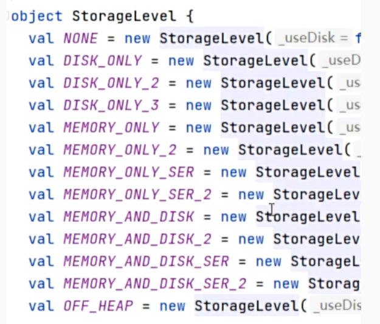
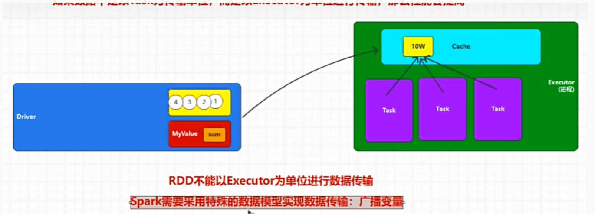

## ---概念篇---

## RDD 弹性分布式数据集

## 依赖关系

依赖关系主要用于数据的追溯，后面的 RDD 需要用到前面的 RDD，所以就是后面的 RDD 依赖于前面的 RDD，本质上是数据处理间的依赖关系，读取当前的 RDD 的血缘关系：

```java
rdd.toDebugString()
```

### 窄依赖

上游的 RDD 的一个分区的数据被下游的 RDD 的一个分区独享。

### 宽依赖

上游的 RDD 的每个分区的数据被下游的 RDD 的多个分区共享。分区被重新打乱组合，所以有 shuffle 操作。而宽依赖也是 DAG 划分 Stage 的标准。

### 总结

- 依赖关系用于数据追溯
- 窄依赖：上游的 RDD 的一个分区的数据被下游的 RDD 的一个分区独享。
- 宽依赖：上游的 RDD 的每个分区的数据被下游的 RDD 的多个分区共享。
  - 宽依赖有 shuffle 操作
  - 宽依赖也是 DAG 划分 Stage 的标准。

## DAG 任务调度图

DAG 任务调度图是 Spark 任务调度的基础，它描述了任务的依赖关系，每个任务都是一个 RDD，任务之间通过依赖关系连接，形成一个有向无环图（DAG），然后 Spark 根据 DAG 图的结构，将任务分成不同的 Stage，每个 Stage 包含多个任务，Stage 之间通过 shuffle 操作进行数据交换。

### DAG 中为什么划分 Stage ？

一个复杂的业务逻辑如果有 shuffle，那么就意味着前面阶段产生结果后，才能执行下一个阶段，即下一个阶段的计算要依赖上一个阶段的数据。那么我们按照 shuffle 进行划分(也就是按照宽依赖就行划分)，就可以将一个 DAG 划分成多个 Stage/阶段，在同一个 Stage 中，会有多个算子操作，可以形成一个 pipeline 流水线，流水线内的多个平行的分区可以并行执行

### 根据什么划分 Stage ？

很显然 Stage 的划分是根据宽依赖进行的，因为宽依赖会导致 shuffle 操作。

### 使用什么算法划分 Stage ？

核心算法是：回溯算法，即从后向前解析 DAG 图，遇到窄依赖就添加到本 Stage 中，遇到宽依赖就划分为多个 Stage。

### 总结

- DAG 任务调度图描述了任务的依赖关系，每个任务都是一个 RDD，任务之间通过依赖关系连接，形成一个有向无环图（DAG）。
- 为什么划分 Stage：同一个 Stage 中的算子可以并行计算。
- 如何划分 Stage：按照宽依赖进行划分。
- 使用什么算法划分 Stage：回溯算法。

## Shuffle

## ---实操篇---

## 开发环境

首先添加 Maven 依赖

```xml
<dependency>
    <groupId>org.apache.spark</groupId>
    <artifactId>spark-core_2.12</artifactId>
    <version>3.5.1</version>
</dependency>
```

然后我们以一个小 Demo 来说明代码结构

```java
public class Spark01_env {
    public static void main(String[] args) {
        SparkConf sparkConf = new SparkConf();
        sparkConf.setMaster("local[*]");
        sparkConf.setAppName("Spark01_env");
        JavaSparkContext jsc = new JavaSparkContext(sparkConf);

        JavaRDD<Integer> javaRDD = jsc.parallelize(Arrays.asList(1, 2, 3, 4, 5));
        javaRDD.collect().forEach(System.out::println);
        jsc.close();
    }
}
```

## 数据加载

可以从如下的三中方式中加载数据：

1. 集合：`parallelize`方法
2. 文件：`textFile`方法
3. RDD：`union`方法

集合

```java
JavaRDD<Integer> javaRDD = jsc.parallelize(Arrays.asList(1, 2, 3, 4, 5));
```

文件

```java
JavaRDD<String> javaRDD = jsc.textFile("input/wordcount.txt");
```

RDD

```java
JavaRDD<String> javaRDD = jsc.textFile("input/wordcount.txt");
JavaRDD<String> javaRDD1 = jsc.textFile("input/wordcount1.txt");
```

:::warning
使用文件加载 RDD 对象，环境不同，相对路径指向的也不同，local 指向本地，yarn 指向 hdfs
:::

## 数据分区

## 算子

算子分为两类：转换算子和行动算子，判断方法如下：

- 转换算子：返回值还是一个 RDD
- 行动算子：返回值不是一个 RDD

:::warning
Spark 中只有行动算子会触发 Job 的执行
:::

### 转换算子

#### map

将数据进行处理，转换为自己想要的格式，下面给出一些例子：

_将列表的每个元素乘以 2：_

```java
JavaRDD<Integer> rdd = jsc.parallelize(Arrays.asList(1, 2, 3, 4, 5))
        .map(i->i*2);
rdd.collect().forEach(System.out::println);
```

_处理包含元组的 RDD：_

```java
JavaRDD<Tuple2<String, Integer>> rdd = jsc.parallelize(Arrays.asList(new Tuple2<String, Integer>("猫颜", 23)
        , new Tuple2<String, Integer>("王五", 45)
        , new Tuple2<String, Integer>("张三", 19)
        , new Tuple2<String, Integer>("小红", 4)))
                .map(tuple->new Tuple2<String,Integer>(tuple._1,tuple._2+1));
rdd.collect().forEach(System.out::println);
```

#### filter

过滤数据，即遍历每一个数据，返回 true 则保留，返回 false 则过滤掉

_过滤出偶数：_

```java
JavaRDD<Integer> rdd = jsc.parallelize(Arrays.asList(1, 2, 3, 4, 5))
        .filter(i->i%2==0);
rdd.collect().forEach(System.out::println);
```

#### flatmap

将一个元素拆分成多个元素，将整体拆成单个，<span style={{color:'red',fontWeight:'bold'}}>返回的是这个整体拆解完成之后的一个迭代器</span>。

_将字符串拆分成单个字符：_

```java
JavaRDD<String> rdd = jsc.parallelize(Arrays.asList("hello", "world"))
        .flatMap(str->Arrays.asList(str.split(" ")).iterator());
rdd.collect().forEach(System.out::println);
```

:::info
如果想把 flatmap 当做 map 来使用，我们可以把单个元素放到 ArrayList 中，然后返回它的迭代器即可。
:::

#### grounpBy

数据分组，传入的参数为分组逻辑，即数据的分组方法，返回的是每个数据的所在组的名称。

_按照奇偶分组：_

```java
JavaPairRDD<Object, Iterable<Integer>> rdd = jsc.parallelize(Arrays.asList(1, 2, 3, 4, 5))
        .groupBy(new Function<Integer, Object>() {
            @Override
            public Object call(Integer integer) throws Exception {
                if (integer % 2 == 0) {
                    return "偶数";
                } else
                    return "奇数";
            }
        });
rdd.collect().forEach(System.out::println);
```

#### sortBy

排序，需要三个参数（排序规则，升序/降序，分区数量）

- 排序规则
  - 给每一个元素添加一个标记，按照标记来排序
  1. 例如数字可以返回自身
  2. 对象可以重写对象的比较方法，或者返回对象的一个属性
- 分区数量
  将排序后的数据进行分区，例如原先的数据为[1,6,3,4,2,5]，排序完成之后，并分为两个分区内容分别是[1,2,3]和[4,5,6]

:::warning
sortBy 算子是有 Shuffle 的，很显然在数据排序完成之后，并且分区的过程中是有磁盘的 I/O 操作的，所以 sortBy 算子是比较耗时的。
:::

_对元祖中的年龄进行排序：_

```java
JavaRDD<Tuple2<String, Integer>> rdd = jsc.parallelize(Arrays.asList(new Tuple2<String, Integer>("猫颜", 23)
                , new Tuple2<String, Integer>("王五", 45)
                , new Tuple2<String, Integer>("张三", 19)
                , new Tuple2<String, Integer>("小红", 4)))
        .sortBy(tuple -> tuple._2, true, 2);
rdd.collect().forEach(System.out::println);
```

### 行动算子

## KV 数据类型

Q：KV 数据类型是什么？

A：KV 类型，不仅仅表示 KV 键值对，还表示不把数据当成一个整体，而是对 K 和 V 分开操作，KV 类型一般为 2 元组->Tuple2，RDD 的类型为 JavaPairRDD。

Q：为什么要使用 KV 数据类型？

A：例如想对 groupBy 之后的数据中的 values 进行计数等，我们需要 K 不变，只有 V 需要变化的时候就可以使用。KV 类型有专属的 API，对于 KV 类型的操作更加的方便

### 常用算子

#### mapvalues

```java
JavaPairRDD<String, Integer> rdd = jsc.parallelizePairs(Arrays.asList(new Tuple2<String, Integer>("猫颜", 23)
        , new Tuple2<String, Integer>("王五", 45)
        , new Tuple2<String, Integer>("张三", 19)
        , new Tuple2<String, Integer>("小红", 4)))
                .mapValues(tupleValue->tupleValue*2);
rdd.collect().forEach(System.out::println);
```

#### groupByKey

```java
JavaPairRDD<String, Integer> rdd = jsc.parallelizePairs(Arrays.asList(new Tuple2<String, Integer>("1班", 23)
                , new Tuple2<String, Integer>("2班", 45)
                , new Tuple2<String, Integer>("1班", 19)
                , new Tuple2<String, Integer>("2班", 4)))
        .groupByKey()
        .mapValues(
                iter -> {
                    int sum = 0;
                    for (Integer i : iter) {
                        sum += i;
                    }
                    return sum;
                }
        );
rdd.collect().forEach(System.out::println);
```

#### reduceByKey

将相同的 k 的值进行聚合，聚合为一个值，核心的方法是聚合方式，对于普通的数字按照相加聚合，对于对象等其他类型可以实现其`Function2`方法，定义其两两计算。

```java
JavaPairRDD<String, Integer> rdd = jsc.parallelizePairs(Arrays.asList(new Tuple2<String, Integer>("1班", 23)
                , new Tuple2<String, Integer>("2班", 45)
                , new Tuple2<String, Integer>("1班", 19)
                , new Tuple2<String, Integer>("2班", 4)))
        .reduceByKey((Integer::sum));
rdd.collect().forEach(System.out::println);
```

使用自定义的 reduce 方式

```java
JavaPairRDD<String, Integer> rdd = jsc.parallelizePairs(Arrays.asList(new Tuple2<String, Integer>("1班", 23)
                , new Tuple2<String, Integer>("2班", 45)
                , new Tuple2<String, Integer>("1班", 19)
                , new Tuple2<String, Integer>("2班", 4)))
        .reduceByKey(new Function2<Integer, Integer, Integer>() {
            @Override
            public Integer call(Integer integer, Integer integer2) throws Exception {
                return integer + integer2;
            }
        });
rdd.collect().forEach(System.out::println);
```

## 持久化

### cache

如果在计算的过程中有很多相同的步骤，可以将其计算过程缓存下来，从而提高效率。

```java {12}
public static void main(String[] args) {
    SparkConf sparkConf = new SparkConf();
    sparkConf.setMaster("local[*]");
    sparkConf.setAppName("Spark01_env");
    JavaSparkContext jsc = new JavaSparkContext(sparkConf);
    JavaPairRDD<String, Integer> rdd = jsc.parallelizePairs(Arrays.asList(new Tuple2<String, Integer>("class_1", 10),
                    new Tuple2<String, Integer>("class_2", 20),
                    new Tuple2<String, Integer>("class_3", 30),
                    new Tuple2<String, Integer>("class_1", 40),
                    new Tuple2<String, Integer>("class_2", 50)))
            .mapValues(x -> x + 1);
    rdd.cache(); // 将RDD缓存
    JavaPairRDD<String, Iterable<Integer>> groupedRDD = rdd.groupByKey();
    JavaPairRDD<String, Integer> reducedRDD = rdd.reduceByKey(Integer::sum);
    groupedRDD.collect().forEach(System.out::println);
    reducedRDD.collect().forEach(System.out::println);
    jsc.close();
}
```

:::warning
缓冲区的真正执行的时候并不是在 cache 的代码处，因为缓冲也是从结果拿来的数据，所以缓冲区的数据**来自于执行算子执行后的结果**。
:::

### persist

<span style={{background:'yellow',fontWeight:'bold'}}>cache 是特殊的 persist</span>

persist 可以设置缓存的级别，从而可以将缓存存放在内存或者文件中。



### checkpoint (容错机制)

在两个进程中，无法共享内存中的数据，并且不知道缓存的文件位置，所以也无法使用 persist，那么我们可以使用 checkpoint 来实现多进程间的持久化。

采用 HDFS 作为存储缓存的位置

```java {13}
public static void main(String[] args) {
    SparkConf sparkConf = new SparkConf();
    sparkConf.setMaster("local[*]");
    sparkConf.setAppName("Spark_RDD_CheckPoint");
    JavaSparkContext jsc = new JavaSparkContext(sparkConf);
    jsc.setCheckpointDir("cp");
    JavaPairRDD<String, Integer> rdd = jsc.parallelizePairs(Arrays.asList(new Tuple2<String, Integer>("class_1", 10),
                    new Tuple2<String, Integer>("class_2", 20),
                    new Tuple2<String, Integer>("class_3", 30),
                    new Tuple2<String, Integer>("class_1", 40),
                    new Tuple2<String, Integer>("class_2", 50)))
            .mapValues(x -> x + 1);
    rdd.checkpoint();
    JavaPairRDD<String, Iterable<Integer>> groupedRDD = rdd.groupByKey();
    JavaPairRDD<String, Integer> reducedRDD = rdd.reduceByKey(Integer::sum);
    groupedRDD.collect().forEach(System.out::println);
    reducedRDD.collect().forEach(System.out::println);
    jsc.close();
}
```

:::warning
在使用 checkpoint 的时候，为了保证数据的安全，会再跑一遍一次，所以 checkpoint 的效率会比较低。我们可以使用 cache 来先进行缓存，然后再进行 checkpoint。
:::

### cache，persist 以及 checkpoint 的区别

cache：cache 是将数据缓存到内存中，数据可能丢失，效率高，会保存血缘关系。

persist：根据缓存等级来进行缓存。

checkpoint：将数据缓存到 HDFS 中，数据不会丢失，效率低，但是会切断血缘关系，因为可以将 HDFS 作为新的数据源。

:::tip
对于 shuffle 操作，Spark 都自动实现了缓存。
:::

## 累加器

## 广播变量

防止一个 Executer 中的数据重复，使用广播变量，Task 共用此变量。



使用 broadcast 包装，使用 broadcast 的 value 方法获取即可

```java {3,4}
JavaRDD<String> rdd = jsc.parallelize(Arrays.asList("hello", "world", "spark", "hadoop", "spark"));
List<String> okList = Arrays.asList("spark", "hadoop");
Broadcast<List<String>> broadcastList = jsc.broadcast(okList);// 广播变量
JavaRDD<String> filterRDD = rdd.filter(x->broadcastList.value().contains(x));
filterRDD.collect().forEach(System.out::println);
jsc.close();
```

## 累加器与广播变量的使用场景

## TopN 实战

### 源码展示

```java

public class HotCategoryTop10 {
    public static void main(String[] args) {
        // 创建环境
        SparkConf sparkConf = new SparkConf();
        sparkConf.setMaster("local[*]").setAppName("HotCategoryTop10");
        JavaSparkContext jsc = new JavaSparkContext(sparkConf);
        // 读取数据
        JavaRDD<HotCatgory> rdd = jsc.textFile("data/user_visit_action.txt")
                .filter(
                        line -> {
                            String[] split = line.split("_");
                            String action = split[5];
                            return action.equals("null");
                        }
                )
                .flatMap(
                        line -> {
                            String[] s = line.split("_");
                            if (!"-1".equals(s[6])) {
                                return Arrays.asList(new HotCatgory(s[6], 1L, 0L, 0L)).iterator();
                            } else if (!"null".equals(s[8])) {
                                String[] ids = s[8].split(",");
                                ArrayList<HotCatgory> hotCatgories = new ArrayList<>();
                                for (String id : ids) {
                                    hotCatgories.add(new HotCatgory(id, 0L, 1L, 0L));
                                }
                                return hotCatgories.iterator();
                            } else {
                                String[] ids = s[10].split(",");
                                ArrayList<HotCatgory> hotCatgories = new ArrayList<>();
                                for (String id : ids) {
                                    hotCatgories.add(new HotCatgory(id, 0L, 0L, 1L));
                                }
                                return hotCatgories.iterator();
                            }
                        }
                )
                .mapToPair(obj -> new Tuple2<>(obj.getId(), obj))
                .reduceByKey(
                        (obj1, obj2) -> {
                            obj1.setClickCount(obj1.getClickCount() + obj2.getClickCount());
                            obj1.setOrderCount(obj1.getOrderCount() + obj2.getOrderCount());
                            obj1.setPayCount(obj1.getPayCount() + obj2.getPayCount());
                            return obj1;
                        }
                )
                .map(kv -> kv._2)
                .sortBy(obj -> obj, true, 2);
        rdd.take(10).forEach(System.out::println);
        jsc.close();
    }
}

@Data
@ToString
@Getter
@Setter
@NoArgsConstructor
@AllArgsConstructor
class HotCatgory implements Serializable ,Comparable<HotCatgory>{
    private String id;
    private Long clickCount;
    private Long orderCount;
    private Long payCount;

    @Override
    public int compareTo(HotCatgory other) {
        double currentRank = this.clickCount * 0.2 + this.orderCount * 0.3 + this.payCount * 0.5;
        double otherRank = other.clickCount * 0.2 + other.orderCount * 0.3 + other.payCount * 0.5;
        if (currentRank > otherRank){
            return -1;
        }else if (currentRank < otherRank) {
            return 1;
        }
        return 0;
    }
}
```

## ---总结篇---
