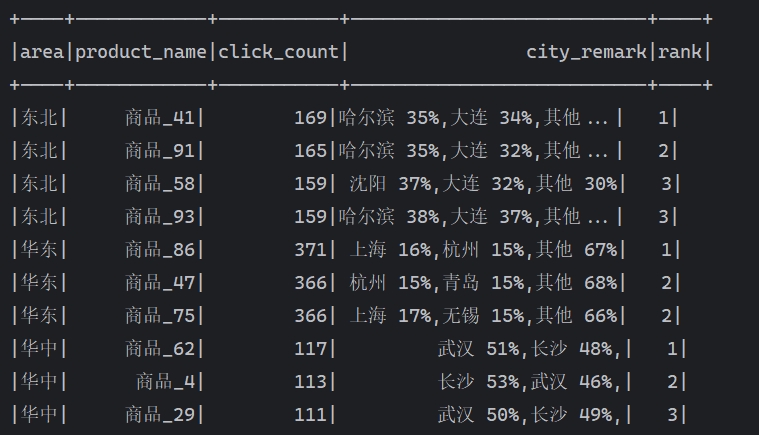

## ---概念篇---

## ---实操篇---

## 环境安装

Maven 依赖

```xml
<dependency>
    <groupId>org.apache.spark</groupId>
    <artifactId>spark-sql_2.12</artifactId>
    <version>3.5.1</version>
</dependency>
<!-- 需要解析json文本就需要此依赖 -->
<dependency>
    <groupId>com.fasterxml.jackson.core</groupId>
    <artifactId>jackson-core</artifactId>
    <version>2.17.1</version>
</dependency>
```

## 环境对象模型

类似于 Core 的环境模型如下：

```java
SparkConf sparkConf = new SparkConf();
sparkConf.setMaster("local[*]");
sparkConf.setAppName("SparkSQL_Demo_1");
SparkContext sparkContext = new SparkContext(sparkConf);
SparkSession sparkSession = new SparkSession(sparkContext);

sparkSession.close();
```

但是我我们有更加推荐的写法

```java
SparkSession sparkSession = SparkSession.builder()
        .master("local[*]")
        .appName("SparkSQL_Demo_2")
        .getOrCreate();

sparkSession.close();
```

## 数据源

Spark SQL 支持从多种数据源读取数据，包括 CSV、Hive、Parquet、JSON、JDBC 等。

csv 示例代码，关键点有以下几点：

1. 定义表头列名，默认是\_c0、\_c1、\_c2...
2. 定义分隔符，默认是逗号，使用`table`键的话就是`\t`

```java
SparkSession sparkSession = SparkSession.builder()
                .enableHiveSupport()
                .master("local[*]")
                .appName("SparkSQL_Resource_CSV")
                .getOrCreate();
        Dataset<Row> csv = sparkSession.read()
                .option("header", "true")
                .option("sep","_")
                .csv("data/sparksql/user.csv");
        csv.show();;
        sparkSession.close();
```

json：

:::warning
注意 json 的文件数据格式，要按照单行，即每一行按照 json 格式，不需要整个文件按照 json 格式。

因为 SparkSQL 是一行行来读取的。
:::

```java
Dataset<Row> ds = sparkSession.read().format("json").load("data/user.json");
ds.createOrReplaceTempView("user");
String sql = "select * from user";
Dataset<Row> sqlResult = sparkSession.sql(sql);
sqlResult.show();
```

#### SparkSQL 连接 Hive

官方文档：[Hive Tables](https://spark.apache.org/docs/latest/sql-data-sources-hive-tables.html)

Hive 作为 SparkSQL 的数据源算是最常用的了，首先我们需要需要添加 Maven 依赖:

```xml
<dependency>
    <groupId>org.apache.spark</groupId>
    <artifactId>spark-hive_2.12</artifactId>
    <version>3.5.1</version>
</dependency>
```

SparkSQL 连接 Hive 首先需要将`hive-site.xml`文件添加到`resource`目录下，然后使用`enableHiveSupport()`方法开启 Hive 支持。

```java {2}
SparkSession sparkSession = SparkSession.builder()
        .enableHiveSupport()
        .master("local[*]")
        .appName("SparkSQL_Resource_Hive")
        .getOrCreate();
```

:::info
如果在`hive-site.xml`文件中没有设置 Metastore，那么 SparkSQL 就会在目录下创建`metastore_db`作为 Hive，如果测试练习的话简单方便很多。
:::

## 自定义函数

### UDF

UDF 是针对每一行的数据进行修改

```java
sparkSession.udf().register("prefixName", new UDF1<String, String>() {
        @Override
        public String call(String name) throws Exception {
        return "名称：" + name;
        }
}, StringType);
sparkSession.read()
        .option("header", "true")
        .option("sep", "_")
        .csv("data/sparksql/user.csv").createOrReplaceTempView("t_user");
sparkSession.sql("select id, prefixName(name),age from t_user").show();
sparkSession.close();
```

:::warning
StringType 为静态导入
`import static org.apache.spark.sql.types.DataTypes.StringType;`
:::

### UDAF

UDAF 是一个聚合函数，所以在底层有缓冲区用于保存数据。

```java
sparkSession.udf().register("cityremark", functions.udaf(
        new CityRemarkUDAF(), Encoders.STRING()
));
```

使用`functions.udaf`来定义 UDAF，第一个参数是 UDAF 实现类，第二个参数是返回值的类型。

UDAF 类继承于`Aggregator`，中间是三个泛型，分别是输入类型、Buffer 类型和输出类型。实现的方法如下：

1. zero：buffer 初始化
2. reduce：缓存区与输入数据进行聚合
3. merge： 多个分区合并
4. finish：封装输出数据

```java
public class CityRemarkUDAF extends Aggregator<String, CityRemarkBuffer, String> {
    @Override
    public CityRemarkBuffer zero() {
        return new CityRemarkBuffer(0L, new HashMap<String, Long>());
    }

    @Override
    public CityRemarkBuffer reduce(CityRemarkBuffer buffer, String city) {
        buffer.setCount(buffer.getCount() + 1);
        Map<String, Long> cityMap = buffer.getCityMap();
        cityMap.merge(city, 1L, Long::sum);
        buffer.setCityMap(cityMap);
        return buffer;
    }

    // 分区合并
    @Override
    public CityRemarkBuffer merge(CityRemarkBuffer b1, CityRemarkBuffer b2) {
        b1.setCount(b1.getCount() + b2.getCount());
        Map<String, Long> cityMap1 = b1.getCityMap();
        Map<String, Long> cityMap2 = b2.getCityMap();
        cityMap2.forEach((k, v) -> cityMap1.merge(k, v, Long::sum));
        b1.setCityMap(cityMap1);
        return b1;
    }

    @Override
    public String finish(CityRemarkBuffer buffer) {
        StringBuilder resultString = new StringBuilder();
        Long total = buffer.getCount();
        Map<String, Long> cityMap = buffer.getCityMap();
        ArrayList<CityCount> cityCounts = new ArrayList<CityCount>();
        cityMap.forEach((k, v) -> cityCounts.add(new CityCount(k, v)));
        Collections.sort(cityCounts);

        CityCount cityCount0 = cityCounts.get(0);
        resultString.append(cityCount0.getCityName()).append(" ").append(cityCount0.getCount() * 100 / total).append("%,");
        CityCount cityCount1 = cityCounts.get(1);
        resultString.append(cityCount1.getCityName()).append(" ").append(cityCount1.getCount() * 100 / total).append("%,");
        if (cityCounts.size() > 2) {
            resultString.append("其他").append(" ").append((total - cityCount0.getCount() - cityCount1.getCount()) * 100 / total).append("%");
        }
        return resultString.toString();
    }

    @Override
    public Encoder<CityRemarkBuffer> bufferEncoder() {
        return Encoders.bean(CityRemarkBuffer.class);
    }

    @Override
    public Encoder<String> outputEncoder() {
        return Encoders.STRING();
    }
}

```

UDF 于 UDAF 的区别

- UDF 就类似于字符串更改等函数：属于单值函数
- UDAF 就类似于 avg，groupby 等函数：属于聚合函数

## 实战地区商品排名与分配比例



首先，前面的地区，商品名称以及点击数量很好实现，但是我们需要计算每个地区的点击比例，所以我们需要对点击数量进行聚合。

```sql
select c.area, p.product_name, count (*) as click_count, cityremark(c.city_name) as city_remark
          from user_visit_action as a
          join product_info as p on a.click_product_id = p.product_id
          join city_info as c on a.city_id = c.city_id
          where a.click_product_id != -1
          group by c.area, p.product_id, p.product_name
```

使用自定义的`cityremark(c.city_name)`函数来计算每个地区的点击比例，已经使用了`where a.click_product_id != -1`过滤出了点击的商品。将每个被点击的商品的城市名称传入。

```java
public class CityRemarkUDAF extends Aggregator<String, CityRemarkBuffer, String> {
    @Override
    public CityRemarkBuffer zero() {
        return new CityRemarkBuffer(0L, new HashMap<String, Long>());
    }

    @Override
    public CityRemarkBuffer reduce(CityRemarkBuffer buffer, String city) {
        buffer.setCount(buffer.getCount() + 1);
        Map<String, Long> cityMap = buffer.getCityMap();
        cityMap.merge(city, 1L, Long::sum);
        buffer.setCityMap(cityMap);
        return buffer;
    }

    // 分区合并
    @Override
    public CityRemarkBuffer merge(CityRemarkBuffer b1, CityRemarkBuffer b2) {
        b1.setCount(b1.getCount() + b2.getCount());
        Map<String, Long> cityMap1 = b1.getCityMap();
        Map<String, Long> cityMap2 = b2.getCityMap();
        cityMap2.forEach((k, v) -> cityMap1.merge(k, v, Long::sum));
        b1.setCityMap(cityMap1);
        return b1;
    }

    @Override
    public String finish(CityRemarkBuffer buffer) {
        StringBuilder resultString = new StringBuilder();
        Long total = buffer.getCount();
        Map<String, Long> cityMap = buffer.getCityMap();
        ArrayList<CityCount> cityCounts = new ArrayList<CityCount>();
        cityMap.forEach((k, v) -> cityCounts.add(new CityCount(k, v)));
        Collections.sort(cityCounts);

        CityCount cityCount0 = cityCounts.get(0);
        resultString.append(cityCount0.getCityName()).append(" ").append(cityCount0.getCount() * 100 / total).append("%,");
        CityCount cityCount1 = cityCounts.get(1);
        resultString.append(cityCount1.getCityName()).append(" ").append(cityCount1.getCount() * 100 / total).append("%,");
        if (cityCounts.size() > 2) {
            resultString.append("其他").append(" ").append((total - cityCount0.getCount() - cityCount1.getCount()) * 100 / total).append("%");
        }
        return resultString.toString();
    }

    @Override
    public Encoder<CityRemarkBuffer> bufferEncoder() {
        return Encoders.bean(CityRemarkBuffer.class);
    }

    @Override
    public Encoder<String> outputEncoder() {
        return Encoders.STRING();
    }
}
```

```java
@Data
@Getter
@Setter
@AllArgsConstructor
@NoArgsConstructor
public class CityRemarkBuffer implements Serializable {
    private Long count;
    private Map<String, Long> cityMap;
}
```

```java
@Data
@Setter
@Getter
@AllArgsConstructor
@NoArgsConstructor
public class CityCount implements Serializable, Comparable<CityCount> {
    private String cityName;
    private Long count;

    @Override
    public int compareTo(@NotNull CityCount other) {
        return (int) (other.getCount() - this.getCount());
    }
}
```
