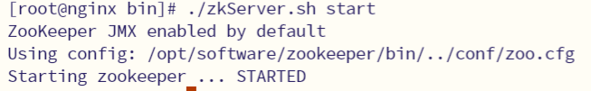

ZooKeeper 官网：[Apache ZooKeeper](https://zookeeper.apache.org/)

ZooKeeper 下载地址：[Apache ZooKeeper™ Releases](https://zookeeper.apache.org/releases.html)

## 单机版安装

:::tip
ZooKeeper 服务器是使用 Java 创建的，运行于 JVM 之上，所以要先安装配置好 JDK7 或以上的版本。
:::
这里将 Zookeeper 安装到`/opt/module/zookeeper`目录下，并配置环境变量

```bash
export ZOOKEEPER_HOME=/opt/module/zookeeper
export PATH=$JAVA_HOME/bin:$PATH
```

### 配置 zoo.cfg

进入到 conf 目录拷贝一个 zoo_sample.cfg 并完成配置

```bash
cd /opt/module/zookeeper/conf
mv zoo_sample.cfg  zoo.cfg
```

修改 zoo.cfg，在 zookeeper 目录下创建`zkdata`目录

```bash
cd /opt/module/zookeeper
# 创建zkdata存储目录
mkdir zkdata
# 修改zoo.cfg
vim /opt/module/zookeeper/conf/zoo.cfg
```

修改存储目录：

```bash
dataDir=/opt/module/zookeeper/zkdata
```

### 启动 Zookeeper

到 ZooKeeper 的 bin 目录下启动

```bash
cd /opt/software/zookeeper/bin
# 启动
./zkServer.sh start
```

输出如下即表示运行成功



## 伪集群安装

## 集群安装

这里使用三台虚拟机来安装，分别是 hadoop101，hadoop102 和 hadoop103，对应的 IP 分别是：

- hadoop101：192.168.10.101
- hadoop102：192.168.10.102
- hadoop103：192.168.10.103

### 配置 zoo.cfg

进入到 conf 目录拷贝一个 zoo_sample.cfg 并完成配置

```bash
# 修改配置文件
vim /opt/module/zookeeper/conf/zoo.cfg
# 使用2181端口
clientPort=2181
dataDir=/opt/module/zookeeper/zkdata
# 修改admin的端口号
admin.serverPort=8081

server.1=192.168.10.101:2881:3881
server.2=192.168.10.102:2881:3881
server.3=192.168.10.103:2881:3881
```

server.服务器 ID=服务器 IP 地址：服务器之间通信端口：服务器之间投票选举端口

- 服务器之间通信端口：就是通信端口
- 服务器之间投票选举端口：投票选举的时候用的端口

然后我们将其分发到三台服务器上，可以使用我们的服务器同步脚本-->[Xsync集群分发脚本](../tools/script-config/#集群分发脚本)

然后我们需要在每个 zookeeper 的实例目录下创建一个 myid 文件，内容分别是 1、2、3 这个文件就是记录每个服务器的 ID。
:::warning
**之前测试使用的是 3.9.1 的最新版本，但是使用 3.7.1 的版本时，myid 要在 zkdata 目录下才可以。**
:::

```bash
echo 1 >/opt/module/zookeeper/myid
echo 2 >/opt/module/zookeeper/myid
echo 3 >/opt/module/zookeeper/myid
```

### 启动集群

当我们配置完成之后，就可以启动集群了，朴素的启动方法就是我们挨个在每个服务器执行如下命令启动:

```bash
/opt/module/zookeeper/bin/zkServer.sh start
```

当然，显而易见的是这样的启动方式实在是太繁琐了，所以我们可以使用更简便的启动方式，即使用脚本启动。

我们可以创建一个`zk.sh`脚本来启停 Zookeeper 集群，脚本内容如下：

```bash
#!/bin/bash
case $1 in
"start"){
	for i in hadoop102 hadoop103 hadoop104
	do
        echo ---------- zookeeper $i 启动 ------------
		ssh $i "/opt/module/zookeeper/bin/zkServer.sh start"
	done
};;
"stop"){
	for i in hadoop102 hadoop103 hadoop104
	do
        echo ---------- zookeeper $i 停止 ------------
		ssh $i "/opt/module/zookeeper/bin/zkServer.sh stop"
	done
};;
"status"){
	for i in hadoop102 hadoop103 hadoop104
	do
        echo ---------- zookeeper $i 状态 ------------
		ssh $i "/opt/module/zookeeper/bin/zkServer.sh status"
	done
};;
esac
```
