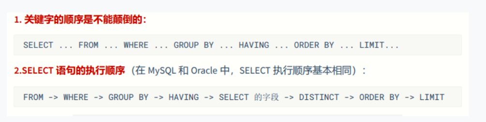

# SQL 基础概念

## <span style={{color:'red',fontWeight:'bold'}}>SQL 的执行流程</span>

充分的理解 SQL 的执行流程是至关重要的，只有理解了 SQL 的执行流程，才能更好的理解 SQL 语句的执行顺序，以及如何优化 SQL 语句的执行效率。首先，我们需要明白 SQL 是数据查询，即**数据流**的形式。所以首先是我们要得到数据，即数据从哪里来，然后再对数据进行处理。

1. FROM：数据从哪里来
2. WHERE：对数据进行过滤
3. GROUP BY：对数据进行分组
4. HAVING：对分组后的数据进行过滤
5. SELECT：对数据进行选择
6. DISTINCT：对数据进行去重
7. ORDER BY：对数据进行排序
8. LIMIT：对数据进行限制
   

:::warning 注意
在 SQL 中，窗口函数都是最后执行的，而且仅仅位于`order by`之前。
:::

## Group by

Group by 是 SQL 中用于对数据进行分组的函数。

:::warning 注意
在 select 中如果包含聚合函数，那么对于 selec 中的查询字段有要求：

1. 常量
2. 查询字段要在聚合函数内使用：相当于对这个字段进行了聚合
3. 查询字段必须参与 group by 分组：使用这个字段进行分组，也相当于对这个字段进行了聚合

:::

例如：

```sql
select name, count(id) from students group by name;
```

**分组字段的关系：**

1. 如果分组字段存在上下级关系或者从属关系，那么统计结果和下级有关，和上级无关，分组时增加上级的字段是为了补全数据。

   **例如：** city 是 province 的下级，那么统计结果和 city 有关，和 province 无关，分组时增加 province 的字段是为了补全数据。

```sql
select province, city, count(id) from students group by province, city;
```

2. 如果分组字段存在关联关系（商品 ID，商品名称），那么统计结果只和具备唯一性的字段有关，其他字段是为了补全数据。

   **例如：** 商品 ID 是商品名称的唯一标识，那么统计结果只和商品 ID 有关，和商品名称无关，分组时增加商品名称的字段是为了补全数据。

```sql
select id, name, count(id) from students group by id, name;
```

3. 如果分组的字段没有任何关系，那么统计结果和分组字段都有关。

## 窗口函数

使用场景：在 SQL 中，窗口函数可以用于对分组后的数据进行计算或排序。窗口函数可以用于计算排名、累计值、百分比等。

语法如下：

```sql
select <窗口函数> over(partition by <用于分组的列名> order by <用于排序的列名>)
from <数据源>
```

执行原理：

1. 首先，根据`partition by`指定的列进行分组，然后对每个分组内的数据进行排序。
2. 然后，根据`order by`指定的列进行排序。
3. 最后，计算窗口函数的值。

### 序号函数

#### row_number

为每个分组内的数据生成一个序号，序号从 1 开始，依次递增。

例如：

```sql
select id, name, row_number() over(partition by name order by id) as rank
from students;
```

解析：

1. 首先，根据`name`列进行分组，然后对每个分组内的数据进行排序。
2. 然后，为每个分组内的数据生成一个序号，序号从 1 开始，依次递增。
3. 最后，将序号作为新的列添加到结果集中。

结果：

| id  | name | rank |
| --- | ---- | ---- |
| 1   | 张三 | 1    |
| 2   | 张三 | 2    |
| 3   | 李四 | 1    |
| 4   | 李四 | 2    |

#### rank

为每个分组内的数据生成一个序号，序号从 1 开始，如果存在并列，则跳过并列的序号。

例如：

```sql
select id, name, rank() over(partition by name order by id) as rank
from students;
```

解析：

1. 首先，根据`name`列进行分组，然后对每个分组内的数据进行排序。
2. 然后，为每个分组内的数据生成一个序号，序号从 1 开始，如果存在并列，则跳过并列的序号。
3. 最后，将序号作为新的列添加到结果集中。

结果：

| id  | name | rank |
| --- | ---- | ---- |
| 1   | 张三 | 1    |
| 2   | 张三 | 2    |
| 3   | 李四 | 3    |
| 4   | 李四 | 4    |

#### dense_rank

为每个分组内的数据生成一个序号，序号从 1 开始，如果存在并列，则不跳过并列的序号。

例如：

```sql
select id, name, dense_rank() over(partition by name order by id) as rank
from students;
```

解析：

1. 首先，根据`name`列进行分组，然后对每个分组内的数据进行排序。
2. 然后，为每个分组内的数据生成一个序号，序号从 1 开始，如果存在并列，则不跳过并列的序号。
3. 最后，将序号作为新的列添加到结果集中。

结果：

| id  | name | rank |
| --- | ---- | ---- |
| 1   | 张三 | 1    |
| 2   | 张三 | 1    |
| 3   | 李四 | 2    |
| 4   | 李四 | 2    |

### 分布函数
