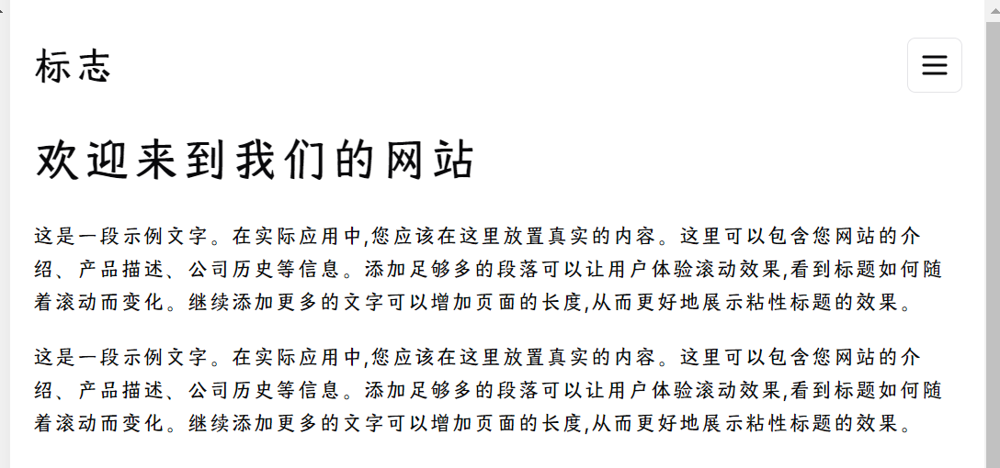
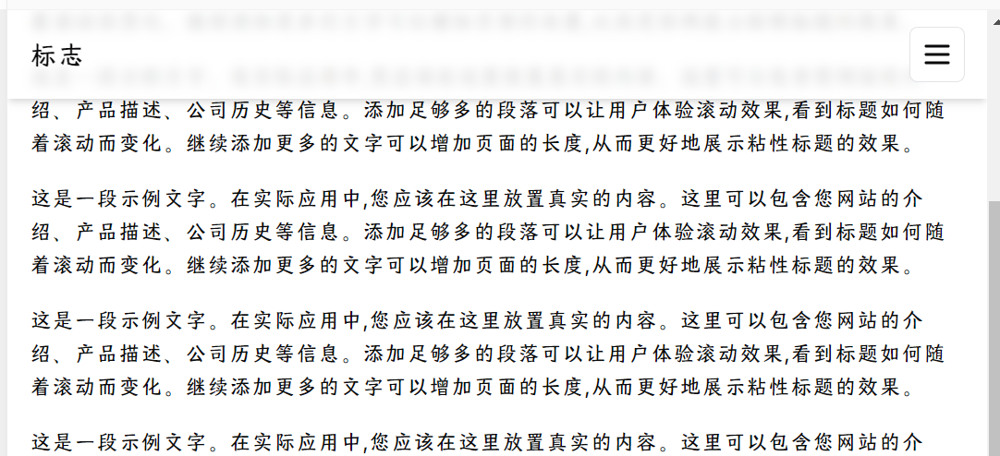

## 效果展示

这个组件实现了一个粘性标题，当下滑的时候标题还会随之变化。





## 代码分析

### 检测下滑

我们使用一个 `useState` 来记录当前页面是否下滑。

```tsx
const [scrolled, setScrolled] = useState(false);
```

在`useEffect` 中监听 `window.scrollY` 的变化，当 `window.scrollY` 大于 20 时，我们认为页面下滑了，此时我们将 `scrolled` 状态设置为 `true`，否则设置为 `false`。

```tsx
useEffect(() => {
  const handleScroll = () => {
    const isScrolled = window.scrollY > 20;
    if (isScrolled !== scrolled) {
      setScrolled(isScrolled);
    }
  };

  window.addEventListener("scroll", handleScroll, { passive: true });

  return () => {
    window.removeEventListener("scroll", handleScroll);
  };
}, [scrolled]);
```

## 代码实现

```tsx
export default function Component() {
  const [scrolled, setScrolled] = useState(false);

  useEffect(() => {
    const handleScroll = () => {
      const isScrolled = window.scrollY > 20;
      if (isScrolled !== scrolled) {
        setScrolled(isScrolled);
      }
    };

    window.addEventListener("scroll", handleScroll, { passive: true });

    return () => {
      window.removeEventListener("scroll", handleScroll);
    };
  }, [scrolled]);

  return (
    <div className="min-h-screen bg-background">
      <header
        className={`fixed top-0 left-0 right-0 z-50 transition-all duration-300 ease-in-out ${
          scrolled
            ? "h-16 bg-background/80 backdrop-blur-sm shadow-md"
            : "h-24 bg-background"
        }`}
      >
        <div className="container mx-auto px-4 h-full flex items-center justify-between">
          <div
            className={`text-2xl font-bold transition-all duration-300 ${
              scrolled ? "text-xl" : "text-3xl"
            }`}
          >
            标志
          </div>
        </div>
      </header>
      <main className="pt-24 container mx-auto px-4">
        <h1 className="text-4xl font-bold mb-6">欢迎来到我们的网站</h1>
        {[...Array(20)].map((_, i) => (
          <p key={i} className="mb-4">
            这是一段示例文字。在实际应用中,您应该在这里放置真实的内容。这里可以包含您网站的介绍、产品描述、公司历史等信息。添加足够多的段落可以让用户体验滚动效果,看到标题如何随着滚动而变化。继续添加更多的文字可以增加页面的长度,从而更好地展示粘性标题的效果。
          </p>
        ))}
      </main>
    </div>
  );
}
```
