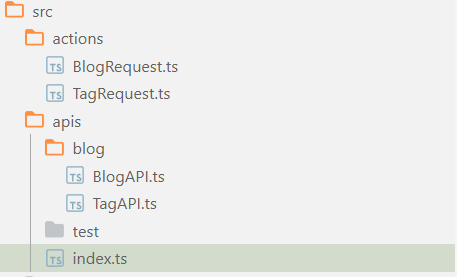

# 项目开发经验

## 动态更改 Tailwind 的 class

工具 ts

```typescript
import { type ClassValue, clsx } from "clsx";
import { twMerge } from "tailwind-merge";

export function cn(...inputs: ClassValue[]) {
  return twMerge(clsx(inputs));
}
```

使用例子

```tsx
<div
  className={cn(
    "ml-auto text-xs",
    mail.selected === item.id ? "text-foreground" : "text-muted-foreground"
  )}
>
  {item.date}
</div>
```

即判定`mail.selected === item.id`是否成立，如果成立的话则将`text-foreground`类与前面的合并在一起，就可以实现**动态的更改 Tailwind 的 class 的效果**。

## 封装 Axios 网络请求

一般不管是在 Vue 中还是在 React 中，使用最频繁的网络请求框架即 Axios 框架，而普通使用 Axios 只是简单的进行网络请求，我们可以将其进行封装，更系统更便捷的使用 Axios。

主要封装的效果如下：

1. 配置 baseURL
2. 设置超时时间
3. Request 拦截器

   1. 为 Request 添加 token

4. Response 拦截器统一对请求失败进行处理

例子如下：

```ts
//axios 网络请求封装
import axios from "axios";
import { getToken } from "@/utils/auth";
import { IResponse, IResponseCode } from "@/types/Response";
import { useNavigate } from "react-router-dom";

// 创建axios实例
const service = axios.create({
  // baseURL: import.meta.env.VITE_BASE_API as string, // api的base_url
  baseURL: "https://httpbin.org", // api的base_url
  timeout: 5000, // 请求超时时间
});
// request拦截器
service.interceptors.request.use(
  (config) => {
    // if (store.getters.token) {
    //     config.headers['Authorization'] = getToken()
    // }
    return config;
  },
  (error) => {
    // Do something with request error
    console.log(error); // for debug
    Promise.reject(error);
  }
);
// response 拦截器
service.interceptors.response.use(
  (response) => {
    const res: IResponse = response.data;
    if (res.code !== IResponseCode.SUCCESS) {
      console.log(res);
      // 50008:非法的token; 50012:其他客户端登录了; 50014:Token 过期了;
      if (
        res.code === IResponseCode.TOKEN_INVALID ||
        res.code === IResponseCode.TOKEN_EXPIRED
      ) {
        // 请自行在引入 MessageBox
        // import { Message, MessageBox } from 'element-plus'
        // MessageBox.confirm('你已被登出，可以取消继续留在该页面，或者重新登录', '确定登出', {
        //   confirmButtonText: '重新登录',
        //   cancelButtonText: '取消',
        //   type: 'warning'
        // }).then(() => {
        //   store.dispatch('FedLogOut').then(() => {
        //     location.reload() // 为了重新实例化vue-router对象 避免bug
        //   })
        // })
        const navigate = useNavigate();
        navigate("/login");
      }
      return Promise.reject("error");
    } else {
      return response.data;
    }
  },
  (error) => {
    console.log("err" + error); // for debug
    return Promise.reject(error);
  }
);
export default service;
```

## 用户信息存储

针对一般的博客或者论坛什么的，一般都需要存储当前的用户信息，已判断是否登录或者显示用户的信息，不会在每一次的请求中都更改用户的信息，那么在用户的信息存储中，我们可以使用比较简单的`jotai`原子状态来存储全局数据。

就拿传统的 User 信息来举例子，在全局状态控制的文件`state-controller.ts`中：

```ts
import { atom, useAtom } from "jotai";
// 创建一个Type保存用户的个人数据
type BcUser = {
  userId: number;
  username: string;
  address: string;
  publicKey: string;
  privateKey: string;
};
// 定义一个用户原子
const userAtom = atom<BcUser>({
  userId: 0,
  username: "初始化用户",
  address: "初始化地址",
  publicKey: "初始化公钥",
  privateKey: "初始化私钥",
});
// 导出函数
export function useBcUser() {
  return useAtom(userAtom);
}
```

在其他的组件中想使用的话，只需要
先获得`useBcUser`方法，用此方法获得数据和 set 方法即可

```tsx
import { useBcUser } from "@/state/state-controller.ts";
const [bcUser, setBcUser] = useBcUser();
//输出用户名
console.log("用户ID：" + bcUser.userId);
console.log("用户名：" + bcUser.username);
// 更改用户信息
setBcUser({
  ...bcUser,
  username: "new username",
});
// 输出用户信息
console.log("更改后的用户名：" + bcUser.username);
```

## 动态背景

在使用 tailwind 的使用可以使用`bg-[url('链接')]`来动态的显示背景图片，但是在使用变量的时候，例如通过`getFirstImageUrlFromMarkdown(meetingdto.meetingIntro)`方法获得 markdown 中的图片链接，返回的是一个变量，而变量无法通过`bg-[url(${变量})]`的方式来设置背景，所以我们需要使用如下的方法。

```ts
style={{backgroundImage: `url(${getFirstImageUrlFromMarkdown(meetingdto.meetingIntro)})`}}
```

使用 style，中的 backgroundImage 参数来设置变量作为背景。

## 路由配置之后，直接访问显示 404

对于单页面应用程序 SPA，有两种路由方式.

1. **Hash 路由**：在 URL 中使用哈希（#）来表示路由，例如`http://example.com/#/page1`。当哈希值改变时，**浏览器不会向服务器发送请求**，而是触发 JavaScript 事件，从而实现页面内容的更新。这种方式可以在不同的路由之间进行导航，而不会导致整个页面的重新加载。常见的 Hash 路由库包括 React Router 的 HashRouter 和 Vue Router 的 hash 模式。
2. **Browser 路由**：也称为历史路由（HTML5 History API），利用 HTML5 History API 中的`pushState()`和`replaceState()`方法来实现前端路由。在这种情况下，URL 看起来更加清晰，没有哈希符号，例如`http://example.com/page1`。当用户点击链接时，浏览器会向服务器发送请求，但服务器需要配置以处理这些 URL。这种方式需要服务器端的支持，并且通常需要配置重定向规则以确保在刷新页面时正确加载相应的资源。

但是使用 Browser 路由的时候，由于刷新页面会重新请求服务器，如果服务器中没有进行设置，就会产生 404 的问题。这里我们使用 Caddy 服务器，有如下的解决方法-->[单页应用程序 spa](../../../tools/caddy.md#单页应用程序spa)

## style.scss 与 style.module.scss 的区别

[style.scss 与 style.module.scss 的主要区别是什么？](https://stackoverflow.com/questions/60735091/whats-the-main-diffrence-style-scss-vs-style-module-scss)
一个例子来展现了 style.scss 和 style.module.scss 之间的区别。

`*.scss`的用法

```scss
.ultra-specific-class-name_item {
  display: flex;
}
```

如果以正常方式使用 SCSS，则必须将类名声明为字符串

```tsx {5} showLineNumbers
import "./foo.scss";

const App = () => <div className="ultra-specific-class-name_item">foo bar</div>;
```

`*.module.scss`的用法

```scss
.item {
  display: flex;
}
```

类似与 Tailwind 的使用方式

```tsx {4} showLineNumbers
import styles from "./foo.module.scss";

const App = () => <div className={styles.item}>foo bar</div>;
```

## 数据请求的通用方式

这里使用`API+Action`的方式，API 主要用于访问 Api 接口，Action 主要使用 SWR 进行数据请求，并返回数据。目录结构如下：



API 的实现方法如下：

```ts
import request from "@/lib/request.ts";
import { BlogDTO } from "@/types/Blog";
import { ResponseResult } from "@/types/ResponseResult";

export type BlogQueryVO = {
  pageNum: number;
  pageSize: number;
  id?: number;
  title?: string;
  status?: number;
  createTime?: string;
  updateTime?: string;
  typeId?: number;
  authorId?: number;
  content?: string;
};

export type BlogEditVO = {
  id: number;
  title?: string;
  description?: string;
  status?: number;
  typeId?: number;
  content?: string;
  tags?: string[];
};

export const fetchUpdateBlog = (blogEditVO: BlogEditVO) => {
  return request({
    url: "/blog/update",
    method: "POST",
    data: blogEditVO,
  });
};

export const fetchBlogDTOById = (url: string) => {
  return request({
    url: url,
    method: "GET",
  });
};

export const fetchQueryBlogs = (blogQueryVO: BlogQueryVO) => {
  return request({
    url: "blog",
    method: "GET",
    params: blogQueryVO,
  });
};
```

Action 的实现方法如下：

```ts
import useSWR from "swr";
import {
  BlogEditVO,
  BlogQueryVO,
  fetchQueryBlogById,
  fetchQueryBlogDTOs,
  fetchQueryBlogs,
  fetchUpdateBlog,
} from "@/apis/blog/BlogAPI";

export function useUpdateBlog(blogEditVO: BlogEditVO) {
  const { data, error, isLoading } = useSWR(blogEditVO, fetchUpdateBlog);
  return { data, error, isLoading };
}
/**
 * 查询博客列表
 * @param blogQueryVO
 * @returns
 */
export function useGetBlogs(blogQueryVO: BlogQueryVO) {
  const { data, error, isLoading } = useSWR(blogQueryVO, fetchQueryBlogs);
  return { data, error, isLoading };
}
export function useGetBlogDTOs(blogQueryVO: BlogQueryVO) {
  const { data, error, isLoading } = useSWR(blogQueryVO, fetchQueryBlogDTOs);
  return { data, error, isLoading };
}

export function useGetBlogById(blogId: number) {
  const { data, error, isLoading } = useSWR(
    `/blog/${blogId}`,
    fetchQueryBlogById
  );
  return { data, error, isLoading };
}
```

:::warning
在 Action 中，命名要使用`use`前缀
:::

调用方法如下：

```ts
const { data: responseResult } = useGetBlogDTOs(blogQueryVO);
```

## 事件方法的通用方式

不同于使用 SWR 来进行数据请求，SWR 是用于初始的数据请求，如果需要使用事件方法，则需要其他的实现方法。

这里我将其分为三部分，与 SWR 中的处理类似

1. 封装 API
2. 封装 Action，对具体事件进行处理
3. 在组件中调用

下面我通过一个给当前用户加分的例子来说明

API 的封装方法如下：

```ts
export const fetchAddScore = (score: number) => {
  return request({
    url: "/user/points",
    method: "GET",
    params: {
      score: score,
    },
  });
};
```

Action 层的封装方法如下：

```ts
export const useAddScore = () => {
  const [loading, setLoading] = useState(false);
  const [error, setError] = useState<Error | null>(null);

  const addScore = async (score: number) => {
    // 初始化loading和error的状态
    setLoading(true);
    setError(null);
    try {
      const response = await fetchAddScore(score);
      // 对于后端已经处理好的情况，可以在这里进行判断再给error赋值
      return response;
    } catch (err) {
      setError(err as Error);
    } finally {
      setLoading(false);
    }
  };
  return {
    addScore,
    loading,
    error,
  };
};
```

然后在组件中调用此方法

```ts
export const TestPageOne = () => {
  const { addScore, loading, error } = useAddScore();

  // 定义点击事件的方法
  const handleClick = async () => {
    await addScore(1);
  };
  return (
    <div>
      <Button onClick={handleClick} disabled={loading}>
        {loading ? "加载中" : "添加"}
      </Button>
      {error && <p>{error.msg}</p>}
    </div>
  );
};
```

## Promise 请求依赖问题

在很多时候，我们需要根据一个请求的结果，来决定另一个请求的参数，比如在文章页面中，我们首先加载了文章的详情，然后根据文章的作者 id，加载作者的详细信息，这时候，我们的作者的详细信息的请求，就需要依赖文章详情的请求。

那么，我们可以通过如下的方式来解决：

1. async/await
2. Promise.then 链式调用

### async/await 解决 Promise 依赖问题

我们通过[async](../../es6/async)以及[await](../../es6/await)这两篇文章，我们可以知道通过`async`和`await`我们可以定义请求的顺序，这样我们可以先执行第一个请求，再根据第一个请求的结果来执行第二个请求。

```ts {11}
const fetchUserDetails = async () => {
  try {
    // 获取用户 ID 列表
    const userIdsResponse = await axios.get("/api/users/ids");
    const userIds = userIdsResponse.data;
    // 根据用户 ID 列表获取用户详情
    const userDetailsPromises = userIds.map((id) =>
      axios.get(`/api/users/${id}`)
    );
    // 等待所有用户详情请求完成，通过 Promise.all来实现
    const userDetailsResponses = await Promise.all(userDetailsPromises);

    const userDetails = userDetailsResponses.map((response) => response.data);
    console.log(userDetails);
  } catch (error) {
    console.error("Error fetching user details:", error);
  }
};
```

### Promise.then 链式调用解决 Promise 依赖问题

我们也可以通过`Promise.then`来实现，但是这种方式需要我们手动处理错误，并且需要手动处理请求的顺序。

```ts
axios
  .get("/api/users/ids")
  .then((response) => {
    const userIds = response.data;
    return Promise.all(userIds.map((id) => axios.get(`/api/users/${id}`)));
  })
  .then((userDetailsResponses) => {
    const userDetails = userDetailsResponses.map((response) => response.data);
    console.log(userDetails);
  })
  .catch((error) => {
    console.error("Error fetching user details:", error);
  });
```

## SWR 解决数据变更问题

例如在同一个页面中，有 A 和 B 两个组件，当我们在 A 组件中发起请求，然后更新了数据，那么 B 组件中的数据也需要更新，这时候，我们就需要使用 SWR 来解决数据变更的问题。在 SWR 中，我们可以通过`mutate`方法来手动更新数据，这样就可以解决数据变更的问题。

我们以如下的例子来说明，在 TopBar 组件中有一个按钮可以增添通道中的用户，在 page 中有一个组件可以展示通道中的用户，当我们在 TopBar 组件中点击按钮，然后更新了数据，那么 page 中的组件也需要更新。

我们首先需要在`action`层，导出`mutate`

```ts
/**
 * 查询加入了指定频道的用户
 */
export function useGetChannelUsers(id: number) {
  const { data, error, isLoading, mutate } = useSWR(
    `/channel/users/${id}`,
    fetchChannelById
  );
  return {
    data,
    error,
    isLoading,
    mutate,
  };
}
```

然后定义 TopBar 中的点击事件，使用`mutate`来更新数据

```ts
// 获得mutate方法
const { mutate } = useGetChannelUsers(channelId);

// 加入通道方法
const handleJoinChannel = async (channelId: number) => {
  try {
    const response = await fetchJoinChannel(channelId);
    if (response.data.code == 200) {
      message.success("加入通道成功");
      // 使用mutate手动重新验证数据
      mutate();
      // 等待1秒刷新页面
      setTimeout(() => {
        window.location.reload();
      }, 1000);
    } else {
      message.error(response.data.msg);
    }
  } catch (error) {
    console.error("加入通道失败:", error);
  }
};
```

