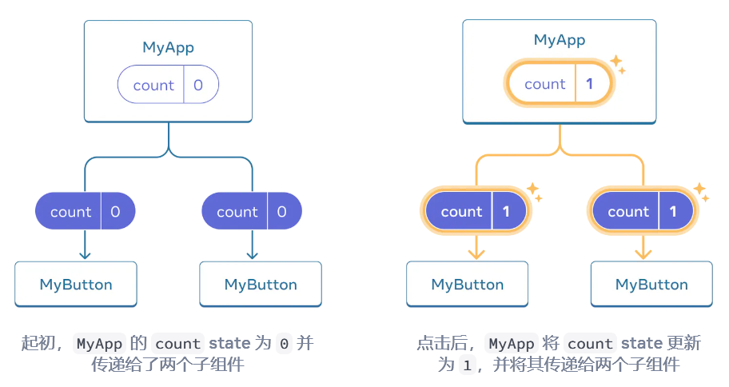

# React 教程

## 参考

React 最佳教程：[React 官方教程](https://zh-hans.react.dev/learn)

## 组件

### 定义组件

:::warning 定义组件的注意事项
React 组件是常规的 JavaScript 函数，但 组件的名称必须以**大写字母开头**，否则它们将无法运行！
:::

### 组件的导入和导出

组件的导出方式有两种：

- 默认导出（default export）
- 命名导出（named export）

```js
// 默认导出
export default function MyComponent() {
  return <div>Hello, world!</div>;
}

// 命名导出
export function MyComponent() {
  return <div>Hello, world!</div>;
}

// 导入
import MyComponent from "./MyComponent";
```

:::tip 默认导出和命名导出的使用场景
文件中仅包含**一个组件**时，人们会选择**默认导出**，而当文件中包含**多个组件**或某个值需要导出时，则会选择**具名导出**。
:::

### 将 props 传递给组件

## 状态

### 状态提升（组件间共享数据）

要从多个子组件收集数据，或让两个子组件相互通信，请改为在其父组件中声明共享 state。父组件可以通过 props 将该 state 传回给子组件。这使子组件彼此同步并与其父组件保持同步。

本质上的实现原理实际上就一句话：<span style={{ color: 'red'}}>**将状态定义在最小父容器中，然后将状态和修改状态的方法传递给子组件**</span>

首先，在父容器中定义状态和修改状态的方法，然后将 state 状态和点击事件传递到子组件中：

```ts {2-6} showLineNumbers
export default function MyApp() {
  const [count, setCount] = useState(0);

  function handleClick() {
    setCount(count + 1);
  }

  return (
    <div>
      <h1>Counters that update together</h1>
      <MyButton count={count} onClick={handleClick} />
      <MyButton count={count} onClick={handleClick} />
    </div>
  );
}
```

在子组件中设置 state 以及点击事件

```ts {3-4} showLineNumbers
function MyButton({ count, onClick }) {
  return <button onClick={onClick}>Clicked {count} times</button>;
}
```

## 响应事件

### 事件处理函数

- 通常在你的组件 内部 定义。
- 名称以 handle 开头，后跟事件名称。
  :::tip Tips
  按照惯例，通常将事件处理程序命名为 handle，后接事件名。你会经常看到 `onClick={handleClick}，onMouseEnter={handleMouseEnter}` 等。
  :::

:::warning 注意
传递给事件处理函数的函数应直接传递，**而非调用**。例如：

- 传递一个函数（正确）: `<button onClick={handleClick}>`
- 调用一个函数（错误）: `<button onClick={handleClick()}>`

同样的，在内联代码中，可以使用 `()=>{}`来传递一个函数

- 传递一个函数（正确）：`<button onClick={() => alert('...')}>`
- 调用一个函数（错误）：`<button onClick={alert('...')}>`

原因：<span style={{background: 'yellow'}}>这是因为在 JSX 中，`{}`中的函数会被立即调用。</span>
:::

## 脱围机制

有些组件可能需要控制和同步 React 之外的系统。例如，你可能需要使用浏览器 API 聚焦输入框，或者在没有 React 的情况下实现视频播放器，或者连接并监听远程服务器的消息。在本章中，你将学习到一些脱围机制，让你可以“走出” React 并连接到外部系统。大多数应用逻辑和数据流不应该依赖这些功能。

### 使用 ref 引用值

当你希望组件“记住”某些信息，但又不想让这些信息触发新的渲染时，你可以使用 ref：

```tsx
const ref = useRef(0);
const ref = useRef(null);
```

与 state 一样，ref 在重新渲染之间由 React 保留。但是，设置 state 会重新渲染组件，而更改 ref 不会！你可以通过 ref.current 属性访问该 ref 的当前值。

### ref 与 state 的不同之处

核心就一条：信息更新的时候

- state 会触发重新渲染
- ref 不会触发重新渲染

举个例子：

```tsx
function MyComponent() {
  const [count, setCount] = useState(0);
  const ref = useRef(0);

  return (
    <div>
      <p>You clicked {count} times</p>
      <button onClick={() => setCount(count + 1)}>Click me</button>
      <p>You clicked {ref.current} times</p>
      <button onClick={() => ref.current++}>Click me</button>
    </div>
  );
}
```

根据输出可以看到点击两个按钮的时候，state 的值会更新，而 ref 的值不会更新，而并不是 ref 的 current 不会更新，而是组件不会刷新。

### ref 操作 DOM

由于 React 会自动处理更新 DOM 以匹配你的渲染输出，因此你在组件中通常不需要操作 DOM。但是，有时你可能需要访问由 React 管理的 DOM 元素 —— 例如，让一个节点获得焦点、滚动到它或测量它的尺寸和位置。在 React 中没有内置的方法来做这些事情，所以你需要一个指向 DOM 节点的 ref 来实现。

#### 获取指向节点的 ref

创建 ref 对象

```tsx
const ref = useRef(null);
```

在需要的地方，将 ref 对象绑定到 DOM 节点上

```tsx
<div ref={ref} />
```

当 React 为这个 `<div> `创建一个 DOM 节点时，React 会把对该节点的引用放入 myRef.current。然后，你可以从 事件处理器 访问此 DOM 节点，并使用在其上定义的内置浏览器 API。例如，滚动到这个 DOM 位置。

```tsx
myRef.current.scrollIntoView();
```

#### 例子：使 input 获得焦点

```tsx {4,7,12} showLineNumbers
import { useRef } from "react";

export default function Form() {
  const inputRef = useRef(null);

  function handleClick() {
    inputRef.current.focus();
  }

  return (
    <>
      <input ref={inputRef} />
      <button onClick={handleClick}>聚焦输入框</button>
    </>
  );
}
```

#### 例子：滚动到一个元素

```tsx {9,17,25} showLineNumbers
import { useRef } from "react";

export default function CatFriends() {
  const firstCatRef = useRef(null);
  const secondCatRef = useRef(null);
  const thirdCatRef = useRef(null);

  function handleScrollToFirstCat() {
    firstCatRef.current.scrollIntoView({
      behavior: "smooth",
      block: "nearest",
      inline: "center",
    });
  }

  function handleScrollToSecondCat() {
    secondCatRef.current.scrollIntoView({
      behavior: "smooth",
      block: "nearest",
      inline: "center",
    });
  }

  function handleScrollToThirdCat() {
    thirdCatRef.current.scrollIntoView({
      behavior: "smooth",
      block: "nearest",
      inline: "center",
    });
  }

  return (
    <>
      <nav>
        <button onClick={handleScrollToFirstCat}>Tom</button>
        <button onClick={handleScrollToSecondCat}>Maru</button>
        <button onClick={handleScrollToThirdCat}>Jellylorum</button>
      </nav>
      <div>
        <ul>
          <li>
            
          </li>
          <li>
            
          </li>
          <li>
            
          </li>
        </ul>
      </div>
    </>
  );
}
```
### 访问另外一个组件的DOM
当将ref放到自定义的组件上的时候，React 不允许组件访问其他组件的 DOM 节点。甚至自己的子组件也不行！所以组件需要暴露ref的引用，并将其ref传递转发给一个子组件。

举个例子，我自定义了一个MyInput组件，在引用MyInput组件的时候，需要传递ref给MyInput组件，并将其转发给input。
```tsx
const MyInput = forwardRef((props, ref) => {
  return <input {...props} ref={ref} />;
});
```
1. `<MyInput ref={inputRef} /> `告诉 React 将对应的 DOM 节点放入 inputRef.current 中。但是，这取决于 MyInput 组件是否允许这种行为， 默认情况下是不允许的。
2. MyInput 组件是使用 forwardRef 声明的。 这让从上面接收的 inputRef 作为第二个参数 ref 传入组件，第一个参数是 props 。
3. MyInput 组件将自己接收到的 ref 传递给它内部的 `<input>`。

```tsx {3-4,8,11,16} showLineNumbers
import { forwardRef, useRef } from 'react';

const MyInput = forwardRef((props, ref) => {
  return <input {...props} ref={ref} />;
});

export default function Form() {
  const inputRef = useRef(null);

  function handleClick() {
    inputRef.current.focus();
  }

  return (
    <>
      <MyInput ref={inputRef} />
      <button onClick={handleClick}>
        聚焦输入框
      </button>
    </>
  );
}
```
