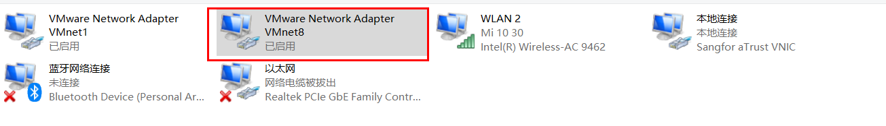
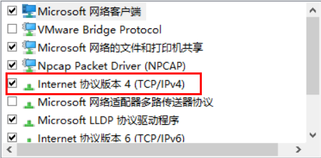
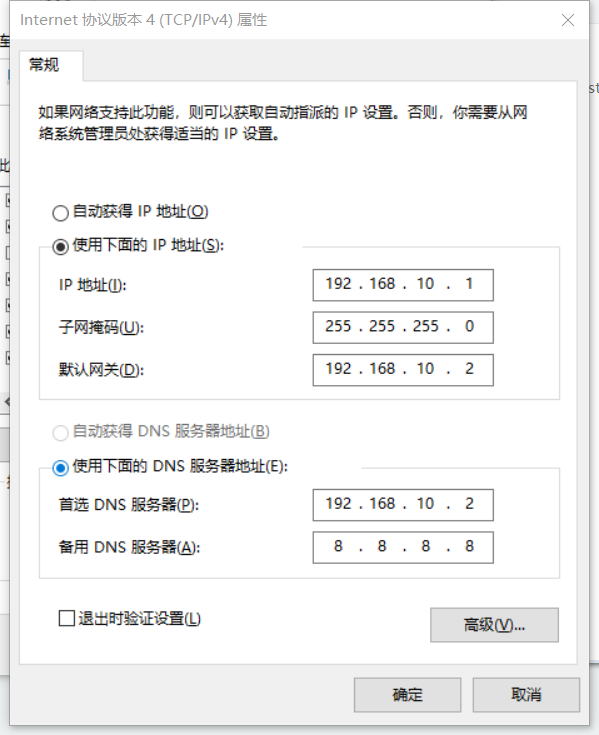
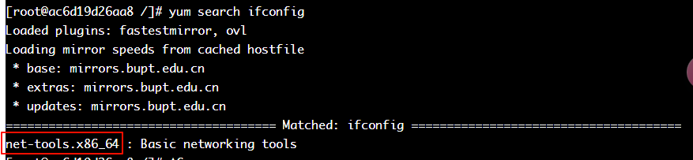

# Linux 虚拟机环境搭建

我们可以在官网下载 Vmware Workstation 的最新版，现在已经免费了-->[Vmware Workstation 17](https://www.vmware.com/products/workstation-pro/workstation-pro-evaluation_html.html.html)

## 安装 CentOS7

系统镜像下载地址-->[CentOS7-Aliyun](https://mirrors.aliyun.com/centos/?spm=a2c6h.13651104.d-2001.2.33df320cKx3dne)

## IP 配置

将虚拟机的 IP 更改为 192.168.10.0，网关为 192.168.10.2

配置本机的 ip 地址，在适配器设置中找到 VMware 的 VMnet8


然后我们更改 IP




在虚拟机中设置静态 IP，使用`root`用户.

```bash
vim /etc/sysconfig/network-scripts/ifcfg-ens33
```

将`BOOTPROTO`修改为`static`

```bash
TYPE=Ethernet
PROXY_METHOD=none
BROWSER_ONLY=no
BOOTPROTO=static
...
```

然后在最后面加上本机的 IP 地址，网关以及 DNS 地址。

```bash
IPADDR=192.168.10.100
GATEWAY=192.168.10.2
DNS1=192.168.10.2
```

## Host 配置

首先，修改主机名称，即修改`/etc/hostname`文件，然后修改`hosts`映射文件，即修改`/etc/hosts`文件。然后再执行`reboot`重启系统即可。

## 虚拟机配置

如上的操作完成之后，我们只是能够使用终端来连接虚拟机，但是在日常的使用当中，还需要进行一定的配置才能更好的使用，这里我对使用场景来进行分类，不同的场景对应不同的配置方法。

### 配置阿里镜像源

详见-->[阿里镜像源](https://developer.aliyun.com/mirror/)

### 更新升级

我们可以将系统进行更新一下，通过如下命令：

```bash
yum -y upgrade
```

### 关闭防火墙

见-->[Linux 服务管理-->配置防火墙](./linux-server/#配置防火墙)

### 配置时间同步

见-->[Linux 服务管理-->配置时间服务器](./linux-server/#配置时间服务器)

### 安装 ifconfig

在 Windows 上查询网络信息使用的命令是`ipconfig`，而在 Linux 上，使用的命令是`ifconfig`，但是在 CentOS 中却没有默认安装，所以需要我们手动安装一下。

先搜索一下是否有`ifconfig`

```bash
yum search ifconfig
```


可以看到在`net-tools`这个包中，所以我们安装这个包即可。

```bash
yum install net-tools.x86_64
```

### 安装 Vim 编辑器

```bash
yum install vim
```

#### 禁用 SELinux

[一文彻底明白 linux 中的 selinux 到底是什么](https://zhuanlan.zhihu.com/p/165974960)

```bash
vim /etc/selinux/config
```

将`SELINUX=enforcing`改为`SELINUX=disabled`

### 设置时间同步

参考-->[Linux 服务管理-->时间同步](./linux-server/#时间同步)

### 配置 JDK 环境

下载 JDK-->[Java 最新 JDK 和 API 下载（持续同步更新于官网）](https://blog.csdn.net/jzycloud/article/details/114123530)

解压到`/opt/module/jdk8`

配置环境变量，在`/etc/profile.d`目录下创建`jdk8_env.sh`脚本文件

```bash
export JAVA_HOME=/opt/module/jdk8
export PATH=$JAVA_HOME/bin:$PATH
export CLASSPATH=.:$JAVA_HOME/lib/dt.jar:$JAVA_HOME/lib/tools.jar
```

刷新环境变量

```bash
source /etc/profile.d/jdk8_env.sh
```

判断是否安装成功

```bash
java -version
```
