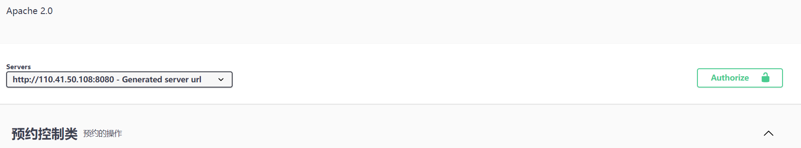

# Swagger
## SpringBoot3使用Swagger

首先引入openAPI依赖
```xml
<dependency>
    <groupId>org.springdoc</groupId>
    <artifactId>springdoc-openapi-starter-webmvc-ui</artifactId>
    <version>2.0.2</version>
</dependency>
```

然后配置Swagger，创建Swagger配置类`SwaggerConfig`
```java
@Configuration
public class SpringDocConfig {
    @Bean
    public OpenAPI myOpenAPI() {
        return new OpenAPI()
                .info(new Info()
                        .title("程序员API")
                        .description("程序员的大本营")
                        .version("v1.0.0")
                        .license(new License()
                                .name("许可协议")
                                .url("https://shusheng007.top"))
                        .contact(new Contact()
                                .name("书生007")
                                .email("wangben850115@gmail.com")))
                .externalDocs(new ExternalDocumentation()
                        .description("ShuSheng007博客")
                        .url("https://shusheng007.top"));
    }
 }
```
## 配置文档分组
用来配置分组的，假如你有两类controller一类以/api为前缀，一类以/admin为前缀，就可以将其配置为两个分组。很多时候我们只有一个分组，所以就不需要下面的配置。
```java
@Configuration
public class SpringDocConfig {
   ...
    @Bean
    public GroupedOpenApi publicApi() {
        return GroupedOpenApi.builder()
                .group("api")
                .pathsToMatch("/api/**")
                .build();
    }

    @Bean
    public GroupedOpenApi adminApi() {
        return GroupedOpenApi.builder()
                .group("admin")
                .pathsToMatch("/admin/**")
                .build();
    }
}
```
## 常用注解
OpenApi 规范提供了很多注解，下面是一些常用的
| 注解 | 说明 |
| ---- | ---- |
| @Tag | 用在controller类上，描述此controller的信息 |
| @Operation | 用在controller方法里，描述此api的信息 |
| @Parameter | 用在controller方法里的参数上，描述参数信息 |
| @Parameters | 用在controller方法里的参数上 |
| @Schema | 用于Entity，以及Entity的属性上 |
| @ApiResponse | 用在controller方法的返回值上 |
| @ApiResponses | 用在controller方法的返回值上 |
| @Hidden | 用于隐藏其api |

## 认证授权
对于有些接口，我们可能需要认证授权，比如需要登录后才能访问的接口，那么我们需要使其在header中带上正确的token

首先，在`Application`类上添加`@SecurityScheme`注解，设置一个安全模式
```java {1}
@SecurityScheme(name = "你的Token名称", type = SecuritySchemeType.HTTP, scheme ="bearer", in = SecuritySchemeIn.HEADER)
@SpringBootApplication
public class SpringdocIntegrateApplication {
    public static void main(String[] args) {
        SpringApplication.run(SpringdocIntegrateApplication.class, args);
    }
}
```
然后在Swagger的配置文件中设置
```java {13} showLineNumbers
@Configuration
public class SwaggerConfig {

    @Bean
    public OpenAPI springShopOpenAPI(){
        return new OpenAPI()
                .info(
                        new Info().title("爱心司机预约系统API文档")
                                .description("爱心司机预约系统API文档")
                                .version("v1.0")
                                .license(new License().name("Apache 2.0").url(""))
                ).security(List.of(new SecurityRequirement().addList("HeartDriverToken")));
    }
}
```
当登陆得到Token之后，再填写到header中即可


## 参考
[SpringBoot3使用Swagger文档](https://blog.csdn.net/m0_60541110/article/details/128902678)

[秒懂SpringBoot之如何集成SpringDoc](https://shusheng007.top/2023/06/21/springdoc/)

[springdoc官网](https://springdoc.org/)