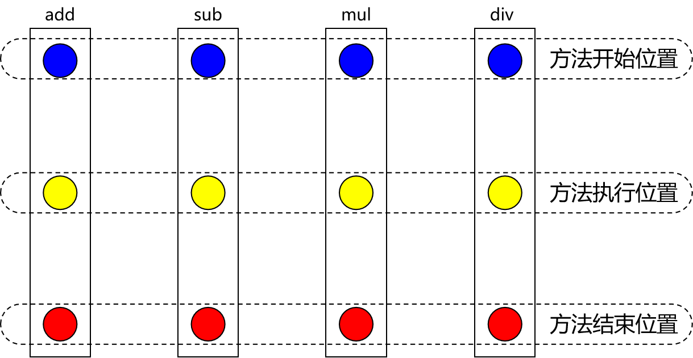
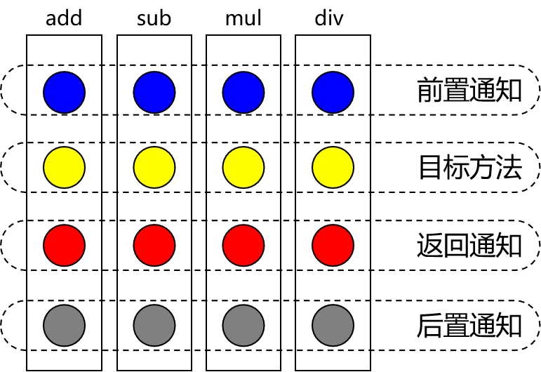
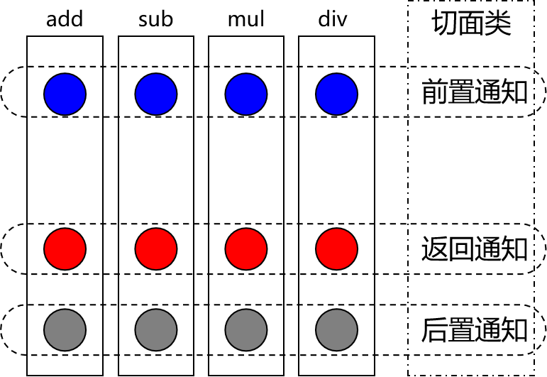
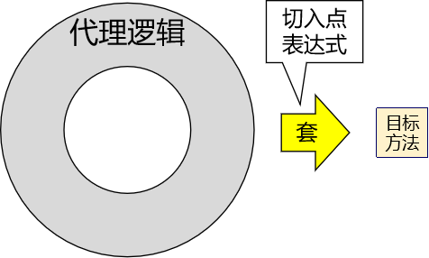

# Spring 核心原理

## AOP 切面编程

在对有日志功能的实现类，有如下缺陷。

1. 对核心业务功能有干扰，导致程序员在开发核心业务功能时分散了精力。
2. 附加功能分散在各个业务功能方法中，不利于统一维护。

所以解决这两个问题，核心就是：**解耦**。我们需要把附加功能从业务功能代码中抽取出来。

解决问题的困难：要抽取的代码在方法内部，靠以前把子类中的重复代码抽取到父类的方式没法解决。所以需要引入新的技术。即用到代理模式。

## 代理模式


它的作用就是通过提供一个代理类，让我们在调用目标方法的时候，不再是直接对目标方法进行调用，而是通过代理类**间接**调用。让不属于目标方法核心逻辑的代码从目标方法中剥离出来——**解耦**。调用目标方法时先调用代理对象的方法，减少对目标方法的调用和打扰，同时让附加功能能够集中在一起也有利于统一维护。

### 静态代理

Q：什么是静态代理？
A：静态代理是一种设计模式，其中一个类（代理类）用来控制对另一个类（目标类）的访问。这个代理类在编译时就已经确定，且代理类和目标类的接口是相同的。通俗解释一下，假设你想要请一个明星参加活动，但是你不直接联系明星，而是通过他的经纪人。经纪人在其中起到了代理的作用。具体来说，经纪人和明星之间有一个协议（接口），经纪人负责处理和过滤所有的请求，并在适当的时候将请求传达给明星。这个过程中，经纪人可能会为你提供一些额外的服务，比如安排时间、处理后续事宜等等。

在程序设计中，静态代理的典型实现步骤如下：

1. 定义接口：首先定义一个接口，其中声明了目标类和代理类都会实现的方法。
2. 实现目标类：目标类实现这个接口，提供实际的业务逻辑。
3. 实现代理类：代理类也实现这个接口，但它主要负责在调用目标类的方法之前或之后添加一些额外的操作，比如日志记录、安全检查等。

下面是一个简单的示例代码：

```java
// 定义接口
public interface Service {
    void perform();
}

// 目标类
public class RealService implements Service {
    @Override
    public void perform() {
        System.out.println("Executing perform in RealService");
    }
}

// 代理类
public class ServiceProxy implements Service {
    private RealService realService;

    public ServiceProxy(RealService realService) {
        this.realService = realService;
    }

    @Override
    public void perform() {
        System.out.println("Before performing");
        realService.perform();
        System.out.println("After performing");
    }
}

// 测试类
public class Main {
    public static void main(String[] args) {
        RealService realService = new RealService();
        ServiceProxy proxy = new ServiceProxy(realService);
        proxy.perform();
    }
}
```

在这个例子中，Service 接口定义了一个方法 perform，RealService 类实现了这个接口并提供了实际的业务逻辑。ServiceProxy 类同样实现了 Service 接口，但它在调用 RealService 的 perform 方法之前和之后添加了额外的操作。在 Main 类中，客户端通过代理类来调用方法，从而间接地访问目标类的功能。

通过静态代理，可以在不修改目标类代码的情况下，添加额外的功能，这种设计模式在实际开发中非常有用，特别是在需要对现有功能进行扩展或者在执行前后添加一些公共操作（如日志、权限控制等）时。

但是，静态代理也有一些缺点：

1. 代理类和目标类需要实现相同的接口，导致代码的重复性。
2. 代理类和目标类之间的依赖关系强耦合，如果目标类发生改变，代理类也需要随之修改。

### 动态代理

Q：什么是动态代理？
A：动态代理是一种设计模式，它允许你在运行时创建代理对象，而不是在编译时。这种代理不需要预先定义代理类，而是通过反射机制动态生成代理类。

通俗地说，假设你仍然要请一个明星参加活动，但这次你不需要找特定的经纪人。相反，你只需要找一个通用的代理服务平台，这个平台会在你提出需求后，临时指派一个经纪人来处理你的请求。这个经纪人也是在你需要的时候动态生成的，能够根据情况灵活应对不同明星的需求。

在程序设计中，动态代理主要通过 Java 的 Proxy 类和 InvocationHandler 接口来实现。以下是一个简单的示例代码：

```java
import java.lang.reflect.InvocationHandler;
import java.lang.reflect.Method;
import java.lang.reflect.Proxy;

// 定义接口
public interface Service {
    void perform();
}

// 目标类
public class RealService implements Service {
    @Override
    public void perform() {
        System.out.println("Executing perform in RealService");
    }
}

// 动态代理处理器
class ServiceInvocationHandler implements InvocationHandler {
    private Object target;

    public ServiceInvocationHandler(Object target) {
        this.target = target;
    }

    @Override
    public Object invoke(Object proxy, Method method, Object[] args) throws Throwable {
        System.out.println("Before performing");
        Object result = method.invoke(target, args);
        System.out.println("After performing");
        return result;
    }
}

// 测试类
public class Main {
    public static void main(String[] args) {
        RealService realService = new RealService();
        ServiceInvocationHandler handler = new ServiceInvocationHandler(realService);

        // 创建动态代理对象
        Service proxy = (Service) Proxy.newProxyInstance(
                realService.getClass().getClassLoader(),
                realService.getClass().getInterfaces(),
                handler);

        // 调用代理方法
        proxy.perform();
    }
}
```

在这个例子中：

1. **定义接口：** Service 接口定义了目标类和代理类都会实现的方法。
2. **实现目标类：** RealService 类实现了这个接口，提供实际的业务逻辑。
3. **创建 InvocationHandler：** ServiceInvocationHandler 类实现了 InvocationHandler 接口，用于处理代理对象的方法调用。在 invoke 方法中，调用目标对象的方法之前和之后添加了额外的操作。
4. **创建动态代理对象：** 在 Main 类中，通过 Proxy.newProxyInstance 方法创建动态代理对象。这个方法需要三个参数：类加载器、目标类实现的接口列表、以及 InvocationHandler 实例。
5. **调用代理对象的方法：** 在 Main 类中，调用代理对象的方法，例如 proxy.perform()。

通过动态代理，可以在运行时为任意接口生成代理类，这样不仅灵活，而且避免了大量的代理类代码。动态代理广泛应用于 AOP（面向切面编程）框架中，例如 Spring AOP，用于在方法执行前后添加通用的功能，比如日志记录、事务管理、安全检查等。

## 静态代理和动态代理的区别

静态代理：静态代理是在编译时就已经定义好的代理，它的代理类是在**编译期间**生成的，不能在运行时动态生成。静态代理的实现需要手动定义一个代理类，实现目标对象接口，并重写所有的方法，在代理方法中，通过反射机制调用目标对象的方法。

动态代理：动态代理是在运行时动态生成的代理，**它不需要手动定义代理类**，而是通过反射机制动态生成一个代理类，代理类可以在运行时动态生成和销毁。动态代理可以为多个目标对象实现代理，而静态代理只能为一个目标对象实现代理。

总体来说，动态代理比静态代理更灵活，但实现起来复杂一些。通常情况下，在程序中使用动态代理。

## AOP 概述

AOP（Aspect Oriented Programming）是一种设计思想，是软件设计领域中的面向切面编程，它是面向对象编程的一种补充和完善，它以通过预编译方式和运行期动态代理方式实现，**在不修改源代码的情况下，给程序动态统一添加额外功能的一种技术。** 利用 AOP 可以对业务逻辑的各个部分进行隔离，从而使得业务逻辑各部分之间的耦合度降低，提高程序的可重用性，同时提高了开发的效率。

### 横切关注点


从每个方法中抽取出来的同一类非核心业务。在同一个项目中，我们可以使用多个横切关注点对相关方法进行多个不同方面的增强。

这个概念不是语法层面的，而是根据附加功能的逻辑上的需要：有十个附加功能，就有十个横切关注点。

### 通知(增强)

**增强，通俗说，就是你想要增强的功能，比如 安全，事务，日志等**

每一个横切关注点上要做的事情都需要写一个方法来实现，这样的方法就叫通知方法。

- 前置通知：在被代理的目标方法**前**执行
- 返回通知：在被代理的目标方法**成功结束**后执行（**寿终正寝**）
- 异常通知：在被代理的目标方法**异常结束**后执行（**死于非命**）
- 后置通知：在被代理的目标方法**最终结束**后执行（**盖棺定论**）
- 环绕通知：使用 try...catch...finally 结构围绕**整个**被代理的目标方法，包括上面四种通知对应的所有位置

通知执行顺序：

Spring5.3.x 版本之后

- 前置通知
- 目标操作
- 返回通知或异常通知
- 后置通知



```java
@Aspect
@Component
public class LogAspect {
    @Before("execution(public int org.example.beans.CalculatorImpl.*(..))")
    void beforeMethod(JoinPoint joinPoint) {
        String methodName = joinPoint.getSignature().getName();
        String args = Arrays.toString(joinPoint.getArgs());
        System.out.println("Logger-->前置通知，方法名：" + methodName + "，参数：" + args);
    }

    @After("execution(public int org.example.beans.CalculatorImpl.*(..))")
    void afterMethod(JoinPoint joinPoint) {
        String methodName = joinPoint.getSignature().getName();
        System.out.println("Logger-->后置通知，方法名：" + methodName);
    }

    @AfterReturning(value = "execution(public int org.example.beans.CalculatorImpl.*(..))", returning = "result")
    void afterReturnMethod(JoinPoint joinPoint, Object result) {
        String methodName = joinPoint.getSignature().getName();
        System.out.println("Logger-->返回通知，方法名：" + methodName + "，结果：" + result);
    }

    @AfterThrowing(value = "execution(public int org.example.beans.CalculatorImpl.*(..))", throwing = "ex")
    void afterThrowingMethod(JoinPoint joinPoint, Throwable ex) {
        String methodName = joinPoint.getSignature().getName();
        System.out.println("Logger-->异常通知，方法名：" + methodName + "，异常：" + ex);
    }

    @Around(value = "execution(public int org.example.beans.CalculatorImpl.*(..))")
    Object aroundMethod(ProceedingJoinPoint joinPoint) {
        String methodName = joinPoint.getSignature().getName();
        String args = Arrays.toString(joinPoint.getArgs());
        Object result = null;
        try {
            System.out.println("环绕通知-->目标对象方法执行之前");
            //目标对象（连接点）方法的执行
            result = joinPoint.proceed();
            System.out.println("环绕通知-->目标对象方法返回值之后");
        } catch (Throwable throwable) {
            throwable.printStackTrace();
            System.out.println("环绕通知-->目标对象方法出现异常时");
        } finally {
            System.out.println("环绕通知-->目标对象方法执行完毕");
        }
        return result;
    }
}
```

#### 获取连接点信息

获取连接点信息可以在通知方法的参数位置设置 `JoinPoint` 类型的形参

```java {4,6}
@Before("execution(public int com.atguigu.aop.annotation.CalculatorImpl.*(..))")
public void beforeMethod(JoinPoint joinPoint){
    //获取连接点的签名信息
    String methodName = joinPoint.getSignature().getName();
    //获取目标方法到的实参信息
    String args = Arrays.toString(joinPoint.getArgs());
    System.out.println("Logger-->前置通知，方法名："+methodName+"，参数："+args);
}
```

#### 获取目标方法的返回值

`@AfterReturning` 中的属性 `returning`，用来将通知方法的某个形参，接收目标方法的返回值。并且**在通知方法中就可以使用这个形参来获取返回值。**

```java {1,2}
@AfterReturning(value = "execution(* com.atguigu.aop.annotation.CalculatorImpl.*(..))", returning = "result")
public void afterReturningMethod(JoinPoint joinPoint, Object result){
    String methodName = joinPoint.getSignature().getName();
    System.out.println("Logger-->返回通知，方法名："+methodName+"，结果："+result);
}
```


### 切面

封装通知方法的类。

### 切入点的语法表达式

* 用*号代替“权限修饰符”和“返回值”部分表示“权限修饰符”和“返回值”不限
* 在包名的部分，**一个“*”号只能代表包的层次结构中的一层**，表示这一层是任意的。

  * 例如：*.Hello 匹配 com.Hello，不匹配 com.atguigu.Hello
* 在包名的部分，使用“*..”表示包名任意、包的层次深度任意
* 在类名的部分，类名部分整体用*号代替，表示类名任意
* 在类名的部分，可以使用*号代替类名的一部分

  * 例如：*Service 匹配所有名称以 Service 结尾的类或接口
* 在方法名部分，可以使用*号表示方法名任意
* 在方法名部分，可以使用*号代替方法名的一部分

  * 例如：*Operation 匹配所有方法名以 Operation 结尾的方法
* 在方法参数列表部分，使用(..)表示参数列表任意
* 在方法参数列表部分，使用(int,..)表示参数列表以一个 int 类型的参数开头
* 在方法参数列表部分，基本数据类型和对应的包装类型是不一样的

  * 切入点表达式中使用 int 和实际方法中 Integer 是不匹配的
* 在方法返回值部分，如果想要明确指定一个返回值类型，那么必须同时写明权限修饰符

  * 例如：execution(public int  *..* Service. *(.., int))	正确例如：execution(*  int  *..* Service.*(.., int))	错误


### 复用切入点表达式
我们有时候需要在多个地方使用相同的切入点表达式，为了减少重复代码，我们可以使用 `@Pointcut` 注解来定义一个公用的切入点表达式。

声明表达式

```java
@Pointcut("execution(public int org.example.beans.CalculatorImpl.*(..))")
    void pointCut(){
    }
```

复用表达式

```java {2,4}
@Pointcut("execution(public int org.example.beans.CalculatorImpl.*(..))")
void pointCut(){
}
@Before("pointCut()")
void beforeMethod(JoinPoint joinPoint) {
    String methodName = joinPoint.getSignature().getName();
    String args = Arrays.toString(joinPoint.getArgs());
    System.out.println("Logger-->前置通知，方法名：" + methodName + "，参数：" + args);
}
```

在不同的切面中使用。

```java {1}
@Before("org.example.aspect.LogAspect.pointCut()")
void beforeMethod(JoinPoint joinPoint) {
    String methodName = joinPoint.getSignature().getName();
    String args = Arrays.toString(joinPoint.getArgs());
    System.out.println("Logger-->前置通知，方法名：" + methodName + "，参数：" + args);
}
```

