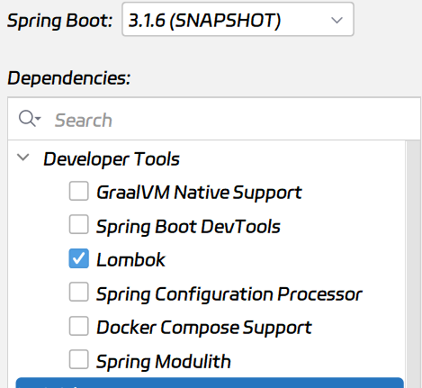
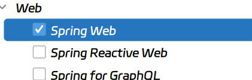
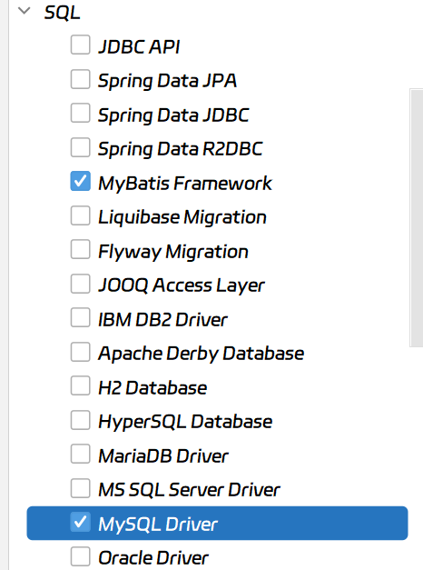
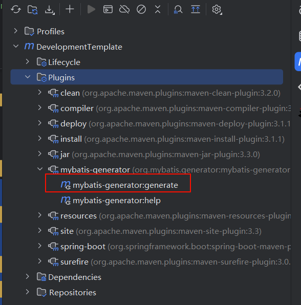

# 后端开发模板

## 依赖库




选择的有

1. Lombok
2. Spring Web
3. Mybatis
4. Mysql Driver

引入如下依赖

```xml
<!-- SpringDoc -->
<dependency>
    <groupId>org.springdoc</groupId>
    <artifactId>springdoc-openapi-starter-webmvc-ui</artifactId>
    <version>2.0.2</version>
</dependency>

```

这里放一个实战开发的所使用的依赖库，如果后续需要添加其他的依赖可以继续添加:

```xml
<?xml version="1.0" encoding="UTF-8"?>
<project xmlns="http://maven.apache.org/POM/4.0.0" xmlns:xsi="http://www.w3.org/2001/XMLSchema-instance"
         xsi:schemaLocation="http://maven.apache.org/POM/4.0.0 https://maven.apache.org/xsd/maven-4.0.0.xsd">
    <modelVersion>4.0.0</modelVersion>
    <parent>
        <groupId>org.springframework.boot</groupId>
        <artifactId>spring-boot-starter-parent</artifactId>
        <version>3.1.6-SNAPSHOT</version>
        <relativePath/> <!-- lookup parent from repository -->
    </parent>
    <groupId>com.maoyan</groupId>
    <artifactId>DevelopmentTemplate</artifactId>
    <version>0.0.1-SNAPSHOT</version>
    <name>DevelopmentTemplate</name>
    <description>DevelopmentTemplate</description>
    <properties>
        <java.version>17</java.version>
    </properties>
    <dependencies>
        <dependency>
            <groupId>org.springframework.boot</groupId>
            <artifactId>spring-boot-starter-web</artifactId>
        </dependency>
        <dependency>
            <groupId>org.mybatis.spring.boot</groupId>
            <artifactId>mybatis-spring-boot-starter</artifactId>
            <version>3.0.2</version>
        </dependency>
        <!--   SpringDoc  Swagger     -->
        <dependency>
            <groupId>org.springdoc</groupId>
            <artifactId>springdoc-openapi-starter-webmvc-ui</artifactId>
            <version>2.0.2</version>
        </dependency>
        <!--连接MySQL-->
        <dependency>
            <groupId>com.mysql</groupId>
            <artifactId>mysql-connector-j</artifactId>
            <version>8.0.32</version>
        </dependency>
        <!--Lombok-->
        <dependency>
            <groupId>org.projectlombok</groupId>
            <artifactId>lombok</artifactId>
            <optional>true</optional>
        </dependency>
        <dependency>
            <groupId>org.springframework.boot</groupId>
            <artifactId>spring-boot-starter-test</artifactId>
            <scope>test</scope>
        </dependency>
        <dependency>
            <groupId>org.mybatis.spring.boot</groupId>
            <artifactId>mybatis-spring-boot-starter-test</artifactId>
            <version>3.0.2</version>
            <scope>test</scope>
        </dependency>
        <!-- Sa-Token 权限认证，在线文档：https://sa-token.cc -->
        <dependency>
            <groupId>cn.dev33</groupId>
            <artifactId>sa-token-spring-boot3-starter</artifactId>
            <version>1.36.0</version>
        </dependency>
        <!--HuTool工具类-->
        <dependency>
            <groupId>cn.hutool</groupId>
            <artifactId>hutool-all</artifactId>
            <version>5.8.21</version>
        </dependency>
        <!--分页查询-->
        <dependency>
            <groupId>com.github.pagehelper</groupId>
            <artifactId>pagehelper-spring-boot-starter</artifactId>
            <version>1.4.7</version>
        </dependency>
    </dependencies>

    <build>
        <plugins>
            <plugin>
                <groupId>org.springframework.boot</groupId>
                <artifactId>spring-boot-maven-plugin</artifactId>
                <configuration>
                    <excludes>
                        <exclude>
                            <groupId>org.projectlombok</groupId>
                            <artifactId>lombok</artifactId>
                        </exclude>
                    </excludes>
                </configuration>
            </plugin>
            <!-- 代码生成器插件-->
            <plugin>
                <groupId>org.mybatis.generator</groupId>
                <artifactId>mybatis-generator-maven-plugin</artifactId>
                <version>1.4.2</version>
                <configuration>
                    <!--代码生成器的配置文件位置-->
                    <configurationFile>src/main/resources/generatorConfig.xml</configurationFile>
                    <!--允许覆盖生成的文件-->
                    <overwrite>true</overwrite>
                    <!--将pom中的依赖添加到生成器的类路径中-->
                    <includeCompileDependencies>true</includeCompileDependencies>
                </configuration>
            </plugin>
        </plugins>
    </build>
    <!--对Maven库的配置-->
    <repositories>
        <repository>
            <id>spring-milestones</id>
            <name>Spring Milestones</name>
            <url>https://repo.spring.io/milestone</url>
            <snapshots>
                <enabled>false</enabled>
            </snapshots>
        </repository>
        <repository>
            <id>spring-snapshots</id>
            <name>Spring Snapshots</name>
            <url>https://repo.spring.io/snapshot</url>
            <releases>
                <enabled>false</enabled>
            </releases>
        </repository>
    </repositories>
    <pluginRepositories>
        <pluginRepository>
            <id>spring-milestones</id>
            <name>Spring Milestones</name>
            <url>https://repo.spring.io/milestone</url>
            <snapshots>
                <enabled>false</enabled>
            </snapshots>
        </pluginRepository>
        <pluginRepository>
            <id>spring-snapshots</id>
            <name>Spring Snapshots</name>
            <url>https://repo.spring.io/snapshot</url>
            <releases>
                <enabled>false</enabled>
            </releases>
        </pluginRepository>
    </pluginRepositories>

</project>
```

## 配置文件

创建 dev 开发版和 prop 运行版配置文件

- application-dev.properties
- application-prop.properties

在 application.properties 文件中指定所使用的配置文件。

```properties
spring.profiles.active=prop
#spring.profiles.active=dev
```

配置文件

```properties
server.port=8080
# 数据库配置
spring.datasource.driver-class-name=com.mysql.cj.jdbc.Driver
spring.datasource.url=jdbc:mysql://192.168.10.104:3306/love_blindbox?useUnicode=true&characterEncoding=utf8&zeroDateTimeBehavior=convertToNull&useSSL=true&serverTimezone=GMT%2B8
spring.datasource.username=root
spring.datasource.password=ar352878987
#下面这些内容是为了让MyBatis映射
#指定Mybatis的Mapper文件
mybatis.mapper-locations=classpath:mapper/*xml
#指定Mybatis的实体目录
mybatis.type-aliases-package=com.maoyan.loveblindbox.entity
# Satoken配置
# token 名称（同时也是 cookie 名称）
sa-token.token-name=LoveBlindBoxToken
# token 有效期（单位：秒） 默认30天，-1 代表永久有效
sa-token.timeout=-1
# token 最低活跃频率（单位：秒），如果 token 超过此时间没有访问系统就会被冻结，默认-1 代表不限制，永不冻结
sa-token.active-timeout=-1
# 是否允许同一账号多地同时登录 （为 true 时允许一起登录, 为 false 时新登录挤掉旧登录）
sa-token.is-concurrent=true
# 在多人登录同一账号时，是否共用一个 token （为 true 时所有登录共用一个 token, 为 false 时每次登录新建一个 token）
sa-token.is-share=true
# token 风格（默认可取值：uuid、simple-uuid、random-32、random-64、random-128、tik）
sa-token.token-style=uuid
# 是否输出操作日志
sa-token.is-log=true
```

## 配置类

### 配置 CORS

创建 config 包，在其中创建`CorsConfig.java`文件

```java
package com.maoyan.loveblindbox.config;

import org.springframework.context.annotation.Bean;
import org.springframework.context.annotation.Configuration;
import org.springframework.web.servlet.config.annotation.CorsRegistry;
import org.springframework.web.servlet.config.annotation.WebMvcConfigurer;

@Configuration
public class CorsConfig {
    @Bean
    public WebMvcConfigurer corsConfigurer() {
        return new WebMvcConfigurer() {
            @Override
            public void addCorsMappings(CorsRegistry registry) {
                registry.addMapping("/**")
                        .allowedOrigins("*")
                        .allowedMethods("*")
                        .allowedHeaders("*")
                        .maxAge(3600);
            }
        };
    }
}
```

### 配置 SaToken

官网：[SaToken](https://sa-token.cc/v/v1.36.0/doc.html#/use/at-check)

这里按照需求来配置，如果要使用注解鉴权，比如使用`@SaCheckLogin`来校验是否登录，就需要注册 Sa-Token 拦截器。如果需要权限认证，就需要定义`StpInterfaceImpl`组件来定义用户的权限以及角色等信息。

创建配置类`SaTokenConfigure.java`

```java
@Configuration
public class SaTokenConfigure implements WebMvcConfigurer {
    // 注册 Sa-Token 拦截器，打开注解式鉴权功能
    @Override
    public void addInterceptors(InterceptorRegistry registry) {
        // 注册 Sa-Token 拦截器，打开注解式鉴权功能
        registry.addInterceptor(new SaInterceptor()).addPathPatterns("/**");
    }
}

```

### 配置 Swagger

在`Application`类中设置安全模式

```java {1}
@SecurityScheme(name = "你的Token名称", type = SecuritySchemeType.HTTP, scheme ="bearer", in = SecuritySchemeIn.HEADER)
@SpringBootApplication
public class SpringdocIntegrateApplication {
    public static void main(String[] args) {
        SpringApplication.run(SpringdocIntegrateApplication.class, args);
    }
}
```

在 config 中创建`SwaggerConfig.java`类

```java
@Configuration
public class SwaggerConfig {

    @Bean
    public OpenAPI springShopOpenAPI(){
        return new OpenAPI()
                .info(
                        new Info().title("爱心司机预约系统API文档")
                                .description("爱心司机预约系统API文档")
                                .version("v1.0")
                                .license(new License().name("Apache 2.0").url(""))
                ).security(List.of(new SecurityRequirement().addList("HeartDriverToken")));
    }
}
```

## 全局异常处理

创建 exception 包，在其中创建 handler 包和自定义异常类`CustomException.java`

### 自定义异常类

`CustomException.java`就是自定义异常。

```java
package com.maoyan.loveblindbox.exception;

/**
 * 自定义异常
 */
public class CustomException extends RuntimeException {
    private static final long serialVersionUID = 1L;

    private Integer code;

    private String message;

    public CustomException(String message) {
        this.message = message;
    }

    public CustomException(String message, Integer code) {
        this.message = message;
        this.code = code;
    }

    public CustomException(String message, Throwable e) {
        super(message, e);
        this.message = message;
    }

    @Override
    public String getMessage() {
        return message;
    }

    public Integer getCode() {
        return code;
    }
}
```

### 全局异常拦截器

在 handler 包中创建全局异常处理器。

```java
package com.maoyan.loveblindbox.exception.handler;

import cn.dev33.satoken.exception.NotLoginException;
import cn.hutool.core.text.CharSequenceUtil;
import cn.hutool.core.util.StrUtil;
import com.maoyan.loveblindbox.exception.CustomException;
import com.maoyan.loveblindbox.utils.AjaxResult;
import org.springframework.web.bind.annotation.ExceptionHandler;
import org.springframework.web.bind.annotation.RestControllerAdvice;

import java.sql.SQLIntegrityConstraintViolationException;

/**
 * 全局异常处理器
 */
@RestControllerAdvice
public class GlobalExceptionHandler {

    @ExceptionHandler(CustomException.class)
    public AjaxResult businessException(CustomException e) {
        if (StrUtil.isBlankIfStr(e.getCode())) {
            return AjaxResult.error(e.getMessage());
        }
        return AjaxResult.error(e.getCode(), e.getMessage());
    }

    @ExceptionHandler(NotLoginException.class)
    public AjaxResult handlerNotLoginException(NotLoginException nle) {
        // 打印堆栈，以供调试
        //nle.printStackTrace();
        // 判断场景值，定制化异常信息
        String message = "";
        if (nle.getType().equals(NotLoginException.NOT_TOKEN)) {
            message = "未提供Token";
        } else if (nle.getType().equals(NotLoginException.INVALID_TOKEN)) {
            message = "Token无效";
            return AjaxResult.error(NotLoginException.INVALID_TOKEN, message);
        } else if (nle.getType().equals(NotLoginException.TOKEN_TIMEOUT)) {
            message = "Token已过期";
        } else if (nle.getType().equals(NotLoginException.BE_REPLACED)) {
            message = "已被顶下线";
        } else if (nle.getType().equals(NotLoginException.KICK_OUT)) {
            message = "已被踢下线";
        } else {
            message = "当前会话未登录";
        }

        // 返回给前端
        return AjaxResult.error(message);
    }

    @ExceptionHandler(SQLIntegrityConstraintViolationException.class)
    public AjaxResult handlerSQLIntegrityConstraintViolationException(SQLIntegrityConstraintViolationException sqlIntegrityConstraintViolationException) {
        String exceptionMessage = sqlIntegrityConstraintViolationException.getMessage();
        String message = exceptionMessage;
        if (CharSequenceUtil.contains(exceptionMessage, "username")) {
            message = "用户名重复";
        } else if (CharSequenceUtil.contains(exceptionMessage, "email")) {
            message = "邮箱重复";
        }
        return AjaxResult.error(message);
    }
}
```

## 配置工具类

### HTTP 状态工具类--HttpStatus

```java
package com.maoyan.loveblindbox.utils;

public class HttpStatus {
    /**
     * 操作成功
     */
    public static final int SUCCESS = 200;
    /**
     * 对象创建成功
     */
    public static final int CREATED = 201;
    /**
     * 请求已经被接受
     */
    public static final int ACCEPTED = 202;
    /**
     * 操作已经执行成功，但是没有返回数据
     */
    public static final int NO_CONTENT = 204;
    /**
     * 资源已被移除
     */
    public static final int MOVED_PERM = 301;
    /**
     * 重定向
     */
    public static final int SEE_OTHER = 303;
    /**
     * 资源没有被修改
     */
    public static final int NOT_MODIFIED = 304;
    /**
     * 参数列表错误（缺少，格式不匹配）
     */
    public static final int BAD_REQUEST = 400;
    /**
     * 未授权
     */
    public static final int UNAUTHORIZED = 401;
    /**
     * 访问受限，授权过期
     */
    public static final int FORBIDDEN = 403;
    /**
     * 资源，服务未找到
     */
    public static final int NOT_FOUND = 404;
    /**
     * 不允许的http方法
     */
    public static final int BAD_METHOD = 405;
    /**
     * 资源冲突，或者资源被锁
     */
    public static final int CONFLICT = 409;
    /**
     * 不支持的数据，媒体类型
     */
    public static final int UNSUPPORTED_TYPE = 415;
    /**
     * 系统内部错误
     */
    public static final int ERROR = 500;
    /**
     * 接口未实现
     */
    public static final int NOT_IMPLEMENTED = 501;
}
```

### 返回类型工具类--Result

```java
@NoArgsConstructor
@Getter
@Setter
@ToString
public class Result {
	private Integer code;
	private String msg;
	private Object data;

	private Result(Integer code, String msg) {
		this.code = code;
		this.msg = msg;
		this.data = null;
	}

	private Result(Integer code, String msg, Object data) {
		this.code = code;
		this.msg = msg;
		this.data = data;
	}

	public static Result ok(String msg, Object data) {
		return new Result(200, msg, data);
	}

	public static Result ok(String msg) {
		return new Result(200, msg);
	}

	public static Result error(String msg) {
		return new Result(500, msg);
	}

	public static Result error() {
		return new Result(500, "异常错误");
	}

	public static Result create(Integer code, String msg, Object data) {
		return new Result(code, msg, data);
	}

	public static Result create(Integer code, String msg) {
		return new Result(code, msg);
	}
}
```

## 代码生成器

首先，我们需要下载代码生成器的 Jar 包，然后放到 resource 目录下，然后创建两个配置文件，分别是`generator.properties`和`generatorConfig.xml`都在 resource 目录下。

generator.properties 内容如下:

```properties
jdbc.driverClass=com.mysql.cj.jdbc.Driver
jdbc.connectionURL=jdbc:mysql://localhost:3306/blog?useUnicode=true&characterEncoding=utf-8&serverTimezone=Asia/Shanghai
jdbc.userId=root
jdbc.password=ar352878987
```

generatorConfig.xml 内容如下:

```xml
<?xml version="1.0" encoding="UTF-8"?>
<!DOCTYPE generatorConfiguration
        PUBLIC "-//mybatis.org//DTD MyBatis Generator Configuration 1.0//EN"
        "http://mybatis.org/dtd/mybatis-generator-config_1_0.dtd">
<generatorConfiguration>
    <!--连接数据库-->
    <context id="simple" targetRuntime="MyBatis3">
        <!-- 配置MBG要连接的数据库信息 -->
        <jdbcConnection driverClass="com.mysql.cj.jdbc.Driver"
                        connectionURL="jdbc:mysql://110.41.50.108:3306/blog?useUnicode=true&amp;characterEncoding=utf-8&amp;serverTimezone=Asia/Shanghai"
                        userId="root"
                        password="ar352878987">
            <!-- 解决mysql驱动升级到8.0后不生成指定数据库代码的问题 -->
            <property name="nullCatalogMeansCurrent" value="true"/>
        </jdbcConnection>
        <!-- 用于控制实体类的生成 -->
        <javaModelGenerator targetPackage="com.maoyan.model" targetProject="src/main/java"/>
        <!-- 用于控制Mapper.xml文件的生成 -->
        <sqlMapGenerator targetPackage="mapper" targetProject="src/main/resources"/>
        <!-- 用于控制Mapper接口的生成 -->
        <javaClientGenerator type="XMLMAPPER" targetPackage="com.maoyan.mapper"
                             targetProject="src/main/java"/>
        <!-- 配置需要生成的表，生成全部表tableName设为% -->
        <table tableName="%"/>
    </context>
</generatorConfiguration>
```

在 pom.xml 依赖中添加代码生成器插件

```xml
 <!-- 代码生成器插件-->
            <plugin>
                <groupId>org.mybatis.generator</groupId>
                <artifactId>mybatis-generator-maven-plugin</artifactId>
                <version>1.4.2</version>
                <configuration>
                    <!--代码生成器的配置文件位置-->
                    <configurationFile>src/main/resources/generatorConfig.xml</configurationFile>
                    <!--允许覆盖生成的文件-->
                    <overwrite>true</overwrite>
                    <!--将pom中的依赖添加到生成器的类路径中-->
                    <includeCompileDependencies>true</includeCompileDependencies>
                </configuration>
            </plugin>
```

然后执行插件命令即可


