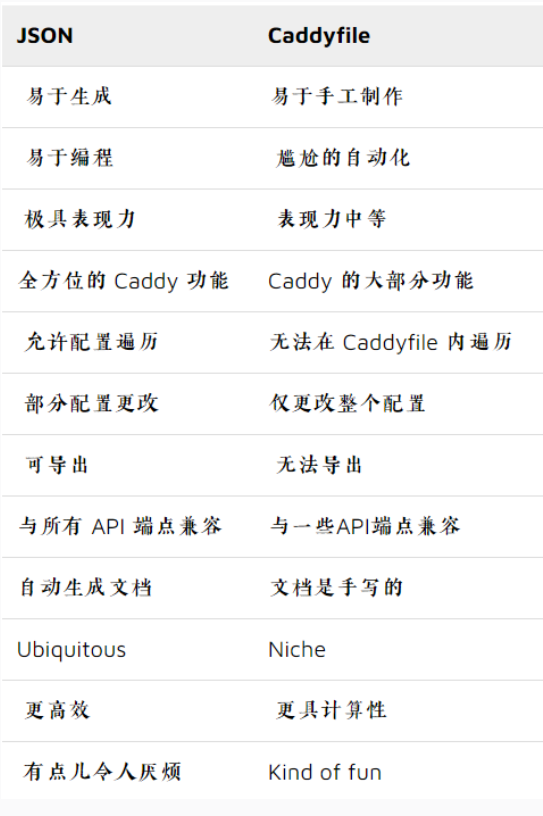

# Caddy
## Caddy介绍

## Caddy安装

### Windows安装

[Download Caddy](https://caddyserver.com/download "Download Caddy")

将文件重命名为caddy，在命令行中使用即可。

### CentOS安装

```bash
yum install yum-plugin-copr
yum copr enable @caddy/caddy
yum install caddy
```


## Caddy的运行与停止

**前台运行**

* caddy run
* 使用特定的配置文件： caddy run --config /path/to/Caddyfile

**后台运行**

caddy start

**停止🛑**

* caddy stop

**不停机更改配置文件**

* caddy reload

这实际上只是在底层使用了 API。它将加载您的配置文件，并在必要时将其调整为 JSON，然后优雅地替换活动配置，而无需停机。
从技术上讲，新配置在旧配置停止之前启动，因此在短时间内，两个配置都在运行！如果新配置失败，它将因错误而中止，而旧配置则不会停止。

## 配置文件

### 配置文件的比较



### 配置适配器

将Caddyfile文件转化为Json格式的配置文件

* caddy adapt
* caddy adapt --config /path/to/Caddyfile

## Caddyfile

### 常用的Caddyfile模式

[Common Caddyfile Patterns — Caddy Documentation](https://caddyserver.com/docs/caddyfile/patterns#static-file-server "Common Caddyfile Patterns — Caddy Documentation")

### 静态文件服务器

快速单行配置
```bash
caddy file-server --listen :2015
```
:::warning
如果收到权限错误，则可能意味着您的操作系统不允许您绑定到低端口 - 因此请改用高端口。
:::

如果没有索引文件，但是想显示文件列表可以使用`--browse`。
```bash
caddy file-server --browse
```
Caddyfile则为
```bash
localhost

file_server browse
```

```
example.com {
	root * /var/www
	file_server
}
```

像往常一样，第一行是站点地址。 root 指令指定站点根目录的路径（ * 表示匹配所有请求，以便与路径匹配器消除歧义）—如果出现以下情况，请更改站点的路径：它不是当前的工作目录。最后，我们启用静态文件服务器。

### 反向代理

 代理所有请求：

```
example.com {
	reverse_proxy localhost:5000
}
```

仅代理请求具有以 /api/ 开头的路径，并为其他所有内容提供静态文件：

```
example.com {
	root * /var/www
	reverse_proxy /api/* localhost:5000
	file_server
}
```

这使用请求匹配器仅匹配以 /api/ 开头的请求并将它们代理到后端。所有其他请求都将通过静态文件服务器从站点 root 提供服务。这还取决于 reverse_proxy 指令顺序高于 file_server 的事实。

这里还有更多 reverse_proxy 示例。

### 重定向到www的子域名

要使用 HTTP 重定向添加 www. 子域：

```
example.com {
	redir https://www.{host}{uri}
}

www.example.com {
}
```

 要删除它：

```
www.example.com {
	redir https://example.com{uri}
}

example.com {
}
```

一次为多个域删除它；这使用 `{labels.*}` 占位符，它们是主机名的一部分， 0 - 从右侧索引（例如 0 = com 、 1 = example-one , 2 = www ):

```
www.example-one.com, www.example-two.com {
	redir https://{labels.1}.{labels.0}{uri}
}

example-one.com, example-two.com {
}
```

### 单页应用程序SPA

当网页进行自己的路由时，服务器可能会收到大量对服务器端不存在的页面的请求，但只要提供单个索引文件，这些页面就可以在客户端呈现。像这样构建的 Web 应用程序称为 SPA，或单页应用程序。

主要思想是让服务器“尝试文件”以查看请求的文件是否存在于服务器端，如果不存在，则回退到客户端执行路由的索引文件（通常使用客户端 JavaScript）。

典型的 SPA 配置通常如下所示：

```
example.com {
	root * /srv
	encode gzip
	try_files {path} /index.html
	file_server
}
```

如果您的 SPA 与 API 或其他仅服务器端端点相结合，您将需要使用 handle 块来专门处理它们：

```
example.com {
	encode gzip

	handle /api/* {
		reverse_proxy backend:8000
	}

	handle {
		root * /srv
		try_files {path} /index.html
		file_server
	}
}
```