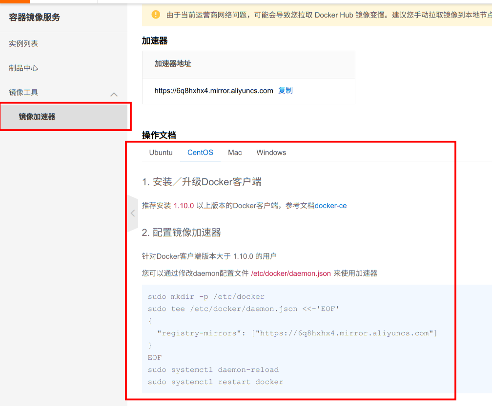

# Docker 的安装与配置

## 参考

官方文档：[https://docs.docker.com/](https://docs.docker.com/)

菜鸟 Docker 教程：[https://www.runoob.com/docker/docker-tutorial.html](https://www.runoob.com/docker/docker-tutorial.html)

阮一峰的网络日志 Docker 教程：[http://www.ruanyifeng.com/blog/2018/02/docker-tutorial.html](http://www.ruanyifeng.com/blog/2018/02/docker-tutorial.html)

[Docker 从入门到实践](https://vuepress.mirror.docker-practice.com/#%E6%8A%80%E6%9C%AF%E4%BA%A4%E6%B5%81)

[Docker 从入门到实践](https://yeasy.gitbook.io/docker_practice/)

[前言 - Docker — 从入门到实践 (gitbook.io)](https://yeasy.gitbook.io/docker_practice/)

## Docker 是什么？

Docker 是一种容器技术,它将应用程序及其所有依赖关系打包到一个可移植的容器中,以确保应用程序在不同环境下可以一致地运行。
Docker 具有以下主要优势:

可移植性(Portability):Docker 容器包含了应用程序运行所需的一切,因此可以在不同的环境(如开发、测试和生产环境)中进行一致的部署。这使得开发和维护应用程序更加容易和高效。

轻量级(Lightweight):与传统虚拟机相比,Docker 容器共享主机系统的内核,因此体积更小、启动更快。这允许在同一台主机上运行更多的容器。

隔离性(Isolation):每个 Docker 容器都在一个独立的环境中运行,与其他容器和主机系统隔离。这有助于防止应用程序之间的冲突,并提供更好的安全性。

版本控制(Version Control):Docker 镜像是可以版本控制的,这使得回滚到以前的版本或分发特定版本的应用程序变得很容易。

可重复性(Repeatability):使用 Docker,可以确保应用程序在任何环境中都能以完全相同的方式运行,消除了"在我的机器上运行正常"的问题。

敏捷开发(Agile Development):Docker 允许快速构建、测试和部署应用程序,从而加快软件开发周期。

组件重用(Component Reuse):Docker 镜像可以被视为可重用的组件,这有助于加速应用程序的构建和部署过程。

云原生(Cloud-Native):Docker 非常适合在云环境中运行应用程序,与主要的云供应商集成良好。

总的来说,Docker 通过提供一种轻量级、可移植和一致的方式来打包和部署应用程序,从而简化了开发、测试和部署流程,使开发人员能够专注于编写代码。

## Linux 安装 Docker

## Windows 安装 Docker

## 配置 Docker

### 干掉讨厌的 sudo

原文：[https://www.jianshu.com/p/1354e0506753](https://www.jianshu.com/p/1354e0506753)

**Q:首先说一下问题是怎么出现的？**

A:Docker 的守护线程绑定的是 unix socket，而不是 TCP 端口，这个套接字默认属于 root，其他用户可以通过 sudo 去访问这个套接字文件。所以 docker 服务进程都是以 root 账户运行。

解决的方式是**创建 docker 用户组，把应用用户加入到 docker 用户组里面。只要 docker 组里的用户都可以直接执行 docker 命令**。

可以先通过指令查看是否有用户组：

```bash
 cat /etc/group | grep docker
```

如果有就跳过第一步！

第一步：创建 docker 用户组

```bash
sudo groupadd docker
```

第二步：用户加入到用户组

```bash
sudo usermod -aG docker 用户名
```

第三步：检查是否有效

```bash
cat /etc/group
```

第四步：重启 docker-daemon

```bash
sudo systemctl restart docker
```

第五步：给 docker.sock 添加权限

```bash
sudo chmod a+rw /var/run/docker.sock
```

### 配置 Docker 镜像

Docker 在国内使用非常的慢，那我们可以使用阿里云的 Docker 镜像加速器。

加速地址：https://6q8hxhx4.mirror.aliyuncs.com

在阿里云的镜像服务功能中[容器镜像服务](https://cr.console.aliyun.com/)



```bash
sudo mkdir -p /etc/docker
sudo tee /etc/docker/daemon.json <<-'EOF'
{
  "registry-mirrors": ["https://6q8hxhx4.mirror.aliyuncs.com"]
}
EOF
sudo systemctl daemon-reload
sudo systemctl restart docker
```
