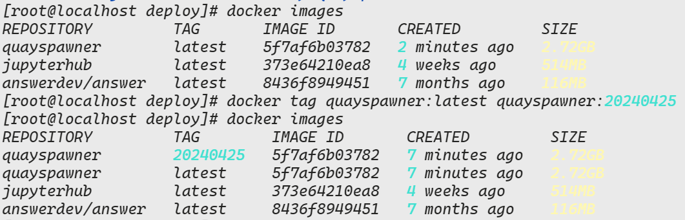

# Docker 常用操作

## Docker 查看容器或镜像的详细信息

原文：[https://www.cnblogs.com/sxdcgaq8080/p/9198309.html](https://www.cnblogs.com/sxdcgaq8080/p/9198309.html)

格式：

```bash
docker inspect 容积或镜像ID
```

## Docker 主机与容器数据传输

原文：[https://www.mediumcn.com/docker/how-to-copy-files-from-docker-container-to-host-or-vice-versa](https://www.mediumcn.com/docker/how-to-copy-files-from-docker-container-to-host-or-vice-versa)

**从容器向主机拷贝文件：**

```bash
docker cp 容器ID:容器内的文件路径 主机的文件路径
docker cp <containerId>:/file/path/within/container /host/path/target
```

:::tip
可以使用如下命令来进入 Docker 容器查看文件路径

```bash
docker exec -it 容器ID /bin/bash
```

:::

**从主机向容器拷贝文件：**

形式上差不多

```bash
docker cp /host/path/target <containerId>:/file/path/within/container
```

## Docker 容器端口切换

原文见：-->[如何修改 docker 容器的端口映射](https://www.codenong.com/cs109765034/)

## Docker 备份容器

```python
docker commit <容器名称> <新的镜像的名称:版本号>
```

- 版本号默认是 latest

## Docker 备份镜像

## Docker 设置已有的容器自启动

常用的自启动策略

1. `no`：默认策略，容器将不会自动重启。如果容器退出，它将保持停止状态。
2. `always`：无论容器退出的原因，Docker 都会自动重新启动容器。
3. `on-failure`：只有当容器以非零状态退出时，Docker 才会自动重新启动容器。可以通过 `--restart=on-failure:5` 指定重试次数，例如重试 5 次。
4. `unless-stopped`：除非手动停止容器，否则 Docker 将自动重新启动容器。这是一个持续性的重启策略。

```dockerfile
docker update --restart=<重启策略> <容器名称或容器ID>
```

## Docker 容器时间同步

[如何实现 docker 容器时间与宿主机不一致](https://blog.51cto.com/u_16175450/6806025)

查看系统时间的方法-->

**安装并配置 ntp 服务**

```bash
apt-get update
apt-get install -y ntp
```

**修改时区设置，相当于设置为上海时区，在容器中**

```bash
ln -sf /usr/share/zoneinfo/Asia/Shanghai /etc/localtime
```

**重启 ntp 服务，并设置为自启动**

```bash
service ntp start
update-rc.d ntp enable
```

**验证时间是否正确**

```bash
date
```

## Docker 镜像加速

Docker 在国内使用非常的慢，那我们可以使用阿里云的 Docker 镜像加速器。

见-->[阿里云 Docker 镜像加速器](./docker-install/#配置-docker-镜像)

:::danger
在 2024 年 6 月之后，国内无法正常使用 Docker 镜像，可以使用其他人开放的镜像来使用，但是速度有些慢-->[DockerHub 国内镜像源列表（2024 年 7 月 18 日 亲测可用）](https://linux.do/t/topic/150936)
:::

个人推荐使用 Github Action+阿里云镜像的方式来解决，原理就是：在 Github Action 中下载阿里云的镜像，然后推送到自己的镜像仓库，这样就可以在本地使用自己的镜像了。详见-->[一个视频解决 Docker 安装, Pull, 找镜像等难题 Docker 停服怎么办？Docker 镜像无法拉取](https://www.bilibili.com/video/BV1fS411A71Y/)

## 解决 gcr、quay、DockerHub 镜像下载难题

在使用 Docker 和 **Kubernetes** 时，我们经常需要访问 `gcr.io` 和 `quay.io` [镜像仓库](https://cloud.tencent.com/product/tcr?from_column=20065&from=20065)，由于众所周知的原因，这些镜像仓库在中国都无法访问，唯一能访问的是 Docker Hub，但速度也是奇慢无比。`gcr.azk8s.cn` 是 `gcr.io` 镜像仓库的代理站点，原来可以通过 `gcr.azk8s.cn` 访问 gcr.io 仓库里的镜像，但是目前 `*.azk8s.cn` 已经仅限于 `Azure` 中国的 IP 使用，不再对外提供服务了。国内其他的镜像加速方案大多都是采用定时同步的方式来缓存，这种方法是有一定延迟的，不能保证及时更新，ustc 和七牛云等镜像加速器我都试过了，非常不靠谱，很多镜像都没有。

# `/var/run/docker.sock:/var/run/docker.sock`的用处

**​`/var/run/docker.sock`​**​**的映射：**

- `/var/run/docker.sock` 是 Docker 守护进程的 UNIX 套接字文件，用于与 Docker 守护进程进行通信。
- 将主机的 `/var/run/docker.sock` 映射到容器内的 `/var/run/docker.sock` 的操作允许容器内的进程与主机上的 Docker 守护进程进行通信，从而能够执行 Docker 相关的命令和操作。

实现效果：容器内的进程可以直接与主机上的 Docker 守护进程进行交互，例如启动、停止、构建镜像等操作。这种方式**可以方便地在容器中执行 Docker 命令，而无需在容器内安装 Docker 客户端。**

常见例子：

```yaml
version: "3"
services:
  docker-client:
    image: docker:latest
    volumes:
      - /var/run/docker.sock:/var/run/docker.sock
    command: ["docker", "ps"]
```

即可以在容器中没有安装 docker 也可以执行 Docker 操作。

## 批量停止使用指定镜像的容器

很多时候，我们使用一个镜像创建了很多的容器，那么我们需要停止这些容器，那么一个一个的手动停止就显得十分的麻烦，所以我们需要一个一键停止的命令。

```bash
docker stop $(docker ps | grep <image_name> | awk '{print$1}')
```

1. 使用 `docker ps -a` 命令列出所有运行中和未运行的容器。
2. 使用 `grep <image_name>` 命令筛选出使用指定镜像的容器。
3. 使用 `awk '{print $1}'` 命令提取容器的 ID。
4. 使用 `docker stop` 命令停止提取出的容器。

## Docker 镜像打标签

使用如下命令：

```bash
docker tag myimage:latest myimage:newtag
```



## docker 进入容器

使用默认的用户进入容器：

```bash
docker exec -it <容器ID> /bin/bash
```

使用 root 用户进入容器：

```bash
docker exec -it -u root <容器ID> /bin/bash
```
